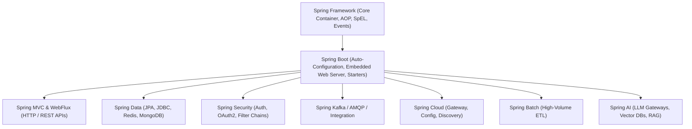
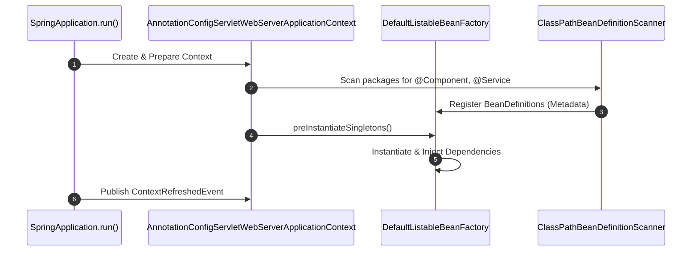

# 01-01: What is Spring? Ecosystem Evolution & Architectural Taxonomy

> **Module**: `MOD-01: Spring Foundations`
> **Topic ID**: `SB-01-01`
> **Prerequisites**: Core Java OOP & Polymorphism
> **Primary Technology**: Java 21 LTS | Spring Framework 6.2.2 | Spring Boot 3.4.13
> **Verification Date**: 2026-09-01

---

## 1. Problem
Enterprise Java applications in the early 2000s suffered from extreme coupling, invasive framework interfaces (EJB 2.x), complex XML deployment descriptors, and heavyweight container requirements. Unit testing business logic without deploying entire enterprise servers (WebLogic, WebSphere) was practically impossible.

---

## 2. Why It Exists
Spring emerged (originated by Rod Johnson in 2002) to enable **non-invasive, POJO-based (Plain Old Java Object) enterprise programming**. Instead of business services implementing vendor-specific EJB interfaces, Spring introduced a lightweight container that injects dependencies via reflection and applies enterprise services (transactions, security, caching) declaratively via Aspect-Oriented Programming (AOP).

---

## 3. Mental Model
Think of the Spring Framework as an **operating system for Java objects**: it manages the entire lifecycle of objects (instantiation, configuration, wiring, interception, destruction), allowing developers to write clean domain logic without plumbing code.

---

## 4. Architecture: The Spring Ecosystem Hierarchy



---

## 5. How Spring Implements It
At the core of the Spring Framework sits the **Inversion of Control (IoC) Container**, modeled fundamentally by:
1. `org.springframework.beans.factory.BeanFactory`: The root interface for accessing the Spring bean registry.
2. `org.springframework.context.ApplicationContext`: The enterprise superset of `BeanFactory` providing event publication, internationalization (i18n), resource loading, and AOP proxy integration.

---

## 6. Minimal Example
A pure Spring Framework POJO and configuration:

```java
package com.spring.interview.foundations.demo;

import org.springframework.context.annotation.AnnotationConfigApplicationContext;
import org.springframework.context.annotation.Bean;
import org.springframework.context.annotation.Configuration;

public class MinimalSpringDemo {

    public record GreetingService(String message) {
        public String greet(String name) {
            return message + ", " + name + "!";
        }
    }

    @Configuration
    static class AppConfig {
        @Bean
        public GreetingService greetingService() {
            return new GreetingService("Hello from Spring Core");
        }
    }

    public static void main(String[] args) {
        try (var context = new AnnotationConfigApplicationContext(AppConfig.class)) {
            GreetingService service = context.getBean(GreetingService.class);
            System.out.println(service.greet("Senior Engineer"));
        }
    }
}
```

---

## 7. Production Example
In modern production applications, Spring Boot packages this foundation with auto-configuration, externalized properties, and structured metrics:

```java
package com.spring.interview.foundations.demo;

import org.springframework.boot.SpringApplication;
import org.springframework.boot.autoconfigure.SpringBootApplication;
import org.springframework.stereotype.Service;
import org.springframework.web.bind.annotation.GetMapping;
import org.springframework.web.bind.annotation.RequestParam;
import org.springframework.web.bind.annotation.RestController;

@SpringBootApplication
public class ProductionApplication {

    @Service
    public static class OrderNotificationService {
        public String formatNotification(String orderId) {
            return "Order #" + orderId + " confirmed.";
        }
    }

    @RestController
    public static class OrderController {
        private final OrderNotificationService notificationService;

        public OrderController(OrderNotificationService notificationService) {
            this.notificationService = notificationService;
        }

        @GetMapping("/api/orders/notify")
        public String notifyOrder(@RequestParam String orderId) {
            return notificationService.formatNotification(orderId);
        }
    }

    public static void main(String[] args) {
        SpringApplication.run(ProductionApplication.class, args);
    }
}
```

---

## 8. Internal Execution Flow


---

## 9. Common Mistakes
1. **Confusing Spring Framework with Spring Boot**: Believing Spring Boot is a replacement for Spring Framework rather than an opinionated, auto-configuring layer on top of it.
2. **Treating Spring as Annotation Magic**: Using annotations (`@Autowired`, `@Transactional`, `@Async`) without understanding the underlying reflection, proxies, and lifecycle callbacks.

---

## 10. Debugging
- **Symptom**: `NoSuchBeanDefinitionException: No qualifying bean of type 'X' available`.
- **Root Cause**: The class is outside the component scan root package or lacks a stereotype annotation (`@Component`, `@Service`, `@Bean`).
- **Fix**: Inspect the `@ComponentScan` package boundaries or provide an explicit `@Configuration` class.

---

## 11. Performance
- **Startup Time**: Spring Framework builds bean dependency graphs at startup via reflection. In massive monolithic applications with thousands of beans, startup can take 30–60 seconds.
- **Modern Mitigations**: Spring Boot 3.4 supports Spring AOT (Ahead-of-Time compilation) and GraalVM native images to reduce startup from seconds to milliseconds.

---

## 12. Testing
Spring allows pure Java unit tests without loading the Spring container:

```java
package com.spring.interview.foundations.demo;

import org.junit.jupiter.api.Test;
import static org.assertj.core.api.Assertions.assertThat;

class GreetingServiceTest {

    @Test
    void shouldGreetWithoutSpringContext() {
        // Pure POJO unit test runs in <1ms
        var service = new MinimalSpringDemo.GreetingService("Welcome");
        String result = service.greet("Sourav");

        assertThat(result).isEqualTo("Welcome, Sourav!");
    }
}
```

---

## 13. Security Considerations
Never allow dynamic class loading or SpEL (Spring Expression Language) evaluation from untrusted user inputs to prevent Remote Code Execution (RCE) vulnerabilities.

---

## 14. Alternatives
- **Jakarta EE / Quarkus / Micronaut**: Compile-time DI frameworks avoiding runtime reflection overhead.
- **Google Guice**: Lightweight dependency injection without enterprise integrations.

---

## 15. Trade-offs
| Attribute | Spring Framework + Boot | Compile-Time DI (Micronaut / Quarkus) |
|---|---|---|
| **Ecosystem Maturity** | Unrivaled (Massive enterprise adoption) | Growing |
| **Startup Overhead** | Higher (Reflection & Classpath Scanning) | Near Instant |
| **Tooling & Community** | Exceptional | Moderate |

---

## 16. Interview Questions
1. **SDE2**: What is the core difference between the Spring Framework and Spring Boot?
2. **Senior**: How does the Spring container achieve non-invasive enterprise services for POJOs?

---

## 17. Interview Answer (Senior Level)
"Spring achieves non-invasive enterprise architecture through two core pillars: Inversion of Control (IoC) and Aspect-Oriented Programming (AOP). Business logic is written in plain Java objects (POJOs) with zero framework import requirements. At runtime, the Spring `ApplicationContext` parses bean metadata, instantiates objects, injects dependencies via constructors, and wraps beans in dynamic proxies to transparently apply cross-cutting concerns such as declarative transactions (`@Transactional`), security authorization, and caching."

---

## 18. Hands-on Exercise
Write a standalone Java 21 class using `AnnotationConfigApplicationContext` that defines two collaborating beans (`OrderRepository` and `OrderService`) and verifies that `OrderService` receives the singleton instance of `OrderRepository`.

---

## 19. Expected Learning
- Differentiate between the foundational layers of the Spring ecosystem.
- Articulate the role of `ApplicationContext` as the central coordinator of Java enterprise services.

---

## 20. Further Reading
- [Spring Framework Official Reference Documentation](https://docs.spring.io/spring-framework/reference/)
- [Spring Boot Official Reference Documentation](https://docs.spring.io/spring-boot/docs/current/reference/html/)
