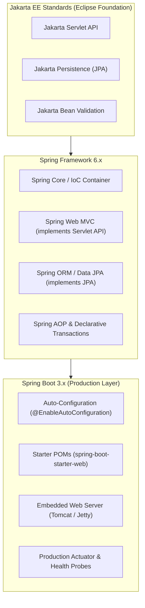

# 01-02: Spring Framework vs Spring Boot vs Jakarta EE

> **Module**: `MOD-01: Spring Foundations`
> **Topic ID**: `SB-01-02`
> **Prerequisites**: `SB-01-01`
> **Primary Technology**: Java 21 LTS | Architecture Comparison | Jakarta EE 10
> **Verification Date**: 2026-09-01

---

## 1. Problem
Developers and candidates frequently confuse **Jakarta EE**, **Spring Framework**, and **Spring Boot**, leading to flawed architectural decisions, incorrect dependency configurations, and poor interview explanations.

---

## 2. Why It Exists
Each technology solved a different layer of the enterprise Java evolution:
1. **Jakarta EE (formerly Java EE / J2EE)**: An industry standard specification (JPA, Servlet, JAX-RS, CDI) governed by the Eclipse Foundation.
2. **Spring Framework**: An implementation-rich enterprise framework that implements many Jakarta specifications (e.g. Servlet API) while providing its own IoC, AOP, and transaction infrastructure.
3. **Spring Boot**: An opinionated runtime packaging and auto-configuration framework that eliminates boilerplate configuration for Spring Framework applications.

---

## 3. Mental Model

```
Jakarta EE       == The Standard Specifications & APIs (e.g. Jakarta Servlet, Jakarta Persistence)
Spring Framework == The Core Engine (IoC Container, AOP, Data Access, Web MVC)
Spring Boot      == The Opinionated Production Assembler (Starters, Auto-Config, Embedded Server, Actuator)
```

---

## 4. Architecture: The Layered Comparison



---

## 5. How Spring Implements It
- **Why Boot does NOT replace Spring Framework**: Spring Boot uses standard Spring Framework `@Configuration`, `@Bean`, and `ApplicationContext` classes under the hood. It simply generates these bean definitions automatically using classpath condition evaluation (`@ConditionalOnClass`, `@ConditionalOnMissingBean`).
- **Namespace Migration**: Spring Framework 6.x and Spring Boot 3.x strictly use the `jakarta.*` package namespace (Jakarta EE 10) instead of legacy `javax.*`.

---

## 6. Minimal Example: Traditional Spring vs Spring Boot
### Traditional Spring Configuration (Verbose)
```java
// Traditional Spring required explicit DispatcherServlet registration, ViewResolvers, etc.
@Configuration
@EnableWebMvc
@ComponentScan(basePackages = "com.example")
public class TraditionalWebConfig implements WebMvcConfigurer {
    @Bean
    public DataSource dataSource() {
        // Manual HikariCP DataSource instantiation & configuration
        HikariDataSource ds = new HikariDataSource();
        ds.setJdbcUrl("jdbc:postgresql://localhost:5432/mydb");
        ds.setUsername("postgres");
        ds.setPassword("secret");
        return ds;
    }
}
```

### Modern Spring Boot Configuration (Zero Boilerplate)
```java
// Spring Boot auto-configures DataSource, Jackson, Tomcat, DispatcherServlet from application.yml
@SpringBootApplication
public class ModernBootApplication {
    public static void main(String[] args) {
        SpringApplication.run(ModernBootApplication.class, args);
    }
}
```

---

## 7. Production Comparison Matrix
| Dimension | Jakarta EE (WildFly / Payara) | Traditional Spring Framework | Spring Boot 3.4.x |
|---|---|---|---|
| **Packaging** | WAR / EAR deployed to external server | WAR deployed to Tomcat/Jetty | Standalone executable Fat JAR with embedded Tomcat |
| **Configuration** | XML descriptors / CDI annotations | XML or explicit `@Configuration` classes | `@SpringBootApplication` + Auto-Configuration |
| **Server Requirement** | Full Java EE Application Server | Servlet Container (Tomcat) | Zero external server; self-contained process |
| **Observability** | Vendor-specific server dashboards | Manual metric wiring | Built-in Micrometer & Actuator endpoints |

---

## 8. Common Mistakes
- **Believing Spring Boot is a separate language or runtime**: It is simply a curated collection of Spring Framework libraries, starter POMs, and auto-configuration classes.
- **Mixing legacy `javax.*` imports with Spring Boot 3.x**: Spring Boot 3 requires `jakarta.persistence.*`, `jakarta.servlet.*`, `jakarta.validation.*`.

---

## 9. Interview Questions
1. **SDE2**: Why did Spring Boot transition from `javax.*` to `jakarta.*` in version 3.0?
2. **Senior**: Does Spring Boot replace the Spring Framework? Explain with architectural evidence.

---

## 10. Interview Answer (Senior Level)
"Spring Boot does not replace the Spring Framework; it is built directly on top of it. The Spring Framework provides the fundamental programming model—the Inversion of Control container, BeanFactory, Spring Web MVC, and transaction management. Spring Boot acts as an opinionated production assembler: it uses `@Conditional` annotations to inspect the classpath and automatically register Spring Framework `@Bean` definitions, bundles embedded web servers like Tomcat into executable Fat JARs, and provides production-ready Actuator telemetry."
