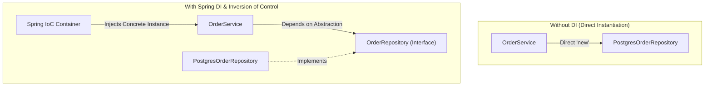

# 01-03: Inversion of Control (IoC) & Dependency Injection (DI) Design Philosophy

> **Module**: `MOD-01: Spring Foundations`
> **Topic ID**: `SB-01-03`
> **Prerequisites**: `SB-01-01`
> **Primary Technology**: Java 21 LTS | Software Design Principles | IoC & DI
> **Verification Date**: 2026-09-01

---

## 1. Problem
When a class creates its own dependencies directly using `new MyDependency()`, it creates **hard coupling**. The class cannot be unit tested in isolation with mocks, cannot easily switch implementations (e.g. Postgres vs InMemory storage), and violates the Single Responsibility and Dependency Inversion principles (SOLID).

---

## 2. Why It Exists
**Inversion of Control (IoC)** inverts the flow of control: instead of an application component instantiating and managing its collaborators, the control is inverted and handed over to an external container/framework (the **Hollywood Principle**: *"Don't call us, we'll call you"*). **Dependency Injection (DI)** is the specific design pattern used by Spring to implement IoC.

---

## 3. Mental Model

```
Tight Coupling (Without DI):
[OrderService] ──instantiates (new)──> [PostgresOrderRepository] ──instantiates (new)──> [HikariDataSource]

Loose Coupling (With Spring IoC Container):
[Spring IoC Container]
   ├── Instantiates [HikariDataSource]
   ├── Injects DataSource into [PostgresOrderRepository]
   └── Injects Repository into [OrderService]
```

---

## 4. Architecture: The Dependency Inversion Principle (DIP)



---

## 5. How Spring Implements It
1. **Metadata Parsing**: Spring reads `@Component`, `@Service`, or `@Bean` metadata into `BeanDefinition` objects.
2. **Topological Dependency Graph**: Spring analyzes constructor parameter types to build a dependency DAG (Directed Acyclic Graph).
3. **Reflection-Based Instantiation**: Spring uses reflection (`Constructor.newInstance()`) to instantiate beans in topological order, injecting required dependencies into constructors.

---

## 6. Minimal Example in Java 21
```java
package com.spring.interview.foundations.ioc;

import java.util.Objects;

// 1. Abstraction
public interface PaymentGateway {
    boolean processPayment(String accountId, double amount);
}

// 2. Concrete Implementation
public class StripePaymentGateway implements PaymentGateway {
    @Override
    public boolean processPayment(String accountId, double amount) {
        return amount > 0;
    }
}

// 3. Client Dependent Class
public class CheckoutService {
    private final PaymentGateway paymentGateway;

    // Inversion of Control: Dependency is passed IN via constructor
    public CheckoutService(PaymentGateway paymentGateway) {
        this.paymentGateway = Objects.requireNonNull(paymentGateway, "paymentGateway must not be null");
    }

    public boolean checkout(String customerId, double total) {
        return paymentGateway.processPayment(customerId, total);
    }
}
```

---

## 7. Production Example with Spring Boot
```java
package com.spring.interview.foundations.ioc;

import org.springframework.context.annotation.Primary;
import org.springframework.stereotype.Component;
import org.springframework.stereotype.Service;

@Component
@Primary
public class ProductionStripeGateway implements PaymentGateway {
    @Override
    public boolean processPayment(String accountId, double amount) {
        // Production stripe API call
        return true;
    }
}

@Service
public class ProductionCheckoutService {
    private final PaymentGateway paymentGateway;

    // Constructor Injection is strongly recommended in production
    public ProductionCheckoutService(PaymentGateway paymentGateway) {
        this.paymentGateway = paymentGateway;
    }

    public boolean completeOrder(String account, double total) {
        return paymentGateway.processPayment(account, total);
    }
}
```

---

## 8. Common Mistakes
- **Using `new` inside Spring Services**: Instantiating a service with `new OrderService()` bypasses the Spring container completely, causing all `@Autowired` dependencies, `@Transactional` proxies, and lifecycle hooks inside it to be `null` or un-intercepted.
- **Service Locator Anti-Pattern**: Calling `applicationContext.getBean(MyService.class)` everywhere instead of using constructor injection.

---

## 9. Interview Questions
1. **SDE2**: What is the difference between Inversion of Control (IoC) and Dependency Injection (DI)?
2. **Senior**: How does Dependency Injection improve unit testability and architectural maintainability?

---

## 10. Interview Answer (Senior Level)
"Inversion of Control (IoC) is a broad architectural principle where the control flow of a program is inverted to an external framework. Dependency Injection (DI) is the specific structural design pattern Spring uses to implement IoC: rather than objects instantiating their own collaborators using the `new` operator, dependencies are passed into objects (preferably via constructor injection) by the Spring container. This decouples classes from concrete implementations, satisfies the Dependency Inversion Principle, and allows unit tests to inject Mockito mocks in sub-millisecond execution times without spinning up a container."
