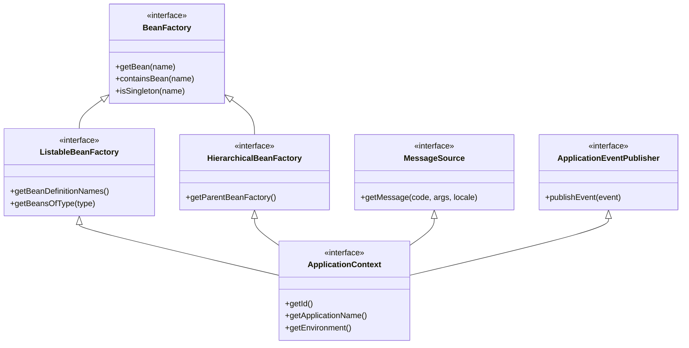

# 01-04: ApplicationContext vs BeanFactory: Architectural Deep Dive

> **Module**: `MOD-01: Spring Foundations`
> **Topic ID**: `SB-01-04`
> **Prerequisites**: `SB-01-03`
> **Primary Technology**: Java 21 LTS | Spring Framework 6.2.2 | Container Internals
> **Verification Date**: 2026-09-01

---

## 1. Problem
Developers often wonder why Spring provides both `BeanFactory` and `ApplicationContext` interfaces, when to use each, and how their initialization strategies differ in terms of memory consumption and startup latency.

---

## 2. Why It Exists
- `BeanFactory`: The minimal, foundational container interface (`org.springframework.beans.factory.BeanFactory`). It initializes beans **lazily** (on-demand when `getBean()` is called).
- `ApplicationContext`: The full enterprise container interface (`org.springframework.context.ApplicationContext`), extending `BeanFactory`, `MessageSource`, `ApplicationEventPublisher`, and `ResourcePatternResolver`. It initializes singleton beans **eagerly** at application startup.

---

## 3. Mental Model

```
BeanFactory        == Lightweight Engine (Lazy loading, minimal memory, basic DI)
ApplicationContext == Enterprise Cockpit (Eager loading, AOP auto-proxying, i18n, Events, Environment profiles)
```

---

## 4. Architecture: Class & Interface Hierarchy



---

## 5. How Spring Implements It
| Feature | `BeanFactory` | `ApplicationContext` |
|---|---|---|
| **Bean Instantiation Strategy**| **Lazy Initialization** (instantiates on `getBean()`) | **Eager Pre-instantiation** (instantiates singletons at startup) |
| **AOP Auto-Proxying** | Requires manual `BeanPostProcessor` registration | Automatic detection and registration |
| **Internationalization (i18n)**| Not supported | Supported via `MessageSource` |
| **Application Events** | Not supported | Supported via `ApplicationEventPublisher` |
| **Environment & Profiles** | Minimal | Full `EnvironmentAware` and `@Profile` integration |
| **Memory Footprint** | Extremely low (suitable for resource-constrained devices)| Standard enterprise footprint |
| **Modern Recommendation** | Rarely used directly | **Standard for 100% of Spring Boot applications** |

---

## 6. Minimal Comparison Demo in Java 21
```java
package com.spring.interview.foundations.context;

import org.springframework.beans.factory.support.DefaultListableBeanFactory;
import org.springframework.beans.factory.support.RootBeanDefinition;
import org.springframework.context.annotation.AnnotationConfigApplicationContext;

public class ContainerComparisonDemo {

    public static class HeavyweightService {
        public HeavyweightService() {
            System.out.println("-> HeavyweightService Instantiated!");
        }
    }

    public static void demonstrateBeanFactoryLazy() {
        System.out.println("=== 1. BeanFactory Demo (Lazy) ===");
        var beanFactory = new DefaultListableBeanFactory();
        beanFactory.registerBeanDefinition("heavy", new RootBeanDefinition(HeavyweightService.class));

        System.out.println("BeanFactory configured. Note: No bean instantiated yet.");
        System.out.println("Calling getBean()...");
        beanFactory.getBean("heavy"); // Instantiation happens HERE
    }

    public static void demonstrateApplicationContextEager() {
        System.out.println("\n=== 2. ApplicationContext Demo (Eager) ===");
        // Instantiation happens IMMEDIATELY during context refresh/startup!
        try (var context = new AnnotationConfigApplicationContext()) {
            context.registerBean(HeavyweightService.class);
            context.refresh();
            System.out.println("ApplicationContext refreshed. Bean was already eagerly created!");
        }
    }

    public static void main(String[] args) {
        demonstrateBeanFactoryLazy();
        demonstrateApplicationContextEager();
    }
}
```

---

## 7. Common Mistakes
- **Failing Fast at Startup**: Believing lazy initialization is always better. In production, **eager initialization is preferred** because it fails fast at deployment time (e.g. invalid DB URL, missing required bean) rather than failing during the first customer request at 2 AM.

---

## 8. Interview Questions
1. **SDE2**: What is the primary difference between `BeanFactory` and `ApplicationContext`?
2. **Senior**: Why does Spring Boot use eager singleton pre-instantiation by default instead of lazy initialization?

---

## 9. Interview Answer (Senior Level)
"`BeanFactory` is the root container interface providing lazy bean instantiation on `getBean()`. `ApplicationContext` is an enterprise superset extending `BeanFactory` with internationalization, application event broadcasting, and environment profiles. In production Spring Boot systems, `ApplicationContext` pre-instantiates singletons eagerly at startup (`preInstantiateSingletons()`). This guarantees fail-fast verification: if a circular dependency, missing configuration property, or invalid database connection exists, the application crashes immediately on deployment rather than failing intermittently under live user traffic."
