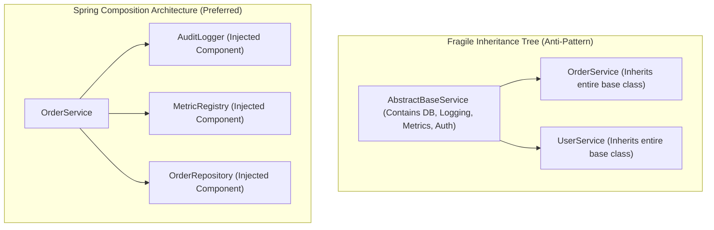

# 01-05: Composition Over Inheritance in Spring Architecture

> **Module**: `MOD-01: Spring Foundations`
> **Topic ID**: `SB-01-05`
> **Prerequisites**: `SB-01-03`
> **Primary Technology**: Java 21 LTS | Software Architecture | Clean Code Patterns
> **Verification Date**: 2026-09-01

---

## 1. Problem
Deep inheritance hierarchies (`AbstractBaseController` -> `BaseCrudController` -> `TenantAwareController` -> `UserController`) create fragile base class problems. Changing one method in a base class cascades breaking changes across dozens of subclasses, tightly couples classes to internal implementation details, and makes unit testing difficult.

---

## 2. Why It Exists
Spring is fundamentally architected around **Composition Over Inheritance** and **Interface-Driven Design**. Instead of inheriting functionality from massive base classes, Spring encourages injecting discrete, single-responsibility collaborator beans (e.g. `Validator`, `Auditor`, `PasswordEncoder`, `ObjectMapper`).

---

## 3. Mental Model

```
Anti-Pattern (Deep Fragile Inheritance):
UserController extends AbstractAuditController extends AbstractSecuredController extends AbstractCrudController
(Fragile, inflexible, hard to mock)

Spring Idiomatic Architecture (Composition):
UserController
  ├── has-a UserService
  ├── has-a UserValidator
  └── has-a AuditLogger
(Modular, highly testable, independent lifecycles)
```

---

## 4. Architecture



---

## 5. How Spring Implements It
1. **Template Method via Callbacks**: Rather than forcing inheritance, Spring uses the Strategy and Callback patterns (e.g. `JdbcTemplate`, `TransactionTemplate`, `KafkaTemplate`).
2. **Method Interception via AOP**: Cross-cutting concerns (Transactions, Auditing, Security) are applied externally via annotations (`@Transactional`, `@PreAuthorize`) rather than requiring `super.executeInTransaction()`.

---

## 6. Minimal Example in Java 21
```java
package com.spring.interview.foundations.composition;

import org.springframework.stereotype.Component;
import org.springframework.stereotype.Service;
import java.util.Objects;

@Component
public class AuditLogger {
    public void logAction(String action, String userId) {
        System.out.println("[AUDIT] User " + userId + " executed " + action);
    }
}

@Service
public class OrderService {
    private final AuditLogger auditLogger;

    // Injected via composition
    public OrderService(AuditLogger auditLogger) {
        this.auditLogger = Objects.requireNonNull(auditLogger, "auditLogger must not be null");
    }

    public void placeOrder(String orderId, String userId) {
        // Business logic here
        auditLogger.logAction("PLACE_ORDER: " + orderId, userId);
    }
}
```

---

## 7. Common Mistakes
- **Writing `BaseService` with dozens of protected `@Autowired` fields**: Subclasses inherit invisible dependencies that cannot be validated via constructor injection.

---

## 8. Interview Questions
1. **SDE2**: Why does Spring favor composition over inheritance in bean architecture?
2. **Senior**: How does Spring's Template design pattern (e.g. `JdbcTemplate`, `TransactionTemplate`) avoid the fragile base class problem?

---

## 9. Interview Answer (Senior Level)
"Spring favors composition over inheritance because inheritance creates tight compile-time coupling to parent class internals, leading to the fragile base class problem. By composing small, focused components through constructor injection, classes remain loosely coupled and easily testable with isolated mocks. Furthermore, Spring replaces inheritance-based hooks with the Strategy pattern and AOP proxies (such as `@Transactional`), allowing cross-cutting behaviors to be attached dynamically without polluting domain class hierarchies."
