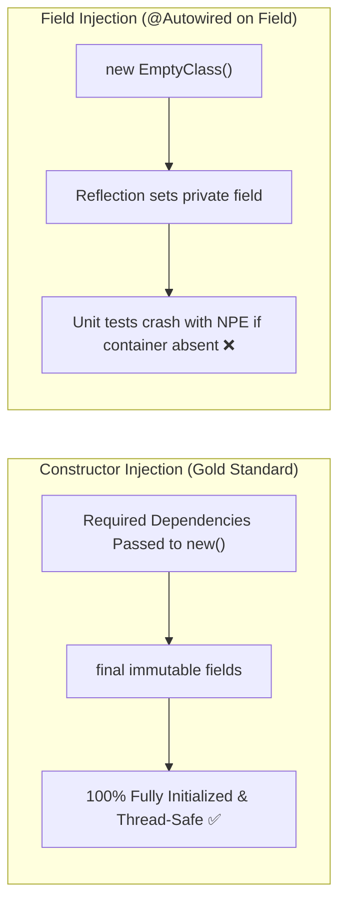

# 02-01: Constructor vs Setter vs Field Injection: Deep Technical Comparison

> **Module**: `MOD-02: IoC and Dependency Injection`
> **Topic ID**: `SB-02-01`
> **Prerequisites**: `SB-01-03`
> **Primary Technology**: Java 21 LTS | Dependency Injection Styles | Immutability & Testing
> **Verification Date**: 2026-09-01

---

## 1. Problem
Spring provides three primary mechanisms for injecting dependencies into beans: **Constructor Injection**, **Setter Injection**, and **Field Injection** (`@Autowired private MyService myService;`). Choosing the wrong injection style leads to `NullPointerException`s in unit tests, hidden dependencies, inability to create immutable beans, and undetected circular dependency runtime deadlocks.

---

## 2. Why It Exists
- **Field Injection**: Historically popular for its brevity, but heavily discouraged in modern enterprise Spring. It relies on reflection (`Field.setAccessible(true)`), hides dependencies from class contracts, prevents `final` immutable fields, and makes unit testing without Spring context nearly impossible.
- **Setter Injection**: Useful for truly optional dependencies that can have reasonable defaults or be reconfigured at runtime.
- **Constructor Injection**: **The official gold standard for modern Spring applications**. It enforces immutability via `final` fields, guarantees non-null instantiation, exposes dependencies explicitly in public APIs, and enables effortless pure-Java unit testing.

---

## 3. Mental Model

```
Field Injection       == Hidden back-door entry (Reflection bypasses class constructor, violates encapsulation)
Setter Injection      == Optional side-door (Mutable state, object can exist in a half-initialized state)
Constructor Injection == Strict front-door contract (Object CANNOT exist without required dependencies)
```

---

## 4. Architecture: Injection Comparison Matrix



---

## 5. Detailed Structural Comparison

| Feature | Constructor Injection | Setter Injection | Field Injection |
|---|:---:|:---:|:---:|
| **Immutability (`final` fields)** | **Yes (`final`)** | No | No |
| **Fail-Fast at Instantiation** | **Yes (Guaranteed non-null)** | No (Can be called before setter) | No (Can be called before reflection) |
| **Unit Testability without Spring** | **Effortless (`new Service(mock))`)**| Moderate (`new Service(); s.set(mock)`) | Painful (Requires ReflectionUtils) |
| **Circular Dependency Detection** | **Immediate fail-fast at startup**| Silently bypassed (Runtime risks) | Silently bypassed |
| **Explicit Class API Contract** | **Clear & transparent** | Obscured | Completely hidden |
| **Official Recommendation** | **STRONGLY RECOMMENDED** | Optional dependencies only | **STRICTLY DISCOURAGED** |

---

## 6. Production Example in Java 21
In modern Spring Boot (Spring 4.3+), `@Autowired` is omitted if a class has a single constructor:

```java
package com.spring.interview.ioc.injection;

import org.springframework.stereotype.Service;
import java.util.Objects;

@Service
public class OrderProcessingService {

    // 1. Immutable, final dependencies
    private final OrderRepository orderRepository;
    private final PaymentClient paymentClient;

    // 2. Single explicit constructor (No @Autowired needed)
    public OrderProcessingService(OrderRepository orderRepository, PaymentClient paymentClient) {
        this.orderRepository = Objects.requireNonNull(orderRepository, "orderRepository must not be null");
        this.paymentClient = Objects.requireNonNull(paymentClient, "paymentClient must not be null");
    }

    public boolean process(String orderId, double amount) {
        if (paymentClient.charge(orderId, amount)) {
            orderRepository.markAsPaid(orderId);
            return true;
        }
        return false;
    }
}
```

---

## 7. Common Mistakes
- **Using Lombok `@RequiredArgsConstructor` blindly without understanding**: While convenient, it generates a constructor matching all `final` fields. If an engineer forgets `final` on a field, it silently becomes `null`.

---

## 8. Interview Questions
1. **SDE2**: Why is field injection considered an anti-pattern in modern Spring development?
2. **Senior**: How does constructor injection interact with Spring Boot's circular dependency prevention?

---

## 9. Interview Answer (Senior Level)
"Field injection is an anti-pattern because it violates encapsulation by using reflection to mutate private fields, prevents fields from being declared `final` (sacrificing immutability and thread safety), and hides dependencies from the class contract, requiring ReflectionTestUtils to mock in unit tests. Constructor injection is the enterprise standard because it guarantees that an object cannot be instantiated in a partial, invalid state. It enables fast pure-Java unit testing and allows Spring Boot to fail fast at startup if circular dependencies exist."
