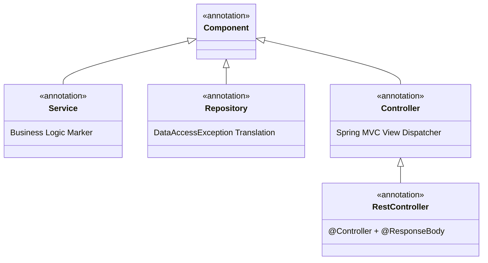

# 02-02: Spring Stereotype Annotations: @Component, @Service, @Repository, @Controller

> **Module**: `MOD-02: IoC and Dependency Injection`
> **Topic ID**: `SB-02-02`
> **Prerequisites**: `SB-02-01`
> **Primary Technology**: Java 21 LTS | Stereotype Hierarchy | Persistence Exception Translation
> **Verification Date**: 2026-09-01

---

## 1. Problem
Developers often treat `@Component`, `@Service`, `@Repository`, and `@Controller` as interchangeable markers that simply register a Spring bean. However, Spring attaches distinct runtime behaviors, AOP exception translators, and MVC routing handlers based on the specific stereotype.

---

## 2. Why It Exists
Stereotype annotations provide **Domain-Driven semantic meaning** to Spring beans and enable targeted post-processing:
- `@Component`: The generic root stereotype for any Spring-managed component.
- `@Service`: Specialization for business logic / service layer; indicates transaction boundaries.
- `@Repository`: Specialization for data access; automatically enables **Persistence Exception Translation** (translating vendor-specific SQL exceptions into Spring's unchecked `DataAccessException` hierarchy).
- `@Controller` / `@RestController`: Specialization for web presentation tier; handles HTTP request mapping, argument resolution, and JSON serialization.

---

## 3. Architecture: Stereotype Inheritance Hierarchy



---

## 4. How Spring Implements Persistence Exception Translation
When `@Repository` is applied to a class, Spring's `PersistenceExceptionTranslationPostProcessor` automatically detects it and attaches an AOP advisor (`PersistenceExceptionTranslationAdvisor`).

If Hibernate throws a `org.hibernate.exception.ConstraintViolationException` or JDBC driver throws `java.sql.SQLException`, the proxy catches it and translates it into `org.springframework.dao.DataIntegrityViolationException`, shielding upper application layers from vendor-specific persistence details.

---

## 5. Minimal Example in Java 21
```java
package com.spring.interview.ioc.stereotypes;

import org.springframework.stereotype.Component;
import org.springframework.stereotype.Repository;
import org.springframework.stereotype.Service;
import org.springframework.web.bind.annotation.GetMapping;
import org.springframework.web.bind.annotation.RestController;

@Repository
public class AccountRepository {
    public String findAccount(String id) {
        return "ACCOUNT_" + id;
    }
}

@Service
public class AccountService {
    private final AccountRepository repository;

    public AccountService(AccountRepository repository) {
        this.repository = repository;
    }

    public String getAccountDetails(String id) {
        return repository.findAccount(id);
    }
}

@RestController
public class AccountController {
    private final AccountService service;

    public AccountController(AccountService service) {
        this.service = service;
    }

    @GetMapping("/api/accounts/{id}")
    public String getAccount(String id) {
        return service.getAccountDetails(id);
    }
}
```

---

## 6. Common Mistakes
- **Omitting `@Repository` on custom DAO classes**: Causes low-level checked `SQLException`s or Hibernate-specific exceptions to leak into business services, violating persistence abstraction boundaries.

---

## 7. Interview Questions
1. **SDE2**: What is the difference between `@Component` and `@Service`?
2. **Senior**: What special runtime capability does `@Repository` provide over a generic `@Component`?

---

## 8. Interview Answer (Senior Level)
"`@Component` is the root stereotype for any Spring-managed bean, while `@Service`, `@Repository`, and `@Controller` are specialized meta-annotations. While `@Service` currently acts as a semantic marker for business logic, `@Repository` has a critical functional role: it automatically registers the bean for Spring's `PersistenceExceptionTranslationPostProcessor`. This intercepts low-level database exceptions (such as JDBC `SQLException` or Hibernate `HibernateException`) and transparently translates them into Spring's unified, unchecked `DataAccessException` hierarchy."
