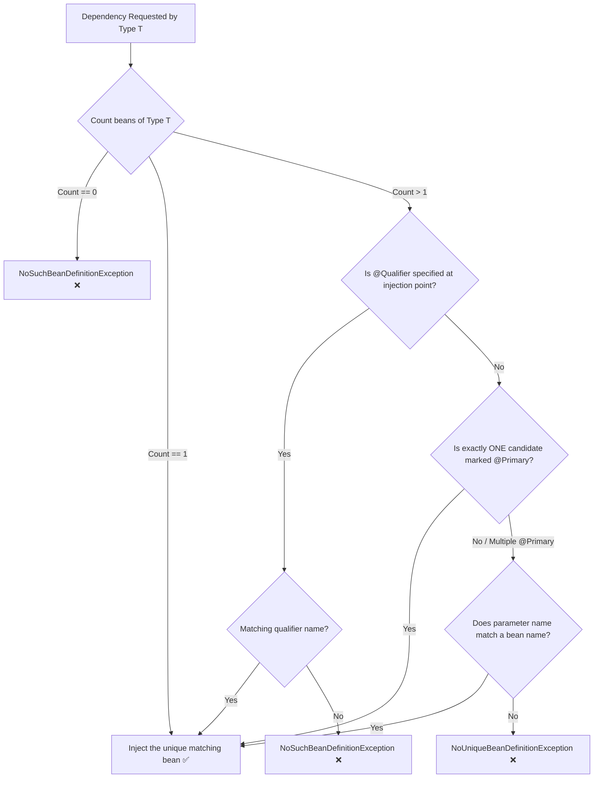

# 02-03: Bean Resolution Algorithm: @Primary, @Qualifier & Collection Injection

> **Module**: `MOD-02: IoC and Dependency Injection`
> **Topic ID**: `SB-02-03`
> **Prerequisites**: `SB-02-02`
> **Primary Technology**: Java 21 LTS | Bean Resolution | Multi-Implementation Routing
> **Verification Date**: 2026-09-01

---

## 1. Problem
When multiple beans implement the same interface (e.g. `SmsNotifier` and `EmailNotifier` both implementing `Notifier`), Spring cannot resolve which bean to inject by type alone, throwing a `NoUniqueBeanDefinitionException`.

---

## 2. Why It Exists
Spring provides deterministic bean disambiguation mechanisms:
1. **`@Primary`**: Designates a default bean when multiple candidates exist.
2. **`@Qualifier("beanName")`**: Explicitly selects a specific bean candidate at the injection point.
3. **Collection Injection (`List<Interface>` or `Map<String, Interface>`)**: Automatically injects **all** implementations, enabling clean Strategy pattern routing.

---

## 3. Architecture: The 5-Step Bean Resolution Algorithm



---

## 4. Production Example in Java 21
Using Map injection for dynamic strategy dispatch:

```java
package com.spring.interview.ioc.resolution;

import org.springframework.beans.factory.annotation.Qualifier;
import org.springframework.context.annotation.Primary;
import org.springframework.stereotype.Component;
import org.springframework.stereotype.Service;

import java.util.Map;
import java.util.Objects;

// 1. Common Strategy Interface
public interface NotificationSender {
    String send(String message);
}

@Component("emailSender")
@Primary // Default fallback
public class EmailNotificationSender implements NotificationSender {
    @Override
    public String send(String message) {
        return "EMAIL: " + message;
    }
}

@Component("smsSender")
public class SmsNotificationSender implements NotificationSender {
    @Override
    public String send(String message) {
        return "SMS: " + message;
    }
}

@Service
public class NotificationRouterService {

    private final NotificationSender defaultSender;
    private final NotificationSender smsSender;
    private final Map<String, NotificationSender> allSenders;

    // Injects @Primary as default, explicit @Qualifier for SMS, and Map for all strategies
    public NotificationRouterService(
        NotificationSender defaultSender,
        @Qualifier("smsSender") NotificationSender smsSender,
        Map<String, NotificationSender> allSenders
    ) {
        this.defaultSender = Objects.requireNonNull(defaultSender);
        this.smsSender = Objects.requireNonNull(smsSender);
        this.allSenders = Objects.requireNonNull(allSenders);
    }

    public String routeNotification(String channel, String msg) {
        NotificationSender sender = allSenders.getOrDefault(channel + "Sender", defaultSender);
        return sender.send(msg);
    }

    public NotificationSender getDefaultSender() { return defaultSender; }
    public NotificationSender getSmsSender() { return smsSender; }
    public int getAvailableSenderCount() { return allSenders.size(); }
}
```

---

## 5. Common Mistakes
- **Marking multiple beans as `@Primary`**: Causes `NoUniqueBeanDefinitionException: more than one 'primary' bean found`.
- **Relying on parameter name matching instead of `@Qualifier`**: Brittle when code is refactored or compiled without `-parameters` metadata.

---

## 6. Interview Questions
1. **SDE2**: What happens when multiple beans match an injection point and neither `@Primary` nor `@Qualifier` is present?
2. **Senior**: How does Spring populate `Map<String, T>` and `List<T>` parameters during constructor injection?

---

## 7. Interview Answer (Senior Level)
"When multiple bean candidates match by type, Spring's resolution algorithm checks for an explicit `@Qualifier`. If absent, it checks if exactly one bean is annotated with `@Primary`. If neither resolves the ambiguity, Spring falls back to matching the constructor parameter name against candidate bean names; if that fails, it throws `NoUniqueBeanDefinitionException`. Furthermore, Spring natively supports Strategy pattern dispatch by allowing constructor parameters of type `Map<String, T>` (where keys are bean names and values are bean instances) or `List<T>` (ordered via `@Order`), injecting all registered implementations automatically."
