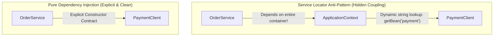

# 02-05: Dependency Graphs & Preventing Hidden Dependencies

> **Module**: `MOD-02: IoC and Dependency Injection`
> **Topic ID**: `SB-02-05`
> **Prerequisites**: `SB-02-01`, `SB-02-04`
> **Primary Technology**: Java 21 LTS | Architecture | Anti-Pattern Prevention
> **Verification Date**: 2026-09-01

---

## 1. Problem
As enterprise Spring Boot systems grow, dependency graphs can become tangled webs. Two major design flaws emerge:
1. **Hidden Dependencies**: Classes accessing external state or container lookups behind the scenes rather than declaring them in public constructor parameters.
2. **Service Locator Anti-Pattern**: Injecting `ApplicationContext` or `BeanFactory` into domain classes to fetch beans dynamically via `context.getBean()`.

---

## 2. Why It Exists
Hidden dependencies destroy testability: a developer cannot inspect a class constructor to understand what it needs to function, leading to unexpected `NullPointerException`s in unit tests and hidden coupling to container infrastructure.

---

## 3. Architecture: Service Locator vs Constructor Injection



---

## 4. Production Example in Java 21
### Bad: Service Locator Anti-Pattern (Hidden Dependency)
```java
@Service
public class BadOrderService implements ApplicationContextAware {
    private ApplicationContext context;

    @Override
    public void setApplicationContext(ApplicationContext context) {
        this.context = context;
    }

    public void processOrder(String orderId) {
        // Anti-pattern: Hidden dependency fetched dynamically!
        PaymentGateway gateway = context.getBean(PaymentGateway.class);
        gateway.charge(orderId);
    }
}
```

### Good: Explicit Constructor Dependency Injection
```java
@Service
public class CleanOrderService {
    private final PaymentGateway paymentGateway;

    // 100% explicit: Constructor documents exact prerequisites
    public CleanOrderService(PaymentGateway paymentGateway) {
        this.paymentGateway = Objects.requireNonNull(paymentGateway, "paymentGateway must not be null");
    }

    public void processOrder(String orderId) {
        paymentGateway.charge(orderId);
    }
}
```

---

## 5. Common Mistakes
- **Passing `ApplicationContext` everywhere**: Turns domain objects into container-dependent monoliths.
- **God Classes with >10 Constructor Arguments**: A sign that the class violates the Single Responsibility Principle (SRP) and needs decomposition.

---

## 6. Interview Questions
1. **SDE2**: Why is the Service Locator pattern considered an anti-pattern when using Spring?
2. **Senior**: What architectural refactoring should be performed when a Spring `@Service` accumulates 12 constructor dependencies?

---

## 7. Interview Answer (Senior Level)
"The Service Locator pattern is an anti-pattern in Spring because it replaces compile-time dependency clarity with runtime string or type lookups against `ApplicationContext`. This hides dependencies from the public class contract, ties domain code to framework APIs, and breaks fast unit testing. When a service accumulates more than 5–7 constructor arguments, it indicates a violation of the Single Responsibility Principle; the senior engineering solution is to decompose the service into cohesive smaller domain services or encapsulate related parameters using dedicated Strategy or Facade components."
