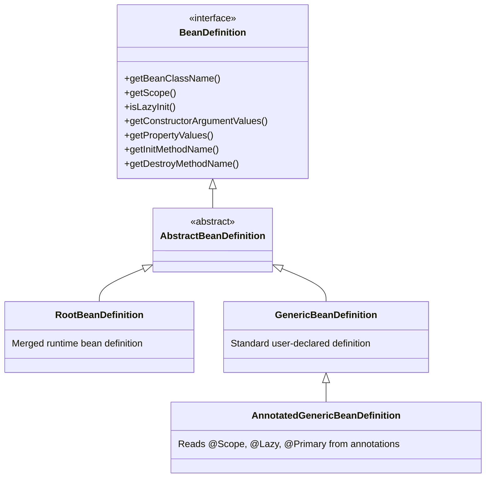

# 03-01: BeanDefinition & The Spring Metadata Registry

> **Module**: `MOD-03: Bean Lifecycle and Configuration`
> **Topic ID**: `SB-03-01`
> **Prerequisites**: `SB-01-04`, `SB-02-01`
> **Primary Technology**: Java 21 LTS | Container Internals | Bean Metadata Architecture
> **Verification Date**: 2026-09-01

---

## 1. Problem
Before Spring can instantiate an object, it must understand its blueprint: What is its class? Is it a singleton or prototype? Is it lazily initialized? What constructor arguments does it require? What initialization and destroy methods are defined?

---

## 2. Why It Exists
Spring decouples **bean configuration metadata** from **actual runtime bean instances** using `org.springframework.beans.factory.config.BeanDefinition`. This abstraction allows Spring to read configuration from multiple sources (Java annotations, XML, YAML, Groovy, or programmatic Java code) and normalize them into a uniform in-memory metadata registry before any instance is created.

---

## 3. Mental Model

```
Source Configuration (@Component, @Bean, XML)
         ↓ (Parsed by ClassPathBeanDefinitionScanner)
   BeanDefinition (Blueprint: Class name, Scope, Lazy init, Factory method)
         ↓ (Registered into BeanDefinitionRegistry)
DefaultListableBeanFactory (The Metadata Warehouse)
         ↓ (Instantiated via Reflection)
    Live Java Object (Bean Instance)
```

---

## 4. Architecture: The BeanDefinition Hierarchy



---

## 5. How Spring Implements It
1. **Scanning**: `ClassPathBeanDefinitionScanner` scans candidate classes matching `@Component` filters.
2. **Registry Storage**: Bean definitions are placed into `BeanDefinitionRegistry` (implemented by `DefaultListableBeanFactory`) stored in a `Map<String, BeanDefinition> beanDefinitionMap`.
3. **BeanFactoryPostProcessor Phase**: Special container extensions (like `PropertySourcesPlaceholderConfigurer` or `ConfigurationClassPostProcessor`) can inspect and mutate `BeanDefinition`s *before* any bean is instantiated.

---

## 6. Minimal Programmatic Example in Java 21
Registering a `BeanDefinition` dynamically without annotations:

```java
package com.spring.interview.lifecycle.definition;

import org.springframework.beans.factory.support.BeanDefinitionBuilder;
import org.springframework.beans.factory.support.DefaultListableBeanFactory;

public class ProgrammaticBeanDefinitionDemo {

    public record DatabaseConfig(String url, int poolSize) {}

    public static void main(String[] args) {
        DefaultListableBeanFactory factory = new DefaultListableBeanFactory();

        // 1. Build BeanDefinition programmatically
        var definition = BeanDefinitionBuilder.genericBeanDefinition(DatabaseConfig.class)
            .addConstructorArgValue("jdbc:postgresql://localhost:5432/orders")
            .addConstructorArgValue(20)
            .setScope("singleton")
            .setLazyInit(false)
            .getBeanDefinition();

        // 2. Register metadata
        factory.registerBeanDefinition("dbConfig", definition);

        // 3. Obtain live instance
        DatabaseConfig config = factory.getBean("dbConfig", DatabaseConfig.class);
        System.out.println("Config URL: " + config.url() + ", Pool: " + config.poolSize());
    }
}
```

---

## 7. Common Mistakes
- **Confusing `BeanFactoryPostProcessor` with `BeanPostProcessor`**:
  - `BeanFactoryPostProcessor` operates on **`BeanDefinition` metadata** before bean creation.
  - `BeanPostProcessor` operates on **live bean instances** after instantiation.

---

## 8. Interview Questions
1. **SDE2**: What is a `BeanDefinition` in Spring?
2. **Senior**: How does `BeanFactoryPostProcessor` differ from `BeanPostProcessor` in the Spring container lifecycle?

---

## 9. Interview Answer (Senior Level)
"`BeanDefinition` is Spring's core metadata interface that encapsulates the full recipe for creating a bean: its target class, scope (singleton/prototype), lazy-initialization flags, constructor argument values, and lifecycle callback names. Spring uses `BeanFactoryPostProcessor` (such as `ConfigurationClassPostProcessor`) to inspect or alter `BeanDefinition`s *before* beans are created. In contrast, `BeanPostProcessor` operates on live object instances *after* instantiation to wrap beans in AOP proxies or execute custom initialization logic."
