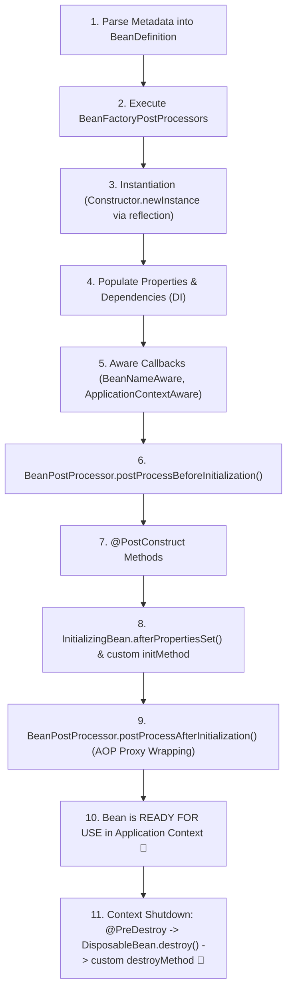

# 03-02: Complete Bean Lifecycle: Instantiation, Callbacks & Destruction

> **Module**: `MOD-03: Bean Lifecycle and Configuration`
> **Topic ID**: `SB-03-02`
> **Prerequisites**: `SB-03-01`
> **Primary Technology**: Java 21 LTS | Container Lifecycle | Lifecycle Callbacks
> **Verification Date**: 2026-09-01

---

## 1. Problem
Understanding the exact sequence in which Spring instantiates, injects, intercepts, initializes, and destroys beans is essential. Executing business logic before dependencies are injected, or before Aware callbacks execute, causes `NullPointerException`s and broken proxy interception.

---

## 2. Why It Exists
Spring provides deterministic lifecycle guarantees: dependencies are guaranteed to be fully populated before initialization callbacks run, and initialization callbacks complete before beans are exposed for public usage.

---

## 3. Architecture: The 11-Step Spring Bean Lifecycle



---

## 4. Lifecycle Callback Hierarchy & Precedence

| Phase | Hook / Callback Mechanism | Source / Type | When It Executes |
|---|---|---|---|
| **Aware** | `BeanNameAware`, `ApplicationContextAware` | Interface | Immediately after property population |
| **BPP Before** | `BeanPostProcessor.postProcessBeforeInitialization()` | Interface | Before any init method |
| **Init 1** | `@PostConstruct` | Jakarta Annotation (`jakarta.annotation`) | First initialization callback |
| **Init 2** | `InitializingBean.afterPropertiesSet()` | Spring Interface | Second initialization callback |
| **Init 3** | `@Bean(initMethod = "init")` | Configuration Method | Third initialization callback |
| **BPP After** | `BeanPostProcessor.postProcessAfterInitialization()` | Interface | Wraps bean in dynamic AOP proxy |
| **Destroy 1** | `@PreDestroy` | Jakarta Annotation | First shutdown callback |
| **Destroy 2** | `DisposableBean.destroy()` | Spring Interface | Second shutdown callback |
| **Destroy 3** | `@Bean(destroyMethod = "cleanup")` | Configuration Method | Third shutdown callback |

---

## 5. Production Example in Java 21
A bean implementing all major lifecycle hooks to demonstrate execution ordering:

```java
package com.spring.interview.lifecycle.demo;

import jakarta.annotation.PostConstruct;
import jakarta.annotation.PreDestroy;
import org.springframework.beans.BeansException;
import org.springframework.beans.factory.BeanNameAware;
import org.springframework.beans.factory.DisposableBean;
import org.springframework.beans.factory.InitializingBean;
import org.springframework.context.ApplicationContext;
import org.springframework.context.ApplicationContextAware;

import java.util.ArrayList;
import java.util.Collections;
import java.util.List;

public class FullLifecycleDemonstrationBean implements
    BeanNameAware,
    ApplicationContextAware,
    InitializingBean,
    DisposableBean {

    private final List<String> lifecycleLog = new ArrayList<>();
    private String beanName;
    private ApplicationContext applicationContext;

    public FullLifecycleDemonstrationBean() {
        lifecycleLog.add("1. CONSTRUCTOR_EXECUTED");
    }

    @Override
    public void setBeanName(String name) {
        this.beanName = name;
        lifecycleLog.add("2. BEAN_NAME_AWARE: " + name);
    }

    @Override
    public void setApplicationContext(ApplicationContext applicationContext) throws BeansException {
        this.applicationContext = applicationContext;
        lifecycleLog.add("3. APPLICATION_CONTEXT_AWARE");
    }

    @PostConstruct
    public void postConstruct() {
        lifecycleLog.add("4. POST_CONSTRUCT_ANNOTATION");
    }

    @Override
    public void afterPropertiesSet() {
        lifecycleLog.add("5. INITIALIZING_BEAN_AFTER_PROPERTIES_SET");
    }

    public void customInitMethod() {
        lifecycleLog.add("6. CUSTOM_INIT_METHOD");
    }

    @PreDestroy
    public void preDestroy() {
        lifecycleLog.add("7. PRE_DESTROY_ANNOTATION");
    }

    @Override
    public void destroy() {
        lifecycleLog.add("8. DISPOSABLE_BEAN_DESTROY");
    }

    public void customDestroyMethod() {
        lifecycleLog.add("9. CUSTOM_DESTROY_METHOD");
    }

    public List<String> getLifecycleLog() {
        return Collections.unmodifiableList(lifecycleLog);
    }
}
```

---

## 6. Common Mistakes
- **Executing database/network calls inside the Constructor**: Dependencies and proxies are not configured yet! Heavy initialization should always happen inside `@PostConstruct` or `InitializingBean`.
- **Assuming Prototype beans execute `@PreDestroy`**: Spring instantiates and configures prototype beans, but **does NOT manage their destruction**; the caller must clean them up.

---

## 7. Interview Questions
1. **SDE2**: What is the execution order of `@PostConstruct`, `afterPropertiesSet()`, and custom `initMethod`?
2. **Senior**: Why does Spring create AOP proxies during the `postProcessAfterInitialization` phase rather than during constructor instantiation?

---

## 8. Interview Answer (Senior Level)
"Spring creates AOP proxies during the `postProcessAfterInitialization()` phase because the target bean must be fully instantiated, its dependencies populated, and its `@PostConstruct` and `InitializingBean` hooks executed before it can be wrapped. Creating the proxy at the end of the lifecycle ensures that the proxy delegates calls to a 100% initialized, fully functional target instance. The initialization order is strictly: 1) `@PostConstruct`, 2) `InitializingBean.afterPropertiesSet()`, and 3) Custom `initMethod`."
