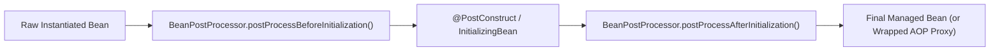

# 03-03: BeanPostProcessor & Custom Bean Interception Mechanics

> **Module**: `MOD-03: Bean Lifecycle and Configuration`
> **Topic ID**: `SB-03-03`
> **Prerequisites**: `SB-03-02`
> **Primary Technology**: Java 21 LTS | Container Extension Points | BeanPostProcessor Architecture
> **Verification Date**: 2026-09-01

---

## 1. Problem
How do enterprise frameworks inject custom behaviors, validate field constraints, or dynamically wrap beans in proxies across an entire application without modifying every individual `@Service` or `@Component` class?

---

## 2. Why It Exists
`org.springframework.beans.factory.config.BeanPostProcessor` is Spring's most powerful container extension point. It defines two callback methods:
1. `postProcessBeforeInitialization(Object bean, String beanName)`: Invoked *before* any initialization callback (`@PostConstruct`).
2. `postProcessAfterInitialization(Object bean, String beanName)`: Invoked *after* all initialization callbacks; returns either the original bean or a dynamic proxy wrapper (e.g. CGLIB or JDK Dynamic Proxy for `@Transactional`, `@Async`, `@Cacheable`).

---

## 3. Architecture: The BeanPostProcessor Interception Pipeline



---

## 4. Built-in Spring BeanPostProcessors
Spring relies heavily on internal `BeanPostProcessor` implementations:
- `CommonAnnotationBeanPostProcessor`: Detects and executes `@PostConstruct` and `@PreDestroy`.
- `AutowiredAnnotationBeanPostProcessor`: Scans and injects `@Autowired` fields and methods.
- `AbstractAutoProxyCreator` (e.g. `AnnotationAwareAspectJAutoProxyCreator`): Scans for `@Aspect`, `@Transactional`, `@Async` and wraps the bean in an AOP proxy.

---

## 5. Production Example in Java 21: Custom Audit Validation BPP
```java
package com.spring.interview.lifecycle.processor;

import org.springframework.beans.BeansException;
import org.springframework.beans.factory.config.BeanPostProcessor;
import org.springframework.stereotype.Component;

import java.lang.annotation.ElementType;
import java.lang.annotation.Retention;
import java.lang.annotation.RetentionPolicy;
import java.lang.annotation.Target;
import java.util.HashSet;
import java.util.Set;

public class CustomValidationBeanPostProcessor implements BeanPostProcessor {

    @Target(ElementType.TYPE)
    @Retention(RetentionPolicy.RUNTIME)
    public @interface AuditValidated {}

    private final Set<String> auditedBeanNames = new HashSet<>();

    @Override
    public Object postProcessBeforeInitialization(Object bean, String beanName) throws BeansException {
        // Inspect annotations before initialization
        if (bean.getClass().isAnnotationPresent(AuditValidated.class)) {
            auditedBeanNames.add(beanName);
        }
        return bean; // Return original bean
    }

    @Override
    public Object postProcessAfterInitialization(Object bean, String beanName) throws BeansException {
        // Can wrap in a proxy or return modified bean
        return bean;
    }

    public boolean isBeanAudited(String beanName) {
        return auditedBeanNames.contains(beanName);
    }
}
```

---

## 6. Common Mistakes
- **Injecting standard `@Autowired` beans directly into a `BeanPostProcessor`**: Because `BeanPostProcessor`s are initialized very early in the container lifecycle, their dependencies are created prematurely, bypassing other subsequent `BeanPostProcessor`s.

---

## 7. Interview Questions
1. **SDE2**: What is the difference between `postProcessBeforeInitialization` and `postProcessAfterInitialization`?
2. **Senior**: How does Spring use `BeanPostProcessor` to implement declarative transactions (`@Transactional`)?

---

## 8. Interview Answer (Senior Level)
"`BeanPostProcessor` is Spring's primary extension hook for intercepting live bean instances. `postProcessBeforeInitialization` runs prior to `@PostConstruct` to populate annotations, whereas `postProcessAfterInitialization` executes after the bean is fully configured. Spring implements declarative transactions (`@Transactional`) via `InfrastructureAdvisorAutoProxyCreator` (a `BeanPostProcessor` subclass): in `postProcessAfterInitialization`, it inspects methods for `@Transactional`, and if found, returns a dynamic CGLIB/JDK proxy that intercepts method invocations with a `TransactionInterceptor`."
