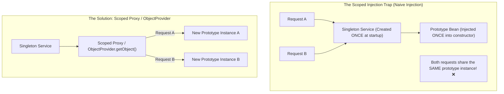

# 03-04: Spring Bean Scopes: Singleton, Prototype & Web Scopes

> **Module**: `MOD-03: Bean Lifecycle and Configuration`
> **Topic ID**: `SB-03-04`
> **Prerequisites**: `SB-03-02`
> **Primary Technology**: Java 21 LTS | Bean Scopes | ScopedProxyMode Architecture
> **Verification Date**: 2026-09-01

---

## 1. Problem
What happens when a **Singleton** bean (created once per `ApplicationContext`) injects a **Prototype** bean (supposed to be created afresh on every request)? The Singleton bean is only initialized once, so the injected Prototype bean is captured at startup and **never recreated again**—violating prototype semantics.

---

## 2. Why It Exists
Spring provides multiple bean scopes tailored for different architectural lifecycles:
1. **`singleton`** (Default): Exactly one shared instance per Spring `ApplicationContext`. Stateless and thread-safe.
2. **`prototype`**: A new instance is created every time the bean is requested from the container (`getBean()`).
3. **`request`**: One instance per HTTP request lifecycle (Web-aware `ApplicationContext` only).
4. **`session`**: One instance per HTTP Session lifecycle.
5. **`application`**: One instance per `ServletContext`.
6. **`websocket`**: One instance per WebSocket session lifecycle.

---

## 3. Architecture: The Singleton-Prototype Injection Dilemma



---

## 4. How to Correctly Inject Prototype Beans into Singletons

### Method 1: `ObjectProvider<T>` (Modern Idiomatic Java 21)
```java
@Service
public class OrderManagerService {
    private final ObjectProvider<ReportGenerator> reportGeneratorProvider;

    public OrderManagerService(ObjectProvider<ReportGenerator> reportGeneratorProvider) {
        this.reportGeneratorProvider = reportGeneratorProvider;
    }

    public void generateReport(String orderId) {
        // getObject() creates a FRESH prototype instance on every invocation!
        ReportGenerator generator = reportGeneratorProvider.getObject();
        generator.buildReport(orderId);
    }
}
```

### Method 2: `@Lookup` Method Injection
```java
@Service
public abstract class ReportManager {
    @Lookup
    public abstract ReportGenerator getReportGenerator();

    public void generate(String id) {
        ReportGenerator generator = getReportGenerator(); // Dynamic CGLIB proxy lookup
        generator.buildReport(id);
    }
}
```

### Method 3: `ScopedProxyMode.TARGET_CLASS`
```java
@Component
@Scope(value = ConfigurableBeanFactory.SCOPE_PROTOTYPE, proxyMode = ScopedProxyMode.TARGET_CLASS)
public class PrototypeStateHolder {
    // A CGLIB proxy is injected into the singleton; delegates to fresh instance on method call
}
```

---

## 5. Lifecycle Matrix Across Scopes

| Scope | Thread Safety Requirement | Spring Manages Instantiation? | Spring Manages Destruction (`@PreDestroy`)? |
|---|---|:---:|:---:|
| **Singleton** | Must be stateless / thread-safe | **Yes** | **Yes** |
| **Prototype** | State can be per-instance | **Yes** | **NO (Client must clean up)** |
| **Request** | Thread-safe per HTTP thread | **Yes** | **Yes** (at end of HTTP request) |
| **Session** | Thread-safe per user session | **Yes** | **Yes** (when session expires) |

---

## 6. Interview Questions
1. **SDE2**: What happens when you inject a `@Scope("prototype")` bean into a `@Scope("singleton")` bean?
2. **Senior**: How does Spring's `ScopedProxyMode.TARGET_CLASS` resolve the mismatch between Singleton and Request/Prototype scopes?

---

## 7. Interview Answer (Senior Level)
"When a Prototype bean is injected directly into a Singleton bean, it is injected only once at container startup, effectively making it behave like a singleton. To solve this, Spring provides three patterns: 1) `ObjectProvider<T>.getObject()` for explicit on-demand resolution, 2) `@Lookup` method injection (where Spring overrides an abstract method at runtime with CGLIB), and 3) `proxyMode = ScopedProxyMode.TARGET_CLASS`, which injects a smart CGLIB proxy that dynamically fetches a fresh scoped target on every method invocation."
