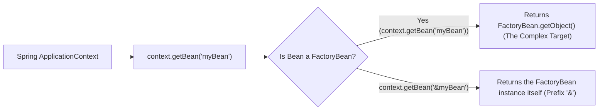

# 03-05: Aware Interfaces, FactoryBean & Application Events

> **Module**: `MOD-03: Bean Lifecycle and Configuration`
> **Topic ID**: `SB-03-05`
> **Prerequisites**: `SB-03-02`, `SB-03-03`
> **Primary Technology**: Java 21 LTS | Aware Interfaces | FactoryBean & Event Broadcasting
> **Verification Date**: 2026-09-01

---

## 1. Problem
How do framework-level beans access container infrastructure (such as current bean name, environment variables, or event dispatchers)? And how do we instantiate complex objects that require multi-step factory construction or custom proxy initialization?

---

## 2. Why It Exists
Spring provides three specialized infrastructure abstractions:
1. **`*Aware` Interfaces**: Callback hooks (e.g. `BeanNameAware`, `ApplicationContextAware`, `EnvironmentAware`) that inject container infrastructure into beans during initialization.
2. **`FactoryBean<T>`**: An SPI for creating complex beans whose instantiation cannot be expressed via a simple `@Bean` method or constructor.
3. **`ApplicationEventPublisher`**: Built-in event bus enabling decoupled synchronous or asynchronous (`@Async`) publish-subscribe messaging within the JVM.

---

## 3. Architecture: FactoryBean vs Regular Bean



---

## 4. Production Example in Java 21

### 1. `FactoryBean<T>` for Complex Client Instantiation
```java
package com.spring.interview.lifecycle.factory;

import org.springframework.beans.factory.FactoryBean;
import org.springframework.stereotype.Component;

public class SecureClientFactoryBean implements FactoryBean<SecureClientFactoryBean.SecureClient> {

    public record SecureClient(String endpoint, String apiKey) {
        public String executeRequest(String payload) {
            return "ENCRYPTED_RESPONSE[" + payload + "]";
        }
    }

    @Override
    public SecureClient getObject() {
        // Complex multi-step initialization (e.g. TLS handshake, key generation)
        return new SecureClient("https://api.secure.internal", "sec-key-9988");
    }

    @Override
    public Class<?> getObjectType() {
        return SecureClient.class;
    }

    @Override
    public boolean isSingleton() {
        return true;
    }
}
```

### 2. Decoupled Event Publishing with `@EventListener`
```java
package com.spring.interview.lifecycle.events;

import org.springframework.context.ApplicationEventPublisher;
import org.springframework.context.event.EventListener;
import org.springframework.stereotype.Component;
import org.springframework.stereotype.Service;

import java.util.ArrayList;
import java.util.Collections;
import java.util.List;

public class OrderEventPublisher {

    public record OrderCreatedEvent(String orderId, double amount) {}

    @Service
    public static class OrderService {
        private final ApplicationEventPublisher eventPublisher;

        public OrderService(ApplicationEventPublisher eventPublisher) {
            this.eventPublisher = eventPublisher;
        }

        public void createOrder(String orderId, double amount) {
            // Decoupled: Emits event instead of tightly calling EmailService/InventoryService
            eventPublisher.publishEvent(new OrderCreatedEvent(orderId, amount));
        }
    }

    @Component
    public static class OrderAuditListener {
        private final List<String> auditLogs = new ArrayList<>();

        @EventListener
        public void handleOrderCreated(OrderCreatedEvent event) {
            auditLogs.add("AUDIT_LOG: Order " + event.orderId() + " created with amount $" + event.amount());
        }

        public List<String> getAuditLogs() {
            return Collections.unmodifiableList(auditLogs);
        }
    }
}
```

---

## 5. Common Mistakes
- **Requesting the `FactoryBean` without `&` prefix**: Calling `context.getBean("myFactoryBean")` returns the object created by `getObject()`. To get the `FactoryBean` instance itself, you must prefix with `&`: `context.getBean("&myFactoryBean")`.

---

## 6. Interview Questions
1. **SDE2**: What is the purpose of `FactoryBean<T>` in Spring?
2. **Senior**: How do you publish and consume in-memory domain events in Spring Boot, and are `@EventListener` methods synchronous or asynchronous by default?

---

## 7. Interview Answer (Senior Level)
"`FactoryBean<T>` is a programmatic interface for encapsulating complex bean creation logic (such as constructing JNDI connections, cryptographic clients, or dynamic proxies) where standard reflection instantiation is insufficient. When requesting the bean name, Spring returns `getObject()`; prefixing the name with `&` returns the factory itself. Spring's `ApplicationEventPublisher` provides in-memory publish-subscribe domain events. By default, `@EventListener` methods execute **synchronously** in the publisher's thread within the same transaction boundary; adding `@Async` allows non-blocking execution in a separate task executor."
