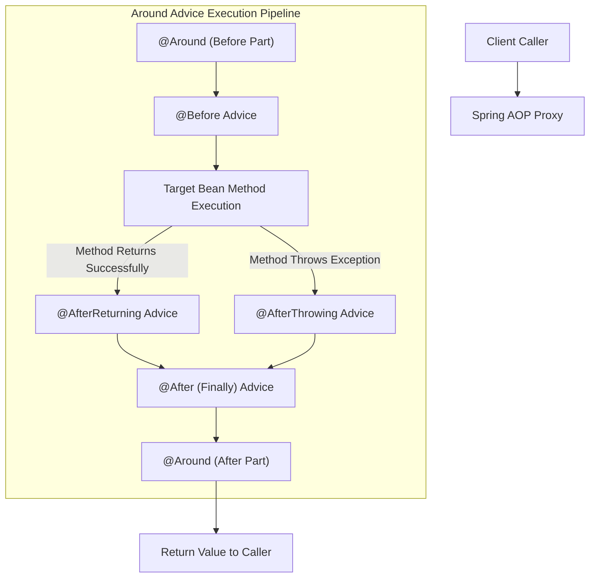

# 04-01: Spring AOP Core Concepts: Join Points, Pointcuts & Advice Types

> **Module**: `MOD-04: Spring AOP`
> **Topic ID**: `SB-04-01`
> **Prerequisites**: `SB-03-03`
> **Primary Technology**: Java 21 LTS | Aspect-Oriented Programming | AspectJ Syntax
> **Verification Date**: 2026-09-01

---

## 1. Problem
Cross-cutting concerns (logging, transaction management, method latency tracking, security authorization) clutter business services with repetitive boilerplate code, violating the Single Responsibility and DRY principles.

---

## 2. Why It Exists
**Aspect-Oriented Programming (AOP)** modularizes cross-cutting concerns into standalone classes called **Aspects**. Instead of hardcoding audit logging into 100 service methods, an Aspect intercepts method executions declaratively based on matching expressions.

---

## 3. Mental Model & AOP Vocabulary

```
Aspect        == The modular class encapsulating the cross-cutting concern (e.g. AuditAspect)
Join Point    == A specific execution point in the program (In Spring AOP: strictly METHOD INVOCATIONS)
Pointcut      == The predicate expression matching which Join Points to intercept (e.g. execution(* com.service.*.*(..)))
Advice        == The action taken at a join point (@Before, @After, @Around, @AfterReturning, @AfterThrowing)
Target Object == The actual business object being intercepted (e.g. OrderServiceImpl)
AOP Proxy     == The wrapper generated by Spring (CGLIB or JDK Dynamic Proxy) intercepting caller calls
Weaving       == Linking aspects with target objects (Spring AOP performs runtime proxy weaving)
```

---

## 4. Architecture: Advice Types Execution Flow



---

## 5. The 5 Advice Types in Spring

| Advice Type | Annotation | When It Runs | Can Modify Return Value? | Can Swallow Exceptions? |
|---|---|---|:---:|:---:|
| **Before** | `@Before` | Before target method executes | No | No |
| **After Returning** | `@AfterReturning` | After target method returns normally | Yes (via return binding) | No |
| **After Throwing** | `@AfterThrowing` | If target method throws exception | No | No |
| **After (Finally)** | `@After` | Runs unconditionally after return/throw | No | No |
| **Around** | `@Around` | Wraps the entire method invocation | **YES (Full control via ProceedingJoinPoint)** | **YES** |

---

## 6. Minimal Example in Java 21
```java
package com.spring.interview.aop.aspects;

import org.aspectj.lang.JoinPoint;
import org.aspectj.lang.ProceedingJoinPoint;
import org.aspectj.lang.annotation.*;
import org.springframework.stereotype.Component;

@Aspect
@Component
public class LoggingAspect {

    // Pointcut matching all methods in service package
    @Pointcut("within(com.spring.interview..*Service)")
    public void serviceLayerMethods() {}

    @Before("serviceLayerMethods()")
    public void logBefore(JoinPoint joinPoint) {
        System.out.println("[BEFORE] Calling method: " + joinPoint.getSignature().toShortString());
    }

    @Around("serviceLayerMethods()")
    public Object profileMethod(ProceedingJoinPoint pjp) throws Throwable {
        long start = System.nanoTime();
        try {
            return pjp.proceed(); // Proceed with target method
        } finally {
            long durationMs = (System.nanoTime() - start) / 1_000_000;
            System.out.println("[PROFILE] " + pjp.getSignature().getName() + " took " + durationMs + "ms");
        }
    }
}
```

---

## 7. Common Mistakes
- **Forgetting `pjp.proceed()` inside `@Around`**: Causes the target method to never execute, silently returning `null`.
- **Expecting Spring AOP to intercept field access or constructors**: Spring AOP is strictly method-execution based. Intercepting field access requires full AspectJ compile-time or load-time weaving (LTW).

---

## 8. Interview Questions
1. **SDE2**: What is the difference between `@Around` and `@Before` advice?
2. **Senior**: What are the limitations of Spring AOP compared to full AspectJ?

---

## 9. Interview Answer (Senior Level)
"Spring AOP is a lightweight, proxy-based AOP framework. It operates exclusively at the **method execution join point** level by generating dynamic proxies (CGLIB or JDK dynamic proxies) at runtime around Spring-managed beans. It cannot intercept private methods, final methods, constructors, or field access. In contrast, full AspectJ uses bytecode weaving (compile-time, post-compile, or load-time weaving) to support all join points including field mutations and direct `new` object instantiations without requiring proxy wrappers."
