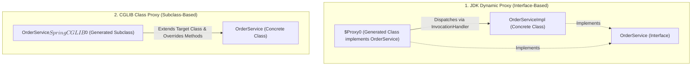

# 04-02: JDK Dynamic Proxies vs CGLIB / ByteBuddy: Bytecode Internals

> **Module**: `MOD-04: Spring AOP`
> **Topic ID**: `SB-04-02`
> **Prerequisites**: `SB-04-01`
> **Primary Technology**: Java 21 LTS | Proxy Generation | CGLIB vs JDK Dynamic Proxy
> **Verification Date**: 2026-09-01

---

## 1. Problem
How does Spring transparently intercept method calls without altering source code? And why did Spring Boot switch its default proxying strategy from JDK Dynamic Proxies to CGLIB class proxies?

---

## 2. Why It Exists
Spring generates proxies using two primary mechanisms:
1. **JDK Dynamic Proxy (`java.lang.reflect.Proxy`)**: Built into the JDK runtime. Requires the target class to implement at least one **interface**. Generates a proxy class implementing the interface and dispatching calls via `InvocationHandler`.
2. **CGLIB / ByteBuddy Proxy (`org.springframework.cglib.proxy.Enhancer`)**: Generates a **subclass** of the target class at runtime and overrides methods via `MethodInterceptor`. Does NOT require interfaces.

---

## 3. Architecture: JDK Proxy vs CGLIB Proxy



---

## 4. Why Spring Boot Defaults to CGLIB (`proxyTargetClass=true`)
In traditional Spring, if a class implemented an interface (e.g. `OrderServiceImpl implements OrderService`), Spring created a JDK proxy. If a developer wrote:

```java
@Autowired
private OrderServiceImpl orderService; // Injects by concrete class type!
```

Spring threw `BeanNotOfRequiredTypeException` because the JDK proxy `$Proxy0` implemented `OrderService` but did **NOT** extend `OrderServiceImpl`.

To eliminate this friction and enable seamless concrete class injection across all `@Service` beans, Spring Boot (starting in Boot 2.0) set `spring.aop.proxy-target-class=true` by default.

---

## 5. Detailed Technical Comparison

| Dimension | JDK Dynamic Proxy | CGLIB / ByteBuddy Proxy |
|---|---|---|
| **Mechanism** | `java.lang.reflect.Proxy` | Dynamic bytecode class generation (subclassing) |
| **Interface Requirement** | **Strictly required** | No interface required |
| **Final Class Support** | Works (class itself not subclassed) | **Fails** (`final` classes cannot be subclassed) |
| **Final Method Support** | Works | **Bypassed** (`final` methods cannot be overridden) |
| **Constructor Execution** | Target constructor runs once | **Target constructor runs twice** (once for target, once for subclass) |
| **Spring Boot Default** | Disabled (`false`) | **Enabled (`true`)** |

---

## 6. Common Mistakes
- **Marking `@Transactional` or `@Service` classes/methods as `final`**: CGLIB cannot subclass final classes or override final methods; Spring AOP will silently fail to intercept them or throw initialization errors.

---

## 7. Interview Questions
1. **SDE2**: What is the key difference between JDK Dynamic Proxies and CGLIB proxies?
2. **Senior**: Why does Spring Boot enable `proxyTargetClass=true` by default, and what happens if a proxied method is declared `final`?

---

## 8. Interview Answer (Senior Level)
"JDK Dynamic Proxies generate proxy classes at runtime that implement the target's interfaces and route calls through an `InvocationHandler`. CGLIB generates a dynamic subclass of the target concrete class at runtime and overrides non-final methods using a `MethodInterceptor`. Spring Boot defaults to `proxyTargetClass=true` (CGLIB) so that beans can be injected by their concrete class type without encountering `BeanNotOfRequiredTypeException`. If a class or method is declared `final`, CGLIB cannot override it, causing AOP aspects (transactions, caching, security) to be silently bypassed."
