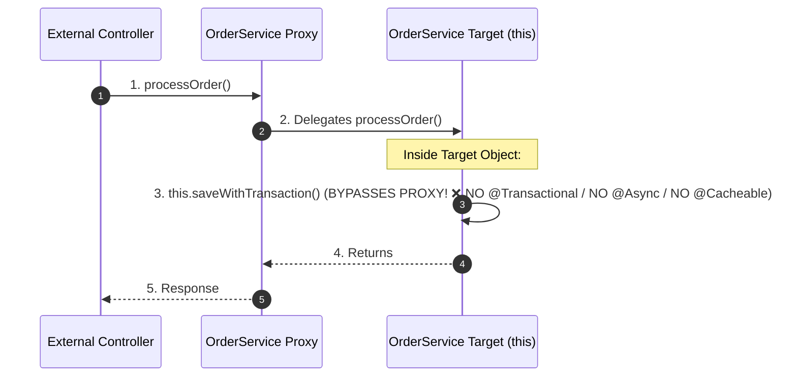

# 04-03: The Self-Invocation Trap & Proxy Boundaries in Spring AOP

> **Module**: `MOD-04: Spring AOP`
> **Topic ID**: `SB-04-03`
> **Prerequisites**: `SB-04-02`
> **Primary Technology**: Java 21 LTS | Proxy Boundary Mechanics | Critical Interview Trap
> **Verification Date**: 2026-09-01

---

## 1. Problem
Consider the following service:

```java
@Service
public class OrderService {

    public void processOrder(String orderId) {
        // Calling another method inside the same class!
        this.saveWithTransaction(orderId);
    }

    @Transactional(propagation = Propagation.REQUIRES_NEW)
    public void saveWithTransaction(String orderId) {
        // Saves to database
    }
}
```

When an external caller invokes `processOrder("123")`, **NO TRANSACTION IS STARTED** when `saveWithTransaction()` executes! Why?

---

## 2. Why It Exists: The Proxy Boundary Principle
Spring AOP is strictly **Proxy-Based**.
- When an external bean calls `orderService.processOrder()`, the call hits the **Spring AOP Proxy**.
- Inside `processOrder()`, calling `this.saveWithTransaction()` resolves to the raw `this` Java object reference.
- The call **never leaves the JVM object boundary**; it completely bypasses the outer Spring AOP Proxy!

---

## 3. Architecture: The Self-Invocation Bypass



---

## 4. The 4 Production Solutions

### Solution 1: Architectural Refactoring (Best Practice - Clean Architecture)
Move the transactional/cached/async method into a separate collaborator service (`OrderPersistenceService`) and inject it.

```java
@Service
public class OrderService {
    private final OrderPersistenceService persistenceService;

    public OrderService(OrderPersistenceService persistenceService) {
        this.persistenceService = persistenceService;
    }

    public void processOrder(String orderId) {
        // Calls external bean -> Hits Spring AOP Proxy! ✅
        persistenceService.saveWithTransaction(orderId);
    }
}
```

### Solution 2: Self-Injection with `@Lazy`
Inject the proxy of the class into itself.

```java
@Service
public class OrderService {
    private OrderService self;

    @Autowired
    public void setSelf(@Lazy OrderService self) {
        this.self = self;
    }

    public void processOrder(String orderId) {
        self.saveWithTransaction(orderId); // Hits proxy! ✅
    }

    @Transactional
    public void saveWithTransaction(String id) {}
}
```

### Solution 3: `AopContext.currentProxy()`
Requires `@EnableAspectJAutoProxy(exposeProxy = true)`.

```java
public void processOrder(String orderId) {
    ((OrderService) AopContext.currentProxy()).saveWithTransaction(orderId); // Hits proxy! ✅
}
```

### Solution 4: Programmatic Templates (`TransactionTemplate`)
Bypass annotations completely using programmatic templates.

```java
@Service
public class OrderService {
    private final TransactionTemplate transactionTemplate;

    public OrderService(TransactionTemplate transactionTemplate) {
        this.transactionTemplate = transactionTemplate;
    }

    public void processOrder(String orderId) {
        transactionTemplate.executeWithoutResult(status -> {
            // Executes in transaction safely without proxy dependency! ✅
        });
    }
}
```

---

## 5. Common Mistakes
- **Assuming `@Async`, `@Transactional`, `@Cacheable`, or `@PreAuthorize` work during internal method calls**: They all rely on the same proxy interception mechanism and will fail silently during internal `this` calls.

---

## 6. Interview Questions
1. **SDE2**: Why does calling a `@Transactional` method from within the same class fail to start a transaction?
2. **Senior**: How do you architecturally defend against self-invocation issues across a team of 30+ engineers?

---

## 7. Interview Answer (Senior Level)
"Spring AOP is proxy-based. When an external caller invokes a bean, it invokes the generated AOP proxy wrapper, which executes interceptors (like `TransactionInterceptor`) before delegating to the target instance. When a method calls another method inside the same class using `this.method()`, the call executes directly on the target instance in JVM memory without passing through the proxy boundary, completely bypassing `@Transactional`, `@Cacheable`, and `@Async`. The senior architectural solution is to decompose responsibilities: extract transactional or cached operations into dedicated collaborator services or use `TransactionTemplate` programmatic boundaries."
