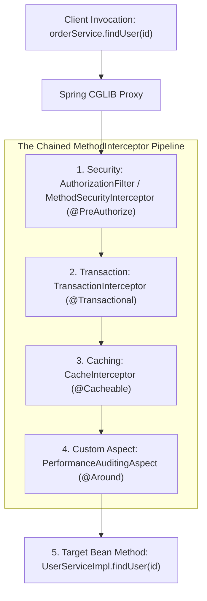

# 04-05: Connecting AOP to Transactions, Security & Caching

> **Module**: `MOD-04: Spring AOP`
> **Topic ID**: `SB-04-05`
> **Prerequisites**: `SB-04-01`, `SB-04-02`, `SB-04-03`
> **Primary Technology**: Java 21 LTS | AOP Advisors | Interceptor Chain Architecture
> **Verification Date**: 2026-09-01

---

## 1. Problem
Understanding that `@Transactional`, `@PreAuthorize`, `@Cacheable`, and `@Async` are **NOT** built-in Java compiler keywords, but rather **standard AOP pointcut triggers** operating inside a shared interceptor chain.

---

## 2. Why It Exists
Spring unifies enterprise services through the **Advisor** and **MethodInterceptor** pattern. When a method has multiple annotations (e.g. `@Transactional` and `@Cacheable`), Spring chains their interceptors in a deterministic order.

---

## 3. Architecture: The Multi-Advisor Proxy Pipeline

---

## 4. How Spring Implements the Interceptor Pipeline
1. `BeanFactoryTransactionAttributeSourceAdvisor` attaches `TransactionInterceptor`.
2. `BeanFactoryCacheOperationSourceAdvisor` attaches `CacheInterceptor`.
3. `AuthorizationMethodInterceptor` attaches security evaluation.
4. Ordering is controlled by the `@Order` annotation on the advisor or configuration.

---

## 5. Common Mistakes
- **Assuming `@Cacheable` runs inside the `@Transactional` boundary**: If caching advice runs before transaction advice, a cache hit returns immediately without opening a database transaction (which is usually desired for performance, but critical to understand).

---

## 6. Interview Questions
1. **SDE2**: How does Spring execute multiple annotations on the same method (e.g. `@Transactional` and `@Async`)?
2. **Senior**: What happens if `@Async` and `@Transactional` are placed on the same method?

---

## 7. Interview Answer (Senior Level)
"Spring executes multiple annotations on a method by chaining `MethodInterceptor`s inside an AOP proxy pipeline according to their `@Order` precedence. Placing `@Async` and `@Transactional` on the same method is a dangerous trap: `@Async` spawns a new thread in a background `TaskExecutor`, meaning the asynchronous method executes in a completely separate thread with a separate `ThreadLocal` context. The transaction context is not propagated across the thread boundary, meaning any transactional state or rollback from the caller thread will not apply to the async task."
