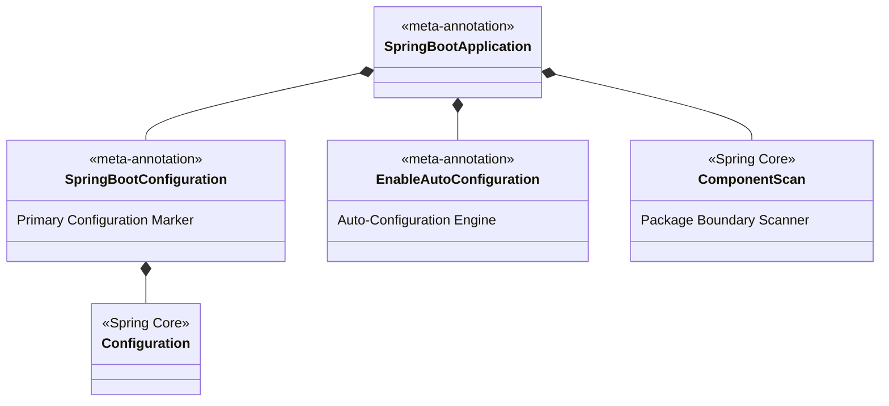

# 05-01: @SpringBootApplication Meta-Annotation Decomposition

> **Module**: `MOD-05: Spring Boot Fundamentals`
> **Topic ID**: `SB-05-01`
> **Prerequisites**: `SB-01-02`, `SB-02-02`
> **Primary Technology**: Java 21 LTS | Meta-Annotations | Component Scanning Boundaries
> **Verification Date**: 2026-09-01

---

## 1. Problem
Senior engineers frequently encounter classpath scanning issues, missing bean registrations, or conflicting auto-configurations because they treat `@SpringBootApplication` as a single magic annotation without understanding its internal composability.

---

## 2. Why It Exists
`@SpringBootApplication` is a **composite meta-annotation** that bundles three foundational Spring Framework annotations into one unified entrypoint:
1. **`@SpringBootConfiguration`**: A specialization of `@Configuration` indicating that the class declares `@Bean` methods and serves as the primary configuration source.
2. **`@EnableAutoConfiguration`**: Enables Spring Boot's opinionated auto-configuration discovery mechanism (`AutoConfiguration.imports`).
3. **`@ComponentScan`**: Enables automated classpath scanning for `@Component`, `@Service`, `@Repository`, and `@Controller` classes rooted at the declaring package.

---

## 3. Architecture: Annotation Decomposition Hierarchy



---

## 4. How Package Scanning Boundaries Work
By default, `@ComponentScan` with no explicit `basePackages` scans **the package of the annotated class and all of its sub-packages**.

```
com.example.app (Contains @SpringBootApplication main class)
  ├── com.example.app.service     --> SCANNED AUTOMATICALLY ✅
  ├── com.example.app.repository  --> SCANNED AUTOMATICALLY ✅
  └── com.other.outside.service   --> IGNORED / NOT SCANNED! ❌ (Throws NoSuchBeanDefinitionException)
```

---

## 5. Selective Exclusion
Spring Boot allows fine-grained disabling of specific auto-configurations:

```java
@SpringBootApplication(exclude = {
    DataSourceAutoConfiguration.class,
    SecurityAutoConfiguration.class
})
public class LightweightMicroserviceApplication {
    public static void main(String[] args) {
        SpringApplication.run(LightweightMicroserviceApplication.class, args);
    }
}
```

---

## 6. Common Mistakes
- **Placing the `@SpringBootApplication` class in the `default` package (empty package)**: Causes Spring to scan every class on the entire classpath, severely degrading startup performance.
- **Placing domain services outside the root package hierarchy**: Forgetting that `@ComponentScan` is root-package relative.

---

## 7. Interview Questions
1. **SDE2**: What three core annotations compose `@SpringBootApplication`?
2. **Senior**: How does `@SpringBootConfiguration` differ from standard `@Configuration`?

---

## 8. Interview Answer (Senior Level)
"`@SpringBootApplication` is a composite meta-annotation composed of: 1) `@SpringBootConfiguration` (a specialized `@Configuration` that enables Spring Boot test slice discovery like `@SpringBootTest`), 2) `@EnableAutoConfiguration` (which triggers conditional auto-configuration discovery via `AutoConfiguration.imports`), and 3) `@ComponentScan` (which scans the declaring class's package and sub-packages for stereotypes). `@SpringBootConfiguration` differs from standard `@Configuration` because it indicates the single unique primary configuration class for the application, which testing frameworks locate automatically."
