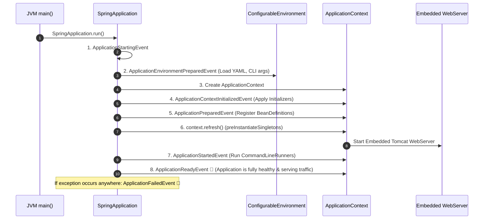

# 05-02: SpringApplication Bootstrap & The 7 Startup Lifecycle Events

> **Module**: `MOD-05: Spring Boot Fundamentals`
> **Topic ID**: `SB-05-02`
> **Prerequisites**: `SB-05-01`
> **Primary Technology**: Java 21 LTS | Startup Sequence | SpringApplicationRunListener
> **Verification Date**: 2026-09-01

---

## 1. Problem
Understanding exactly what happens when `SpringApplication.run(Application.class, args)` is executed in `main()`, how the `Environment` is prepared, when the `ApplicationContext` is refreshed, and how to hook into startup events.

---

## 2. Why It Exists
Spring Boot provides a deterministic, phased bootstrap lifecycle managed by `SpringApplication` and published via `SpringApplicationRunListener`.

---

## 3. Architecture: The 7 Phased Startup Events



---

## 4. The 7 Core SpringApplication Events

| Event | When It Fires | What Is Available? |
|---|---|---|
| **`ApplicationStartingEvent`** | Immediately at the start of `run()` | Listeners & initializers only (No Environment or Context yet) |
| **`ApplicationEnvironmentPreparedEvent`** | Once properties, profiles & YAML are parsed | `ConfigurableEnvironment` is ready |
| **`ApplicationContextInitializedEvent`** | After context created, before bean definitions loaded | `ApplicationContextInitializer`s execute |
| **`ApplicationPreparedEvent`** | After bean definitions loaded, before beans created | `BeanDefinition` metadata warehouse ready |
| **`ApplicationStartedEvent`** | Context refreshed & web server started | Beans are ready, `CommandLineRunner`s execute |
| **`ApplicationReadyEvent`** | Application is fully ready to accept user traffic | Everything ready (ideal for cache warm-up) |
| **`ApplicationFailedEvent`** | If any unhandled exception crashes startup | `FailureAnalyzer` diagnostics available |

---

## 5. Production Example: Startup Event Listener in Java 21
```java
package com.spring.interview.boot.lifecycle;

import org.springframework.boot.context.event.ApplicationReadyEvent;
import org.springframework.boot.context.event.ApplicationStartedEvent;
import org.springframework.context.event.EventListener;
import org.springframework.stereotype.Component;

import java.util.ArrayList;
import java.util.Collections;
import java.util.List;

@Component
public class StartupLifecycleEventListener {

    private final List<String> capturedEvents = new ArrayList<>();

    @EventListener
    public void onApplicationStarted(ApplicationStartedEvent event) {
        capturedEvents.add("APPLICATION_STARTED");
    }

    @EventListener
    public void onApplicationReady(ApplicationReadyEvent event) {
        capturedEvents.add("APPLICATION_READY");
        // Ideal hook for pre-warming read caches or health checks!
    }

    public List<String> getCapturedEvents() {
        return Collections.unmodifiableList(capturedEvents);
    }
}
```

---

## 6. Common Mistakes
- **Running heavy synchronous tasks in `ApplicationStartingEvent`**: Blocks the bootstrap thread before logging or environment configurations are active.

---

## 7. Interview Questions
1. **SDE2**: What is the difference between `CommandLineRunner` and `ApplicationRunner`?
2. **Senior**: At what point in the startup lifecycle is the embedded Tomcat web server started?

---

## 8. Interview Answer (Senior Level)
"During `SpringApplication.run()`, Spring Boot loads the environment, creates the `ApplicationContext`, and registers bean definitions. The embedded Tomcat web server is created and started during the `context.refresh()` phase—specifically inside the `onRefresh()` method of `ServletWebServerApplicationContext`. Once the web server is bound to its port and the context refresh is complete, `ApplicationStartedEvent` fires, followed by `CommandLineRunner`/`ApplicationRunner` execution, and finally `ApplicationReadyEvent` signaling readiness."
