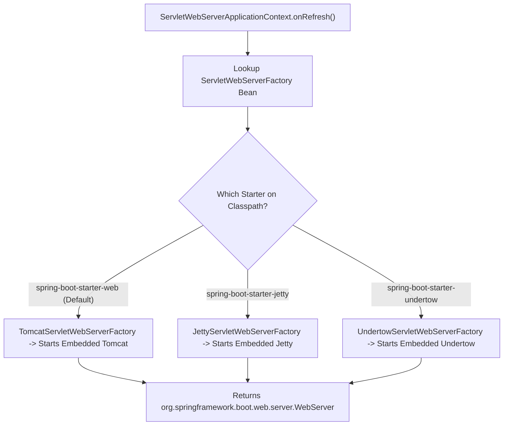

# 05-03: Embedded Servlet Containers: Tomcat, Jetty & Undertow

> **Module**: `MOD-05: Spring Boot Fundamentals`
> **Topic ID**: `SB-05-03`
> **Prerequisites**: `SB-05-02`
> **Primary Technology**: Java 21 LTS | Embedded Servers | WebServerFactory Architecture
> **Verification Date**: 2026-09-01

---

## 1. Problem
Traditional Java EE required packaging applications as WARs/EARs and deploying them into external application servers. This created environment drift between local development and production, complicated Docker containerization, and slowed down CI/CD pipelines.

---

## 2. Why It Exists
Spring Boot inverts the relationship: **The application contains the server, rather than the server containing the application**. Spring Boot bundles the servlet container (Tomcat by default) directly inside the executable Fat JAR via embedded libraries (`org.apache.tomcat.embed:tomcat-embed-core`).

---

## 3. Architecture: WebServerFactory Abstraction



---

## 4. Comparing Embedded Containers

| Container | Default In | Architecture | Virtual Threads Support (Java 21) | Best Use Case |
|---|:---:|---|:---:|---|
| **Apache Tomcat** | **`spring-boot-starter-web`** | NIO Thread Pool | **Fully Supported (`spring.threads.virtual.enabled=true`)** | **Universal enterprise standard** |
| **Eclipse Jetty** | Alternate starter | Non-blocking NIO | Fully Supported | Lightweight footprint, WebSockets |
| **Red Hat Undertow**| Alternate starter | XNIO / Async non-blocking | Fully Supported | High raw concurrent throughput |

---

## 5. Swapping to Jetty or Undertow in `pom.xml`
```xml
<dependency>
    <groupId>org.springframework.boot</groupId>
    <artifactId>spring-boot-starter-web</artifactId>
    <exclusions>
        <exclusion>
            <groupId>org.springframework.boot</groupId>
            <artifactId>spring-boot-starter-tomcat</artifactId>
        </exclusion>
    </exclusions>
</dependency>
<dependency>
    <groupId>org.springframework.boot</groupId>
    <artifactId>spring-boot-starter-undertow</artifactId>
</dependency>
```

---

## 6. Enabling Virtual Threads in Spring Boot 3.4+
In `application.properties`:
```properties
spring.threads.virtual.enabled=true
```
When enabled, Spring Boot configures Tomcat to dispatch incoming HTTP requests using Java 21 **Virtual Threads** (`Thread.ofVirtual()`), handling tens of thousands of concurrent blocking I/O requests without thread pool exhaustion.

---

## 7. Common Mistakes
- **Deploying a WAR with embedded server code to external legacy Tomcat**: Requires extending `SpringBootServletInitializer`.

---

## 8. Interview Questions
1. **SDE2**: How does Spring Boot start an embedded web server without an external container?
2. **Senior**: How does enabling Java 21 Virtual Threads (`spring.threads.virtual.enabled=true`) change Tomcat request processing in Spring Boot 3.4?

---

## 9. Interview Answer (Senior Level)
"Spring Boot starts an embedded container through the `ServletWebServerFactory` abstraction. During `ServletWebServerApplicationContext.onRefresh()`, Spring detects the factory bean (such as `TomcatServletWebServerFactory`), creates a programmatic `Tomcat` instance, binds the `DispatcherServlet`, and starts the connector on the configured port. In Spring Boot 3.4 with `spring.threads.virtual.enabled=true`, Tomcat replaces its traditional fixed platform thread pool (default 200 threads) with a Virtual Thread executor (`Executors.newVirtualThreadPerTaskExecutor()`). Every incoming HTTP request is processed on an ephemeral virtual thread, eliminating thread starvation on blocking I/O calls."
