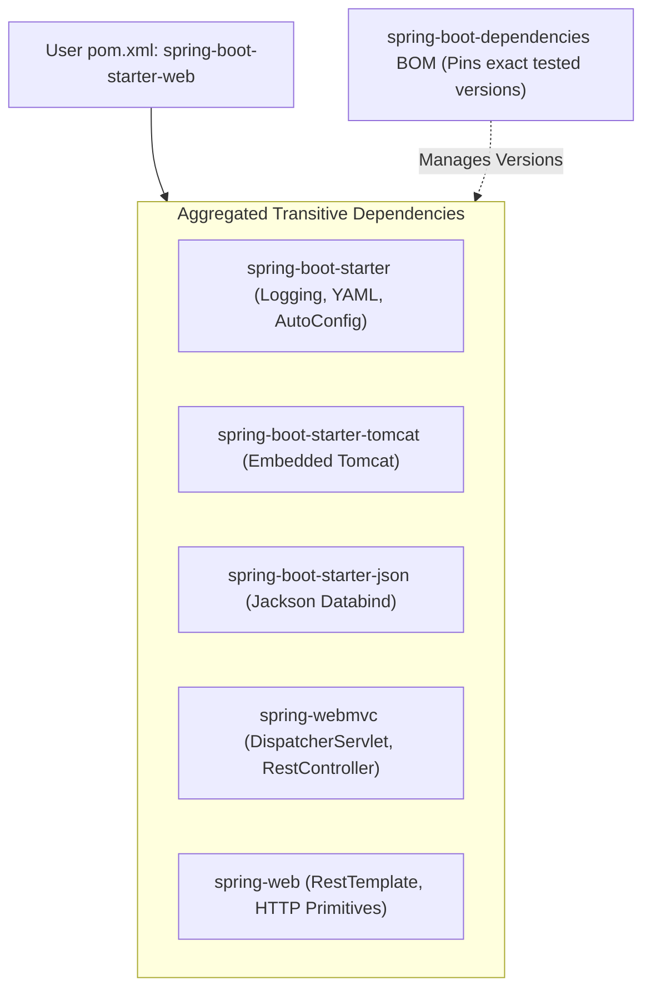

# 05-04: Starter Dependencies & Dependency Management BOMs

> **Module**: `MOD-05: Spring Boot Fundamentals`
> **Topic ID**: `SB-05-04`
> **Prerequisites**: `SB-05-01`
> **Primary Technology**: Java 21 LTS | Maven Architecture | Spring Boot Starters
> **Verification Date**: 2026-09-01

---

## 1. Problem
Managing dozens of individual Maven library versions (Jackson, Hibernate, HikariCP, Tomcat, Logback, Spring Core) leads to **Dependency Hell**: version mismatches, `NoSuchMethodError`s, and conflicting transitive dependencies.

---

## 2. Why It Exists
Spring Boot solves this through two complementary Maven architectural patterns:
1. **Bill of Materials (BOM)** (`spring-boot-dependencies`): A curated `<dependencyManagement>` file pinning tested, compatible versions for 200+ enterprise libraries.
2. **Starter Dependencies** (`spring-boot-starter-*`): Aggregate descriptor artifacts containing pre-configured transitive dependencies needed for a specific capability.

---

## 3. Architecture: Starter Composition Tree



---

## 4. How to Properly Override a Managed Dependency Version
In `pom.xml`, override the corresponding version property:

```xml
<properties>
    <java.version>21</java.version>
    <!-- Override Jackson or Flyway version safely -->
    <flyway.version>10.20.1</flyway.version>
</properties>
```

---

## 5. Common Mistakes
- **Explicitly adding `<version>` tags to dependencies managed by Spring Boot**: Bypasses the curated BOM and reintroduces version incompatibility risks.

---

## 6. Interview Questions
1. **SDE2**: What is the purpose of `spring-boot-starter` dependencies?
2. **Senior**: How does `spring-boot-dependencies` BOM prevent dependency version conflicts across microservices?

---

## 7. Interview Answer (Senior Level)
"Spring Boot starter dependencies are aggregate POM descriptors that bundle all necessary libraries for a specific feature (e.g. `spring-boot-starter-data-jpa` bundles Hibernate, HikariCP, Spring ORM, and Spring Data repositories). They work in tandem with the `spring-boot-dependencies` BOM imported in `<dependencyManagement>`. The BOM pins compatible versions for over 200 common Java libraries, allowing developers to omit `<version>` tags from child dependencies and guaranteeing binary compatibility across all transitive dependencies."
