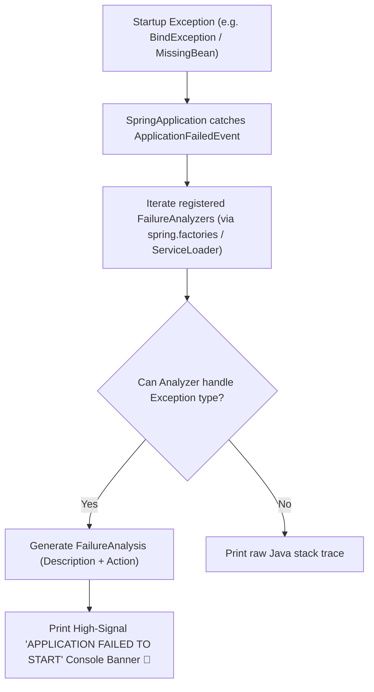

# 05-05: Startup Diagnostics & Custom FailureAnalyzer Implementation

> **Module**: `MOD-05: Spring Boot Fundamentals`
> **Topic ID**: `SB-05-05`
> **Prerequisites**: `SB-05-02`
> **Primary Technology**: Java 21 LTS | Diagnostics SPI | FailureAnalysis Architecture
> **Verification Date**: 2026-09-01

---

## 1. Problem
When a Spring Boot application crashes during startup (e.g. `PortInUseException`, `NoSuchBeanDefinitionException`, `UnsatisfiedDependencyException`), standard Java raw stack traces span 500+ lines, making root-cause identification slow and frustrating.

---

## 2. Why It Exists
Spring Boot provides the **`FailureAnalyzer` SPI** (`org.springframework.boot.diagnostics.FailureAnalyzer`). When an exception crashes `SpringApplication.run()`, Spring Boot intercepts it and formats a clean, human-readable **APPLICATION FAILED TO START** diagnostic block complete with:
1. **Description**: Clear statement of the root failure.
2. **Action**: Actionable steps to resolve the error.

---

## 3. Architecture: FailureAnalyzer Execution Flow



---

## 4. Production Example in Java 21: Custom Port Conflict Analyzer
```java
package com.spring.interview.boot.diagnostics;

import org.springframework.boot.diagnostics.AbstractFailureAnalyzer;
import org.springframework.boot.diagnostics.FailureAnalysis;

import java.net.BindException;

public class CustomPortConflictFailureAnalyzer extends AbstractFailureAnalyzer<BindException> {

    @Override
    protected FailureAnalysis analyze(Throwable rootFailure, BindException cause) {
        String description = "Embedded Web Server failed to bind to its configured TCP port: " + cause.getMessage();
        String action = """
            Remediation Steps:
            1. Verify if another process is occupying the port (e.g. run 'lsof -i :8080' or 'netstat -ano').
            2. Configure a different port in application.properties via 'server.port=8081'.
            3. Set 'server.port=0' to assign an ephemeral random available port in test environments.
            """;

        return new FailureAnalysis(description, action, cause);
    }
}
```

---

## 5. Registering in `META-INF/spring.factories`
```properties
org.springframework.boot.diagnostics.FailureAnalyzer=\
com.spring.interview.boot.diagnostics.CustomPortConflictFailureAnalyzer
```

---

## 6. Common Mistakes
- **Relying solely on default Java console stack traces**: Missing the concise, actionable summary printed at the bottom of the startup log.

---

## 7. Interview Questions
1. **SDE2**: What is a `FailureAnalyzer` in Spring Boot?
2. **Senior**: How do you implement a custom `FailureAnalyzer` for proprietary microservice infrastructure failures?

---

## 8. Interview Answer (Senior Level)
"`FailureAnalyzer` is Spring Boot's diagnostic SPI for converting raw startup exceptions into structured, actionable problem reports. By extending `AbstractFailureAnalyzer<T>`, an engineer can intercept specific failure types (such as custom vault authentication errors or missing configuration properties) and return a `FailureAnalysis` containing a clear description and remediation action. Custom analyzers are registered in `META-INF/spring.factories` or via standard Java `ServiceLoader`, providing developers and DevOps teams with instant troubleshooting guidance during startup failures."
