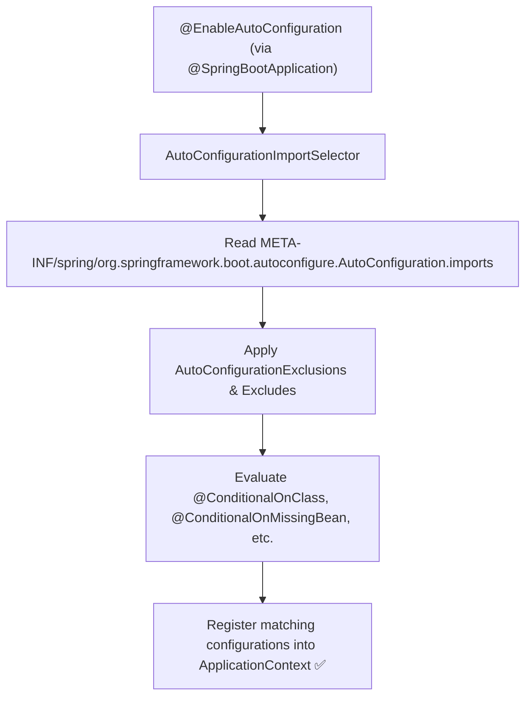

# 06-01: Auto-Configuration Discovery: AutoConfiguration.imports vs spring.factories

> **Module**: `MOD-06: Auto-Configuration`
> **Topic ID**: `SB-06-01`
> **Prerequisites**: `SB-05-01`
> **Primary Technology**: Java 21 LTS | Auto-Configuration SPI | Modern Imports Architecture
> **Verification Date**: 2026-09-01

---

## 1. Problem
How does Spring Boot know which auto-configurations exist across hundreds of JARs on the classpath without doing an expensive full-classpath scan?

---

## 2. Why It Exists
Historically (Spring Boot 1.x & 2.x), auto-configurations were registered in `META-INF/spring.factories` under `EnableAutoConfiguration`.

Starting in **Spring Boot 2.7 and enforced in Spring Boot 3.x**, auto-configurations are declared in a dedicated file:
`META-INF/spring/org.springframework.boot.autoconfigure.AutoConfiguration.imports`

This file contains a simple, line-separated list of fully-qualified `@AutoConfiguration` class names.

---

## 3. Architecture: Auto-Configuration Loading Sequence



---

## 4. Why the New Format?
1. **Clean Separation**: `spring.factories` was an overloaded multi-purpose registry. `AutoConfiguration.imports` is strictly dedicated to auto-configuration.
2. **Spring AOT & GraalVM Compatibility**: A flat, line-separated file allows Ahead-Of-Time (AOT) compiler engines to easily analyze and optimize auto-configurations at build time.

---

## 5. Minimal Example: `AutoConfiguration.imports`
Create file at `src/main/resources/META-INF/spring/org.springframework.boot.autoconfigure.AutoConfiguration.imports`:

```
com.spring.interview.autoconfig.starter.AuditAutoConfiguration
```

---

## 6. Common Mistakes
- **Using legacy `spring.factories` in Spring Boot 3.x for auto-configuration**: Spring Boot 3 ignores `EnableAutoConfiguration` entries in `spring.factories`!

---

## 7. Interview Questions
1. **SDE2**: How does Spring Boot 3 locate and load auto-configuration classes?
2. **Senior**: Why did Spring Boot replace `spring.factories` with `AutoConfiguration.imports` in Spring Boot 3.x?

---

## 8. Interview Answer (Senior Level)
"In Spring Boot 3.x, `@EnableAutoConfiguration` activates `AutoConfigurationImportSelector`, which reads `META-INF/spring/org.springframework.boot.autoconfigure.AutoConfiguration.imports` from all classpath JARs. This file lists candidate `@AutoConfiguration` classes. Spring Boot replaced legacy `spring.factories` with this dedicated format to cleanly separate configuration discovery from other framework hooks and to facilitate Spring AOT (Ahead-of-Time) compilation and GraalVM native image generation during Maven builds."
