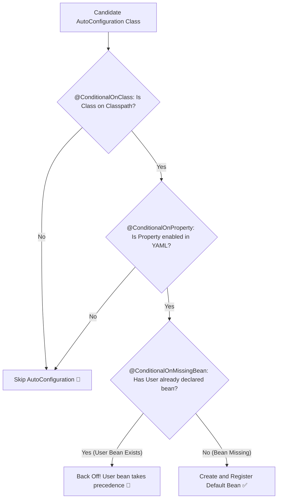

# 06-02: Conditional Configuration: @ConditionalOnClass, @ConditionalOnMissingBean & Back-Off Mechanics

> **Module**: `MOD-06: Auto-Configuration`
> **Topic ID**: `SB-06-02`
> **Prerequisites**: `SB-06-01`
> **Primary Technology**: Java 21 LTS | Conditional Evaluation | Back-Off Mechanics
> **Verification Date**: 2026-09-01

---

## 1. Problem
How does Spring Boot configure a `HikariDataSource` when Hikari is on the classpath, but automatically back off and do nothing if the user defines their own custom `DataSource` `@Bean`?

---

## 2. Why It Exists
Spring Boot's auto-configuration is **non-invasive**: it provides smart defaults that seamlessly **back off** the instant a developer declares custom configuration. This is achieved via `@Conditional` annotations extending `org.springframework.context.annotation.Condition`.

---

## 3. Architecture: The 5 Essential Conditional Annotations



---

## 4. The Core Conditional Annotations

| Annotation | Condition Evaluated | Example Use Case |
|---|---|---|
| **`@ConditionalOnClass`** | Target `.class` is present in JVM ClassLoader | Only configure Kafka if `KafkaTemplate.class` is on classpath |
| **`@ConditionalOnMissingClass`** | Target `.class` is NOT on classpath | Fallback when library is absent |
| **`@ConditionalOnMissingBean`** | No bean of type/name exists in `ApplicationContext` | **Primary back-off mechanism for user override** |
| **`@ConditionalOnBean`** | A required bean ALREADY exists in context | Configure security filters only if `AuthenticationManager` exists |
| **`@ConditionalOnProperty`** | Matches a configuration property value / presence | Enable feature toggle: `app.features.audit.enabled=true` |
| **`@ConditionalOnWebApplication`**| Evaluates if running in Servlet or Reactive web context| Register `DispatcherServlet` only in Servlet web apps |

---

## 5. Production Example in Java 21
```java
package com.spring.interview.autoconfig.starter;

import org.springframework.boot.autoconfigure.AutoConfiguration;
import org.springframework.boot.autoconfigure.condition.ConditionalOnClass;
import org.springframework.boot.autoconfigure.condition.ConditionalOnMissingBean;
import org.springframework.boot.autoconfigure.condition.ConditionalOnProperty;
import org.springframework.context.annotation.Bean;

@AutoConfiguration
@ConditionalOnClass(AuditService.class)
@ConditionalOnProperty(name = "app.audit.enabled", havingValue = "true", matchIfMissing = true)
public class AuditAutoConfiguration {

    public interface AuditService {
        String logAudit(String event);
    }

    public static class DefaultAuditService implements AuditService {
        @Override
        public String logAudit(String event) {
            return "DEFAULT_AUDIT: " + event;
        }
    }

    // If user creates their own AuditService bean, this auto-config backs off!
    @Bean
    @ConditionalOnMissingBean(AuditService.class)
    public AuditService defaultAuditService() {
        return new DefaultAuditService();
    }
}
```

---

## 6. Common Mistakes
- **Putting `@ConditionalOnBean` on a regular user `@Configuration` class**: Because bean creation order is non-deterministic among user configs, the required bean may not be registered yet, causing the condition to evaluate to `false` prematurely.

---

## 7. Interview Questions
1. **SDE2**: What is the purpose of `@ConditionalOnMissingBean`?
2. **Senior**: How does Spring Boot guarantee that user-defined `@Bean` methods always take precedence over auto-configured beans?

---

## 8. Interview Answer (Senior Level)
"Spring Boot guarantees that user-defined beans take precedence over auto-configurations through phased execution ordering. User `@Configuration` classes are parsed first during standard component scanning. Auto-configurations loaded from `AutoConfiguration.imports` execute in a subsequent phase (`@AutoConfigureOrder`). Auto-configuration `@Bean` methods are annotated with `@ConditionalOnMissingBean(MyService.class)`. When Spring evaluates this condition, it detects that the user's bean is already registered in the `BeanDefinitionRegistry`, causing the auto-configuration to gracefully back off."
