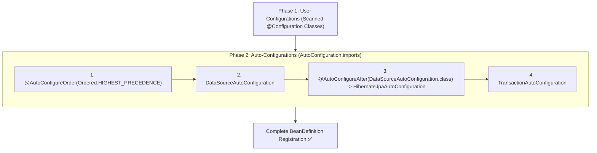

# 06-03: Auto-Configuration Ordering & Precedence: @AutoConfigureBefore & After

> **Module**: `MOD-06: Auto-Configuration`
> **Topic ID**: `SB-06-03`
> **Prerequisites**: `SB-06-02`
> **Primary Technology**: Java 21 LTS | Configuration Ordering | Precedence Architecture
> **Verification Date**: 2026-09-01

---

## 1. Problem
Some auto-configurations depend on beans created by other auto-configurations (e.g. `HibernateJpaAutoConfiguration` requires the `DataSource` created by `DataSourceAutoConfiguration`). If they execute in the wrong order, `@ConditionalOnBean` checks will fail and startup will crash.

---

## 2. Why It Exists
Spring Boot provides explicit auto-configuration ordering annotations:
1. **`@AutoConfigureBefore(OtherAutoConfig.class)`**: Guarantees this auto-configuration runs before another specific auto-configuration.
2. **`@AutoConfigureAfter(OtherAutoConfig.class)`**: Guarantees this auto-configuration runs after another specific auto-configuration.
3. **`@AutoConfigureOrder(Ordered.HIGHEST_PRECEDENCE)`**: Defines absolute integer priority among auto-configurations.

---

## 3. Architecture: Phased Configuration Ordering



---

## 4. Production Example in Java 21
```java
package com.spring.interview.autoconfig.starter;

import org.springframework.boot.autoconfigure.AutoConfiguration;
import org.springframework.boot.autoconfigure.AutoConfigureAfter;
import org.springframework.boot.autoconfigure.condition.ConditionalOnBean;
import org.springframework.context.annotation.Bean;

import javax.sql.DataSource;

@AutoConfiguration
@AutoConfigureAfter(name = "org.springframework.boot.autoconfigure.jdbc.DataSourceAutoConfiguration")
public class DatabaseMetricsAutoConfiguration {

    public record DatabaseMetricsCollector(String status) {}

    @Bean
    @ConditionalOnBean(DataSource.class)
    public DatabaseMetricsCollector databaseMetricsCollector(DataSource dataSource) {
        return new DatabaseMetricsCollector("MONITORING_ACTIVE");
    }
}
```

---

## 5. Common Mistakes
- **Using `@Order` instead of `@AutoConfigureOrder` on auto-configurations**: `@Order` does not affect auto-configuration evaluation order; only `@AutoConfigureOrder`, `@AutoConfigureBefore`, and `@AutoConfigureAfter` apply to auto-configuration classes.

---

## 6. Interview Questions
1. **SDE2**: What is the difference between `@AutoConfigureAfter` and `@DependsOn`?
2. **Senior**: Why should `@AutoConfigureBefore`/`@AutoConfigureAfter` only be used on auto-configuration classes rather than regular user `@Configuration` classes?

---

## 7. Interview Answer (Senior Level)
"`@AutoConfigureAfter` orders the evaluation of auto-configuration classes during the `AutoConfigurationImportSelector` phase, whereas `@DependsOn` forces bean instantiation order at runtime. `@AutoConfigureBefore` and `@AutoConfigureAfter` only apply to classes loaded via `AutoConfiguration.imports`. They have zero effect on user `@Configuration` classes discovered via `@ComponentScan`, because user configurations are processed in an entirely separate, earlier container phase."
