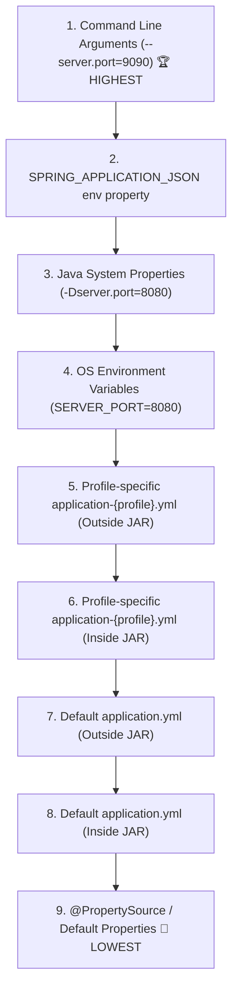

# 07-01: External Configuration Precedence Hierarchy: The 17 Levels

> **Module**: `MOD-07: Configuration and Properties`
> **Topic ID**: `SB-07-01`
> **Prerequisites**: `SB-05-02`
> **Primary Technology**: Java 21 LTS | Environment Architecture | Property Precedence
> **Verification Date**: 2026-09-01

---

## 1. Problem
When a configuration property (`server.port`) is defined in `application.yml`, an OS Environment Variable (`SERVER_PORT`), and a command-line argument (`--server.port=9090`), which one wins?

---

## 2. Why It Exists
Spring Boot establishes an **opinionated, 17-level property resolution hierarchy**. Higher-priority sources override lower-priority sources, allowing base defaults in YAML while letting container environments (Docker/Kubernetes) override values dynamically via environment variables or CLI arguments.

---

## 3. Architecture: The Practical Order of Precedence (Highest to Lowest)

---

## 4. Relaxed Property Binding Rules
Spring Boot translates property names across formats automatically:

| Environment Variable (K8s/Docker) | YAML / Properties Key |
|---|---|
| `APP_DATABASE_POOL_SIZE=50` | `app.database.pool-size: 50` |
| `APP_SECURITY_JWT_SECRET_KEY=xxx` | `app.security.jwt.secret-key: xxx` |
| `SERVER_PORT=8081` | `server.port: 8081` |

Rules:
- Uppercase letters replace lowercase.
- Underscores (`_`) replace dots (`.`) and dashes (`-`).

---

## 5. Common Mistakes
- **Committing environment-specific URLs into default `application.yml`**: Overriding becomes fragile; always supply sensible local defaults and override in production via Kubernetes ConfigMaps or Environment Variables.

---

## 6. Interview Questions
1. **SDE2**: Which takes precedence: an OS environment variable or a value inside `application.yml`?
2. **Senior**: How does Spring Boot's Relaxed Binding engine match `DATABASE_URL` to `app.database.url`?

---

## 7. Interview Answer (Senior Level)
"OS environment variables take precedence over both profile-specific and default `application.yml` files (ranking 4th vs 6th/8th in Spring Boot's 17-level hierarchy), allowing containerized environments to override bundled defaults. Spring Boot's Relaxed Binding engine normalizes property names: environment variables in `SCREAMING_SNAKE_CASE` (e.g. `APP_DATABASE_MAX_POOL_SIZE`) are automatically converted to kebab-case (`app.database.max-pool-size`) and camelCase (`app.database.maxPoolSize`) properties when binding to `@ConfigurationProperties` classes."
