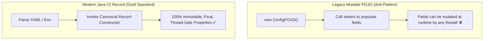

# 07-05: Immutable Configuration with Java 21 Records & ConstructorBinding

> **Module**: `MOD-07: Configuration and Properties`
> **Topic ID**: `SB-07-05`
> **Prerequisites**: `SB-07-02`, `SB-07-04`
> **Primary Technology**: Java 21 LTS | Java Records | Immutable Infrastructure
> **Verification Date**: 2026-09-01

---

## 1. Problem
Traditional Java bean configuration classes used mutable fields with getters and setters. This allowed accidental runtime mutation of sensitive configuration properties (e.g. modifying thread pool sizes or API URLs from random service methods), causing insidious concurrency and state bugs.

---

## 2. Why It Exists
**Java 21 Records** provide built-in immutability: all components are automatically `final`, private, and immutable. In Spring Boot 3.x, `@ConfigurationProperties` on a Java Record automatically enables **Constructor Binding** without requiring explicit `@ConstructorBinding` annotations.

---

## 3. Architecture: Mutable POJO vs Immutable Record Binding



---

## 4. Production Example in Java 21: Nested Immutable Records
```java
package com.spring.interview.config.properties;

import org.springframework.boot.context.properties.ConfigurationProperties;
import org.springframework.boot.context.properties.bind.DefaultValue;

import java.util.List;
import java.util.Map;

@ConfigurationProperties(prefix = "app.security")
public record SecurityProperties(
    JwtConfig jwt,
    CorsConfig cors,
    @DefaultValue("true") boolean rateLimitingEnabled
) {
    public record JwtConfig(
        String issuer,
        String secretKey,
        @DefaultValue("3600") long expirationSeconds
    ) {}

    public record CorsConfig(
        List<String> allowedOrigins,
        List<String> allowedMethods,
        Map<String, String> customHeaders
    ) {}
}
```

---

## 5. Common Mistakes
- **Adding explicit `@ConstructorBinding` to Java Records in Spring Boot 3.0+**: In Spring Boot 3.0+, `@ConstructorBinding` is implicit on Java Records and classes with a single constructor.

---

## 6. Interview Questions
1. **SDE2**: Why are Java Records ideal for `@ConfigurationProperties`?
2. **Senior**: How do `@DefaultValue` annotations work with Java 21 Record canonical constructors during property binding?

---

## 7. Interview Answer (Senior Level)
"Java 21 Records are ideal for `@ConfigurationProperties` because they enforce compile-time immutability, thread safety, and concise syntax without Lombok. Spring Boot 3 automatically detects the canonical record constructor and uses Constructor Binding to instantiate the record with validated properties. If a property is missing in YAML, the `@DefaultValue` annotation on a record component parameter instructs the Binder to inject the specified fallback value directly into the constructor."
