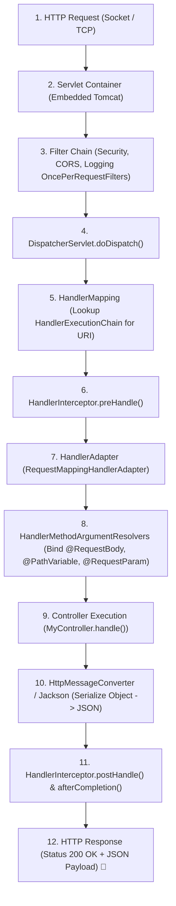

# 08-01: DispatcherServlet: The Complete Request Processing Lifecycle

> **Module**: `MOD-08: Spring Web MVC`
> **Topic ID**: `SB-08-01`
> **Prerequisites**: `SB-01-02`, `SB-05-03`
> **Primary Technology**: Java 21 LTS | Front Controller Pattern | Request Pipeline Architecture
> **Verification Date**: 2026-09-01

---

## 1. Problem
When an HTTP request hits a Spring Boot application, how does it traverse from the network socket through the servlet container, filter chains, routing tables, argument resolvers, controllers, and message converters to return an HTTP response?

---

## 2. Why It Exists
Spring Web MVC is built around the **Front Controller Design Pattern**, implemented by `org.springframework.web.servlet.DispatcherServlet`. Instead of mapping individual servlets to each URL endpoint, all incoming HTTP requests route through a single central dispatcher that coordinates request routing, interceptors, argument binding, view resolution, and error handling.

---

## 3. Architecture: The 12-Step DispatcherServlet Request Lifecycle

---

## 4. Internal Execution Trace: Inside `DispatcherServlet.doDispatch()`

1. **`getHandler(request)`**: Iterates registered `HandlerMapping`s (primarily `RequestMappingHandlerMapping`) to find a matching `HandlerExecutionChain` containing the target `HandlerMethod` and registered `HandlerInterceptor`s.
2. **`getHandlerAdapter(handler)`**: Obtains the `HandlerAdapter` (primarily `RequestMappingHandlerAdapter`) capable of invoking the handler.
3. **`applyPreHandle(request, response)`**: Executes `preHandle()` on all interceptors in the chain. If any returns `false`, execution halts immediately.
4. **`ha.handle(request, response, handler)`**:
   - Resolves method parameters via `HandlerMethodArgumentResolverComposite`.
   - Invokes the controller method via reflection (`InvocableHandlerMethod.invokeForRequest()`).
   - Converts the return value using `HandlerMethodReturnValueHandlerComposite` and `HttpMessageConverter`.
5. **`applyPostHandle(request, response, mv)`**: Executes `postHandle()` across interceptors.
6. **`processDispatchResult(request, response, mappedHandler, mv, exception)`**: Handles exceptions (via `@ExceptionHandler` / `HandlerExceptionResolver`) and executes `triggerAfterCompletion()`.

---

## 5. Common Mistakes
- **Confusing Servlet Filters with Spring Interceptors**: Modifying request headers inside an Interceptor is often too late if down-stream filters already committed the response stream.

---

## 6. Interview Questions
1. **SDE2**: Walk me through the lifecycle of an HTTP request inside Spring MVC from the servlet container to the controller.
2. **Senior**: What role does `HandlerAdapter` play, and why doesn't `DispatcherServlet` invoke `@RequestMapping` methods directly?

---

## 7. Interview Answer (Senior Level)
"Spring MVC uses the Front Controller pattern centered on `DispatcherServlet`. When a request arrives, `DispatcherServlet.doDispatch()` queries `RequestMappingHandlerMapping` to locate a `HandlerExecutionChain` (the controller method plus interceptors). It then delegates invocation to `RequestMappingHandlerAdapter`. `DispatcherServlet` uses this adapter abstraction so it can support diverse handler types (annotated `@Controller`s, functional `RouterFunction`s, legacy `HttpRequestHandler`s) without tight coupling. The adapter resolves method arguments using `HandlerMethodArgumentResolver`, executes the controller method, serializes the response with `HttpMessageConverter` (Jackson), and runs `HandlerInterceptor.afterCompletion()` callbacks."
