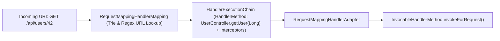

# 08-02: HandlerMapping & HandlerAdapter: Routing & Execution Internals

> **Module**: `MOD-08: Spring Web MVC`
> **Topic ID**: `SB-08-02`
> **Prerequisites**: `SB-08-01`
> **Primary Technology**: Java 21 LTS | Routing Engines | HandlerMethod Reflection Architecture
> **Verification Date**: 2026-09-01

---

## 1. Problem
How does Spring MVC index hundreds of `@GetMapping`, `@PostMapping`, `@PathVariable`, and `@RequestParam` mappings at startup so that runtime URL lookups execute in $O(1)$ time?

---

## 2. Why It Exists
Spring decouples **URL mapping lookup** (`HandlerMapping`) from **method reflection execution** (`HandlerAdapter`).

---

## 3. Architecture: HandlerMapping & HandlerAdapter Collaboration

---

## 4. Key Classes in the Execution Engine
1. **`RequestMappingHandlerMapping`**: Scans all `@Controller` beans at startup, extracting `@RequestMapping` metadata into `RequestMappingInfo` keys stored in an internal mapping registry (`MappingRegistry`).
2. **`HandlerMethod`**: Encapsulates the target controller bean instance, target `Method` reflection object, and parameter metadata.
3. **`RequestMappingHandlerAdapter`**: Coordinates argument resolution (`HandlerMethodArgumentResolverComposite`) and return value handling (`HandlerMethodReturnValueHandlerComposite`).

---

## 5. Common Mistakes
- **Ambiguous URL Mappings**: Defining two `@GetMapping("/users/{id}")` methods with identical parameter patterns throws `IllegalStateException: Ambiguous mapping`.

---

## 6. Interview Questions
1. **SDE2**: What is a `HandlerMethod` in Spring MVC?
2. **Senior**: How does `RequestMappingHandlerMapping` detect and index URL mappings at startup?

---

## 7. Interview Answer (Senior Level)
"`RequestMappingHandlerMapping` implements `InitializingBean`. During application startup `afterPropertiesSet()`, it iterates all beans in the `ApplicationContext` looking for `@Controller` or `@RequestMapping` annotations. For each matched bean, it inspects every method using reflection, builds a `RequestMappingInfo` descriptor (path patterns, HTTP verbs, content types), and registers it in an internal lookup map (`MappingRegistry`). At runtime, incoming HTTP requests perform $O(1)$ lookups against this registry to produce a `HandlerExecutionChain` wrapping the matched `HandlerMethod` and associated `HandlerInterceptor`s."
