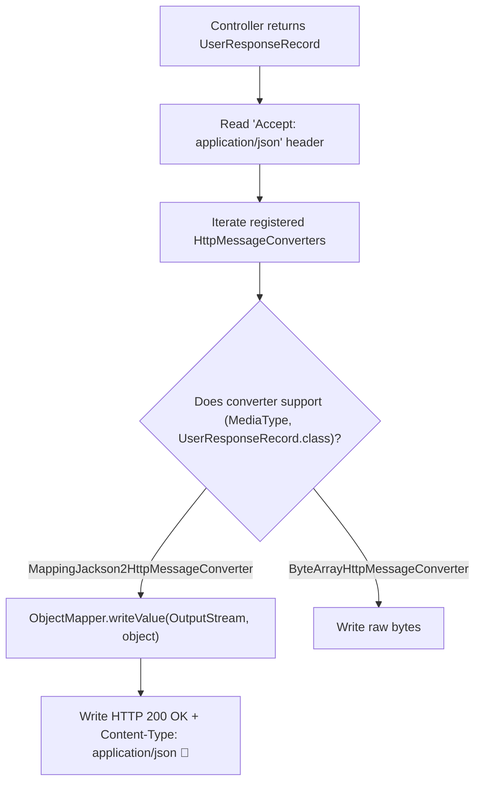

# 04-04: HttpMessageConverter & Jackson Serialization Internals

> **Module**: `MOD-08: Spring Web MVC`
> **Topic ID**: `SB-08-04`
> **Prerequisites**: `SB-08-01`
> **Primary Technology**: Java 21 LTS | JSON Conversion | Jackson ObjectMapper Architecture
> **Verification Date**: 2026-09-01

---

## 1. Problem
How does a Java object returned from a `@RestController` method get converted into a serialized JSON or XML payload on the HTTP network response stream, and how does Content Negotiation (`Accept` header) select the appropriate converter?

---

## 2. Why It Exists
Spring MVC uses `org.springframework.http.converter.HttpMessageConverter<T>` to handle serialization and deserialization between HTTP request/response bodies and Java objects. When `@ResponseBody` or `@RestController` is used, `RequestResponseBodyMethodProcessor` inspects the HTTP `Accept` header and matches it against registered converters.

---

## 3. Architecture: HttpMessageConverter Resolution Flow



---

## 4. Built-in HttpMessageConverters in Spring Boot
1. `ByteArrayHttpMessageConverter`: Handles `byte[]`.
2. `StringHttpMessageConverter`: Handles `String` (plain text).
3. `ResourceHttpMessageConverter`: Handles `org.springframework.core.io.Resource`.
4. `MappingJackson2HttpMessageConverter`: Handles JSON serialization via Jackson `ObjectMapper`.

---

## 5. Customizing Jackson Serialization in Java 21
Configuring Jackson via properties or custom modules:

```properties
spring.jackson.property-naming-strategy=SNAKE_CASE
spring.jackson.default-property-inclusion=non_null
spring.jackson.serialization.write-dates-as-timestamps=false
```

---

## 6. Common Mistakes
- **Circular references in JPA entities serialized with Jackson**: Causes `JsonMappingException: Infinite recursion (StackOverflowError)`. Always use DTOs!

---

## 7. Interview Questions
1. **SDE2**: How does Content Negotiation work in Spring MVC?
2. **Senior**: What causes Jackson `Infinite recursion (StackOverflowError)` and how do you architecturally prevent it?

---

## 8. Interview Answer (Senior Level)
"When a controller returns an object, Spring's `RequestResponseBodyMethodProcessor` evaluates the HTTP `Accept` request header and queries the registered `HttpMessageConverter` pipeline using Content Negotiation. `MappingJackson2HttpMessageConverter` handles `application/json` by delegating to Jackson's `ObjectMapper`. Jackson infinite recursion errors occur when bi-directional JPA entity relationships (e.g. `Order -> User -> Orders`) are serialized directly, triggering recursive getter cycles. The senior architectural solution is strict separation: never serialize JPA entities; always project database state into immutable Java 21 Record DTOs."
