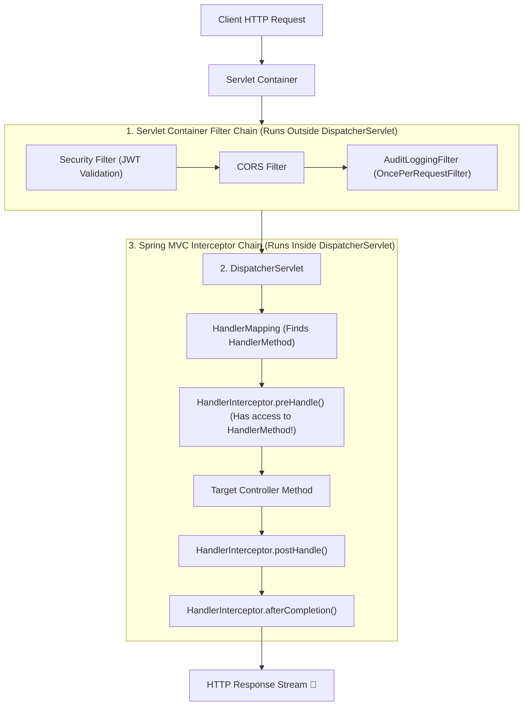

# 08-05: Servlet Filters vs HandlerInterceptors: Boundaries & Responsibilities

> **Module**: `MOD-08: Spring Web MVC`
> **Topic ID**: `SB-08-05`
> **Prerequisites**: `SB-08-01`
> **Primary Technology**: Java 21 LTS | Web Infrastructure | Filter vs Interceptor Comparison
> **Verification Date**: 2026-09-01

---

## 1. Problem
Candidates and developers frequently struggle with where to implement cross-cutting web concerns: Should JWT validation, CORS, rate limiting, and request correlation IDs be implemented in a Servlet `Filter` or a Spring MVC `HandlerInterceptor`?

---

## 2. Why It Exists
Filters and Interceptors operate at fundamentally different architectural boundaries in the servlet lifecycle:
- **`jakarta.servlet.Filter` (e.g. `OncePerRequestFilter`)**: Part of the **Servlet Specification**. Runs *before* request reaches `DispatcherServlet`. Operates on raw `HttpServletRequest` / `HttpServletResponse`. Can block requests, wrap request/response streams, or short-circuit before Spring MVC routing occurs.
- **`org.springframework.web.servlet.HandlerInterceptor`**: Part of **Spring MVC**. Runs *inside* `DispatcherServlet`. Operates *after* `HandlerMapping` matches the URI. Has direct access to the target `HandlerMethod` reflection metadata.

---

## 3. Architecture: Filter vs Interceptor Lifecycle Boundaries



---

## 4. Comprehensive Architectural Comparison Matrix

| Dimension | Servlet `Filter` (`OncePerRequestFilter`) | Spring `HandlerInterceptor` |
|---|---|---|
| **Specification / Layer** | **Jakarta Servlet API** (Tomcat container level) | **Spring Web MVC** (`DispatcherServlet` level) |
| **Execution Point** | Runs **BEFORE** `DispatcherServlet` | Runs **AFTER** `HandlerMapping` lookup |
| **Access to `HandlerMethod`** | **NO** (Has no awareness of Spring controllers) | **YES** (Can inspect method annotations, types, signatures) |
| **Can Modify Request Stream** | **YES** (Can wrap in `HttpServletRequestWrapper`) | **NO** (Stream already being read/consumed) |
| **Can Short-Circuit Execution** | **YES** (By not calling `filterChain.doFilter()`) | **YES** (By returning `false` in `preHandle()`) |
| **Best Used For** | Authentication, CORS, GZIP compression, Request Body Caching, WAF | Fine-grained method authorization, MDC logging, Handler audit metrics |

---

## 5. Production Examples in Java 21

### 1. `OncePerRequestFilter` for Latency Logging
```java
package com.spring.interview.mvc.filter;

import jakarta.servlet.FilterChain;
import jakarta.servlet.ServletException;
import jakarta.servlet.http.HttpServletRequest;
import jakarta.servlet.http.HttpServletResponse;
import org.springframework.stereotype.Component;
import org.springframework.web.filter.OncePerRequestFilter;

import java.io.IOException;

@Component
public class AuditLoggingFilter extends OncePerRequestFilter {

    @Override
    protected void doFilterInternal(
        HttpServletRequest request,
        HttpServletResponse response,
        FilterChain filterChain
    ) throws ServletException, IOException {
        long startNanos = System.nanoTime();
        try {
            filterChain.doFilter(request, response);
        } finally {
            long durationMs = (System.nanoTime() - startNanos) / 1_000_000;
            response.setHeader("X-Response-Time-Millis", String.valueOf(durationMs));
        }
    }
}
```

### 2. `HandlerInterceptor` for Controller Method Auditing
```java
package com.spring.interview.mvc.interceptor;

import jakarta.servlet.http.HttpServletRequest;
import jakarta.servlet.http.HttpServletResponse;
import org.springframework.stereotype.Component;
import org.springframework.web.method.HandlerMethod;
import org.springframework.web.servlet.HandlerInterceptor;

@Component
public class RequestCorrelationInterceptor implements HandlerInterceptor {

    @Override
    public boolean preHandle(HttpServletRequest request, HttpServletResponse response, Object handler) {
        if (handler instanceof HandlerMethod handlerMethod) {
            String controllerName = handlerMethod.getBeanType().getSimpleName();
            String methodName = handlerMethod.getMethod().getName();
            request.setAttribute("MVC_TARGET_HANDLER", controllerName + "#" + methodName);
        }
        return true;
    }
}
```

---

## 6. Common Mistakes
- **Trying to read custom method annotations inside a Servlet Filter**: Filters execute before `HandlerMapping`, so they have zero knowledge of which controller or method will process the request.

---

## 7. Interview Questions
1. **SDE2**: What is the difference between a Servlet Filter and a Spring MVC HandlerInterceptor?
2. **Senior**: Which mechanism should you use to implement request payload encryption/decryption, and why?

---

## 8. Interview Answer (Senior Level)
"A Servlet `Filter` operates at the Servlet container boundary before `DispatcherServlet`, giving it access to raw request/response streams. It is the ideal place for low-level concerns such as CORS, payload decompression, request payload caching (`ContentCachingRequestWrapper`), and security token extraction. A Spring `HandlerInterceptor` operates inside `DispatcherServlet` after the URI has been mapped to a `HandlerMethod`. It provides access to controller method metadata, making it ideal for method-specific audit logging, MDC correlation tracking, or checking custom controller annotations."
