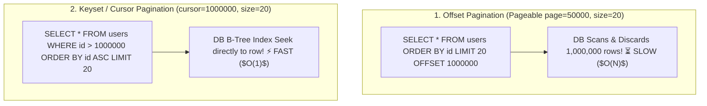

# 09-02: Pagination, Sorting & Filtering Architecture

> **Module**: `MOD-09: REST API Development`
> **Topic ID**: `SB-09-02`
> **Prerequisites**: `SB-09-01`
> **Primary Technology**: Java 21 LTS | High-Volume Queries | Offset vs Keyset Pagination
> **Verification Date**: 2026-09-01

---

## 1. Problem
Returning unpaginated database records (`SELECT * FROM users`) crashes JVM memory with `OutOfMemoryError` when data grows. However, naive **Offset Pagination** (`LIMIT 20 OFFSET 1000000`) forces PostgreSQL to scan 1,000,000 index rows, causing query timeouts.

---

## 2. Why It Exists
High-performance REST APIs must support bounded pagination and sorting:
1. **Offset Pagination (`Pageable` / `Page<T>`)**: Best for standard admin dashboards requiring total page counts (`page=2&size=20&sort=createdAt,desc`).
2. **Keyset / Cursor Pagination (`Slice<T>` / Cursor)**: Best for high-throughput mobile infinite scroll feeds (`SELECT * FROM orders WHERE id > :lastSeenId ORDER BY id ASC LIMIT 20`). Avoids `OFFSET` scanning penalties ($O(1)$ lookup).

---

## 3. Architecture: Offset vs Keyset Comparison



---

## 4. Production Example in Java 21: Spring Data Pageable
```java
package com.spring.interview.rest.controller;

import org.springframework.data.domain.Page;
import org.springframework.data.domain.Pageable;
import org.springframework.data.domain.Sort;
import org.springframework.data.web.PageableDefault;
import org.springframework.web.bind.annotation.GetMapping;
import org.springframework.web.bind.annotation.RequestParam;
import org.springframework.web.bind.annotation.RestController;

@RestController
public class OrderSearchController {

    public record OrderSummaryDto(String orderId, double amount, String status) {}

    public interface OrderService {
        Page<OrderSummaryDto> searchOrders(String status, Pageable pageable);
    }

    private final OrderService orderService;

    public OrderSearchController(OrderService orderService) {
        this.orderService = orderService;
    }

    @GetMapping("/api/v1/orders")
    public Page<OrderSummaryDto> listOrders(
        @RequestParam(required = false) String status,
        @PageableDefault(page = 0, size = 20, sort = "createdAt", direction = Sort.Direction.DESC) Pageable pageable
    ) {
        return orderService.searchOrders(status, pageable);
    }
}
```

---

## 5. Common Mistakes
- **Allowing unbounded page sizes (`size=100000`)**: Callers can DoS the service; always cap maximum page size via `spring.data.web.pageable.max-page-size=100`.

---

## 6. Interview Questions
1. **SDE2**: What is the difference between `Page<T>` and `Slice<T>` in Spring Data?
2. **Senior**: Why does Offset pagination degrade at large offsets, and how does Keyset pagination resolve the issue?

---

## 7. Interview Answer (Senior Level)
"`Page<T>` executes two SQL queries: the paginated query (`LIMIT / OFFSET`) plus an expensive `COUNT(*)` query to compute total elements and pages. `Slice<T>` queries `LIMIT size + 1` to check if a next page exists without running a `COUNT(*)` query, making it much faster. At large offsets (e.g. page 50,000), databases must traverse and discard millions of rows before returning the slice. Keyset (cursor) pagination resolves this by filtering with a B-tree index (`WHERE id > :lastSeenId ORDER BY id LIMIT 20`), performing an $O(1)$ index seek regardless of table size."
