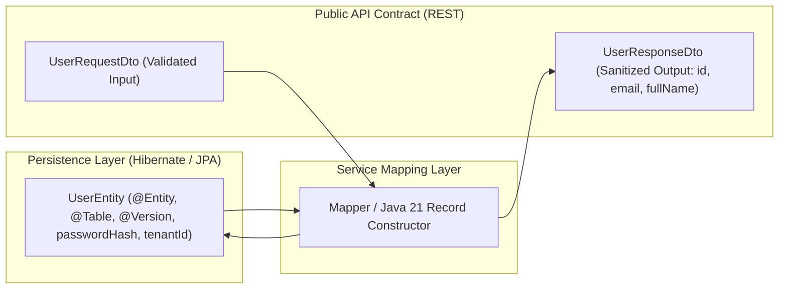

# 09-03: The DTO Pattern vs Entity Leakage: Architectural Defense

> **Module**: `MOD-09: REST API Development`
> **Topic ID**: `SB-09-03`
> **Prerequisites**: `SB-09-01`
> **Primary Technology**: Java 21 LTS | API Contract Design | DTO Projections
> **Verification Date**: 2026-09-01

---

## 1. Problem
Directly returning JPA `@Entity` classes from `@RestController` methods is one of the most destructive architectural anti-patterns in backend engineering. It causes:
1. **Security / Data Exposure**: Accidentally serializing hashed password fields, credit card tokens, or internal soft-delete flags to external API consumers.
2. **`LazyInitializationException`**: Jackson trying to serialize uninitialized lazy JPA relationships outside active transaction boundaries.
3. **Jackson Infinite Recursion**: Bi-directional relationship loops (`User -> Orders -> User`) crashing with `StackOverflowError`.
4. **Tight Database Coupling**: Changing a database column name instantly breaks public API client contracts.

---

## 2. Why It Exists
The **Data Transfer Object (DTO)** pattern strictly separates the **internal persistence model** from the **external API contract**.

---

## 3. Architecture: Layer Separation



---

## 4. Production Example in Java 21: Java Records as Immutable DTOs
```java
package com.spring.interview.rest.dto;

import jakarta.validation.constraints.Email;
import jakarta.validation.constraints.NotBlank;
import jakarta.validation.constraints.Size;

public final class UserDtos {

    public record CreateUserRequest(
        @NotBlank(message = "Username is required")
        @Size(min = 3, max = 50, message = "Username must be 3-50 characters")
        String username,

        @NotBlank(message = "Email is required")
        @Email(message = "Invalid email format")
        String email,

        @NotBlank(message = "Password is required")
        @Size(min = 8, message = "Password must be at least 8 characters")
        String password
    ) {}

    public record UserResponse(
        String id,
        String username,
        String email,
        String createdAt
    ) {}
}
```

---

## 5. Common Mistakes
- **Using `@JsonIgnore` on JPA entities instead of creating DTOs**: Brittle; if another API endpoint needs that field, it is globally hidden.

---

## 6. Interview Questions
1. **SDE2**: Why should JPA `@Entity` classes never be exposed directly in REST controllers?
2. **Senior**: How do Java 21 Records simplify DTO design compared to traditional Lombok/POJO classes?

---

## 7. Interview Answer (Senior Level)
"Exposing JPA entities directly in REST controllers couples database schema changes directly to external API contracts, risks leaking sensitive fields (e.g. password hashes), triggers `LazyInitializationException`s during Jackson serialization, and causes stack overflows on bi-directional relationships. Java 21 Records solve this cleanly by providing concise, immutable, thread-safe data carriers with built-in value-based `equals()`, `hashCode()`, and getter semantics, serving as ideal DTOs."
