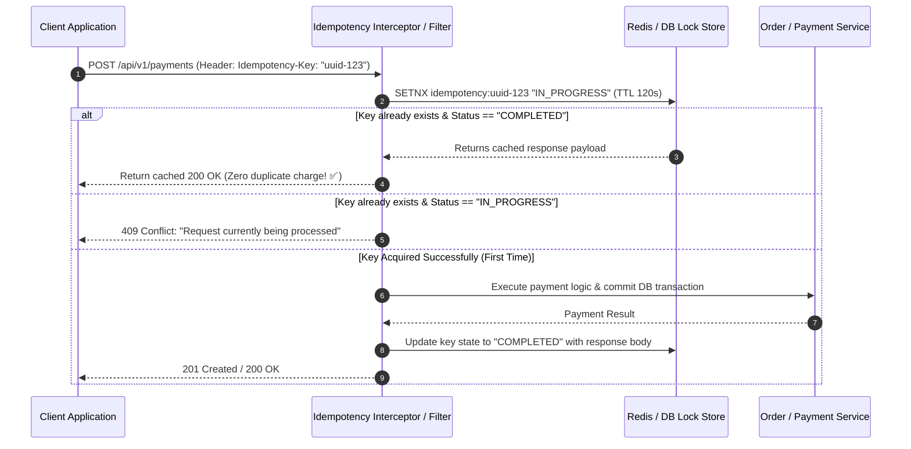

# 09-05: Idempotency Keys & Safe Mutations in POST APIs

> **Module**: `MOD-09: REST API Development`
> **Topic ID**: `SB-09-05`
> **Prerequisites**: `SB-09-01`
> **Primary Technology**: Java 21 LTS | Distributed Systems | Idempotency Key Architecture
> **Verification Date**: 2026-09-01

---

## 1. Problem
In distributed systems, network timeouts occur frequently: a client sends `POST /api/v1/payments`, the payment succeeds in the database, but the network drops before the `200 OK` reaches the client. If the client retries, **the customer is charged twice!**

---

## 2. Why It Exists
While `GET`, `PUT`, and `DELETE` are naturally idempotent, `POST` is non-idempotent by default. To make `POST` APIs safe for network retries, payment and order systems implement the **Idempotency Key Pattern** (`Idempotency-Key: <UUID>`).

---

## 3. Architecture: Idempotency Key Processing Pipeline



---

## 4. Production Example in Java 21: Idempotency Store Contract
```java
package com.spring.interview.rest.idempotency;

import java.util.Optional;
import java.util.concurrent.ConcurrentHashMap;

public class InMemoryIdempotencyStore {

    public enum Status { IN_PROGRESS, COMPLETED }
    public record IdempotentRecord(Status status, String responsePayload) {}

    private final ConcurrentHashMap<String, IdempotentRecord> store = new ConcurrentHashMap<>();

    public synchronized boolean acquireLock(String idempotencyKey) {
        if (store.containsKey(idempotencyKey)) {
            return false;
        }
        store.put(idempotencyKey, new IdempotentRecord(Status.IN_PROGRESS, null));
        return true;
    }

    public synchronized void recordSuccess(String idempotencyKey, String payload) {
        store.put(idempotencyKey, new IdempotentRecord(Status.COMPLETED, payload));
    }

    public Optional<IdempotentRecord> getRecord(String idempotencyKey) {
        return Optional.ofNullable(store.get(idempotencyKey));
    }
}
```

---

## 5. Common Mistakes
- **Storing idempotency keys without a TTL (Time-To-Live)**: Causes unbounded memory growth; always set a reasonable TTL (e.g. 24–48 hours).

---

## 6. Interview Questions
1. **SDE2**: How do you make a `POST` payment endpoint safe against duplicate client retries?
2. **Senior**: What happens if the service crashes while processing a request holding an `IN_PROGRESS` idempotency key?

---

## 7. Interview Answer (Senior Level)
"To make a `POST` endpoint idempotent, require clients to pass an `Idempotency-Key: <UUID>` header. An interceptor executes an atomic `SETNX` in Redis with an expiration TTL (e.g. 60 seconds). If the key already exists and has a cached response, the cached response is returned immediately. If the key exists with `IN_PROGRESS`, the API returns `409 Conflict`. If the node crashes during execution, the lock TTL expires automatically, allowing the client to safely retry without leaving the system permanently locked."
