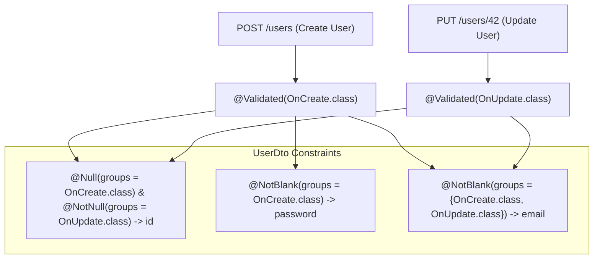

# 10-02: Validation Groups & Conditional Constraint Architecture

> **Module**: `MOD-10: Validation and Error Handling`
> **Topic ID**: `SB-10-02`
> **Prerequisites**: `SB-10-01`
> **Primary Technology**: Java 21 LTS | Validation Groups | Multi-Stage Constraints
> **Verification Date**: 2026-09-01

---

## 1. Problem
In enterprise workflows, the same entity/DTO has different validation requirements depending on the operation:
- When creating a user (`POST`), the `password` is strictly mandatory, but `id` must be null.
- When updating a user (`PUT` or `PATCH`), `id` is required, but `password` may be optional.

---

## 2. Why It Exists
**Validation Groups** allow categorizing constraints into interface markers (`OnCreate.class`, `OnUpdate.class`). When validating, `@Validated(OnCreate.class)` instructs the validator to evaluate only the constraints belonging to that group.

---

## 3. Architecture: Group-Based Constraint Segregation



---

## 4. Production Example in Java 21: Validation Groups

### 1. Group Marker Interfaces
```java
package com.spring.interview.validation.groups;

public interface ValidationGroups {
    interface OnCreate {}
    interface OnUpdate {}
}
```

### 2. DTO with Group Constraints
```java
package com.spring.interview.validation.dto;

import com.spring.interview.validation.groups.ValidationGroups.OnCreate;
import com.spring.interview.validation.groups.ValidationGroups.OnUpdate;
import jakarta.validation.constraints.Email;
import jakarta.validation.constraints.NotBlank;
import jakarta.validation.constraints.NotNull;
import jakarta.validation.constraints.Null;

public record UserProfileDto(
    @Null(groups = OnCreate.class, message = "ID must be null during creation")
    @NotNull(groups = OnUpdate.class, message = "ID is required during update")
    String id,

    @NotBlank(groups = {OnCreate.class, OnUpdate.class}, message = "Email is required")
    @Email(groups = {OnCreate.class, OnUpdate.class}, message = "Invalid email")
    String email,

    @NotBlank(groups = OnCreate.class, message = "Password is required for new accounts")
    String password
) {}
```

---

## 5. Common Mistakes
- **Using `@Valid` instead of `@Validated` when groups are configured**: `@Valid` does not accept group parameters and only evaluates the default un-grouped constraints (`Default.class`).

---

## 6. Interview Questions
1. **SDE2**: How do you apply different validation rules for Create vs Update on the same DTO?
2. **Senior**: What is `GroupSequence` and how does it prevent executing expensive database checks when simple format validations fail?

---

## 7. Interview Answer (Senior Level)
"To apply different validation rules to the same DTO, define marker interfaces (e.g. `OnCreate` and `OnUpdate`) and pass them to constraint `groups = OnCreate.class`. In the controller, use `@Validated(OnCreate.class)`. To optimize validation pipelines, Jakarta Bean Validation provides `@GroupSequence({First.class, Second.class})`. This evaluates lightweight syntactic validations (e.g. `@NotBlank`) in `First.class`, and only proceeds to evaluate expensive constraints (e.g. custom database uniqueness checks in `Second.class`) if the first group passes completely."
