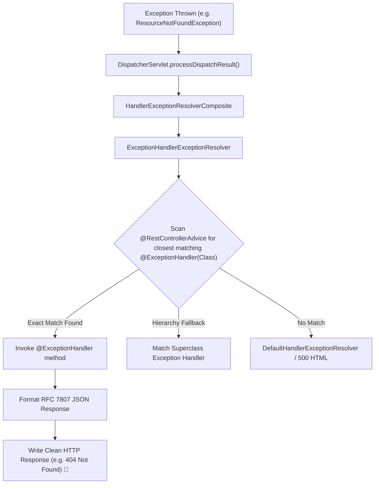

# 10-03: @ControllerAdvice & @ExceptionHandler Internals: The Exception Pipeline

> **Module**: `MOD-10: Validation and Error Handling`
> **Topic ID**: `SB-10-03`
> **Prerequisites**: `SB-08-01`, `SB-10-01`
> **Primary Technology**: Java 21 LTS | Exception Handling Architecture | Spring MVC Exception Pipeline
> **Verification Date**: 2026-09-01

---

## 1. Problem
When exceptions occur in controllers or services (e.g. `MethodArgumentNotValidException`, `ResourceNotFoundException`, `SQLException`), unhandled exceptions crash into the servlet container, returning default Tomcat HTML error pages or unformatted 500 responses leaking internal implementation details.

---

## 2. Why It Exists
Spring MVC provides the **`HandlerExceptionResolver` SPI**, implemented primarily by `ExceptionHandlerExceptionResolver`. By annotating a central class with `@RestControllerAdvice` (or `@ControllerAdvice`), engineers can catch and map any thrown exception into a structured, sanitized HTTP response.

---

## 3. Architecture: Exception Resolution Pipeline



---

## 4. Exception Handler Resolution Precedence Rules
When an exception $E$ is thrown:
1. Spring searches for an `@ExceptionHandler` matching the exact class type of $E$.
2. If no exact match exists, it searches up the inheritance hierarchy of $E$ (e.g. `ResourceNotFoundException` -> `RuntimeException` -> `Exception` -> `Throwable`).
3. The closest ancestor handler in the class hierarchy wins.

---

## 5. Production Example in Java 21
```java
package com.spring.interview.validation.exception;

import org.springframework.http.HttpStatus;
import org.springframework.http.ProblemDetail;
import org.springframework.web.bind.annotation.ExceptionHandler;
import org.springframework.web.bind.annotation.RestControllerAdvice;

import java.net.URI;
import java.time.Instant;

@RestControllerAdvice
public class BaseControllerAdvice {

    @ExceptionHandler(DomainExceptions.ResourceNotFoundException.class)
    public ProblemDetail handleNotFound(DomainExceptions.ResourceNotFoundException ex) {
        ProblemDetail problem = ProblemDetail.forStatusAndDetail(HttpStatus.NOT_FOUND, ex.getMessage());
        problem.setTitle("Resource Not Found");
        problem.setType(URI.create("https://api.example.com/errors/not-found"));
        problem.setProperty("timestamp", Instant.now().toString());
        return problem;
    }
}
```

---

## 6. Common Mistakes
- **Having multiple `@RestControllerAdvice` classes without `@Order`**: If two advice classes declare handlers for the same exception type, Spring's selection order is non-deterministic.

---

## 7. Interview Questions
1. **SDE2**: What is the difference between `@ControllerAdvice` and `@RestControllerAdvice`?
2. **Senior**: How does Spring MVC resolve which `@ExceptionHandler` method to call when multiple handlers match an exception hierarchy?

---

## 8. Interview Answer (Senior Level)
"`@RestControllerAdvice` is a meta-annotation combining `@ControllerAdvice` and `@ResponseBody`, ensuring all exception handler return values are automatically serialized into the response body via `HttpMessageConverter` (e.g. Jackson JSON). Spring uses `ExceptionHandlerExceptionResolver` to resolve handlers. When an exception occurs, it computes the distance in the Java inheritance tree between the thrown exception and each declared handler type, selecting the one with the smallest tree distance (exact match first, then nearest superclass). Multiple `@RestControllerAdvice` beans should be explicitly ordered with `@Order`."
