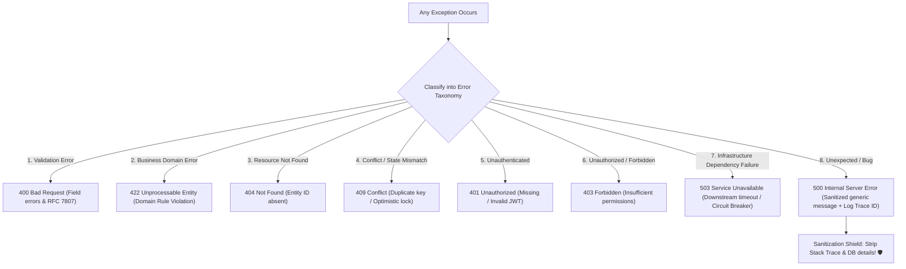

# 10-05: Enterprise Error Taxonomy & Security Sanitization

> **Module**: `MOD-10: Validation and Error Handling`
> **Topic ID**: `SB-10-05`
> **Prerequisites**: `SB-10-03`, `SB-10-04`
> **Primary Technology**: Java 21 LTS | Security Sanitization | Enterprise Error Taxonomy
> **Verification Date**: 2026-09-01

---

## 1. Problem: Security Vulnerabilities from Leaking Errors
Exposing raw database stack traces (`org.postgresql.util.PSQLException: table "tbl_users_v2" does not have column "ssn"`), internal IP addresses, SQL queries, or package names in HTTP responses creates a severe **Information Disclosure (CWE-209)** vulnerability that attackers exploit to map backend infrastructure.

---

## 2. Why It Exists: The 8-Tier Enterprise Error Taxonomy
Production architectures categorize all runtime errors into an **explicit 8-tier taxonomy**, mapping domain exceptions to appropriate HTTP status codes while enforcing strict **Security Sanitization** at the API edge:



---

## 3. The 8 Error Tiers Mapped

| Tier | Category | Example Java Exception | HTTP Status | Response Payload |
|---|---|---|:---:|---|
| **1** | **Validation Error** | `MethodArgumentNotValidException` | `400` | Detailed field validation violations |
| **2** | **Business Rule Violation** | `InsufficientFundsException` | `422` | Safe business error detail |
| **3** | **Resource Not Found** | `ResourceNotFoundException` | `404` | "User with id 42 not found" |
| **4** | **State Conflict** | `DuplicateEmailException` | `409` | "Email address already registered" |
| **5** | **Unauthenticated** | `AuthenticationException` | `401` | "Authentication credentials missing or invalid" |
| **6** | **Forbidden** | `AccessDeniedException` | `403` | "Access denied: insufficient privileges" |
| **7** | **Downstream Failure** | `CallNotPermittedException` | `503` | "Service temporarily unavailable. Please retry later." |
| **8** | **Unexpected / Internal**| `NullPointerException`, `SQLException`| `500` | **Sanitized**: "An unexpected internal error occurred. Ref: {traceId}" |

---

## 4. Production Example in Java 21: Enterprise Sanitizing Global Exception Handler
```java
package com.spring.interview.validation.exception;

import org.slf4j.Logger;
import org.slf4j.LoggerFactory;
import org.springframework.http.HttpStatus;
import org.springframework.http.ProblemDetail;
import org.springframework.web.bind.MethodArgumentNotValidException;
import org.springframework.web.bind.annotation.ExceptionHandler;
import org.springframework.web.bind.annotation.RestControllerAdvice;

import java.net.URI;
import java.time.Instant;
import java.util.List;
import java.util.UUID;

@RestControllerAdvice
public class GlobalExceptionHandler {

    private static final Logger log = LoggerFactory.getLogger(GlobalExceptionHandler.class);

    public record ValidationErrorItem(String field, String reason) {}

    // 1. Validation Errors (400 Bad Request)
    @ExceptionHandler(MethodArgumentNotValidException.class)
    public ProblemDetail handleValidation(MethodArgumentNotValidException ex) {
        ProblemDetail problem = ProblemDetail.forStatusAndDetail(
            HttpStatus.BAD_REQUEST,
            "Request validation failed. Please correct the invalid fields."
        );
        problem.setTitle("Validation Failure");
        problem.setType(URI.create("https://api.example.com/errors/validation"));

        List<ValidationErrorItem> errors = ex.getBindingResult().getFieldErrors().stream()
            .map(err -> new ValidationErrorItem(err.getField(), err.getDefaultMessage()))
            .toList();

        problem.setProperty("invalidParams", errors);
        problem.setProperty("timestamp", Instant.now().toString());
        return problem;
    }

    // 2. Resource Not Found (404 Not Found)
    @ExceptionHandler(DomainExceptions.ResourceNotFoundException.class)
    public ProblemDetail handleNotFound(DomainExceptions.ResourceNotFoundException ex) {
        ProblemDetail problem = ProblemDetail.forStatusAndDetail(HttpStatus.NOT_FOUND, ex.getMessage());
        problem.setTitle("Resource Not Found");
        problem.setType(URI.create("https://api.example.com/errors/not-found"));
        problem.setProperty("timestamp", Instant.now().toString());
        return problem;
    }

    // 3. Business Conflict (409 Conflict)
    @ExceptionHandler(DomainExceptions.BusinessConflictException.class)
    public ProblemDetail handleConflict(DomainExceptions.BusinessConflictException ex) {
        ProblemDetail problem = ProblemDetail.forStatusAndDetail(HttpStatus.CONFLICT, ex.getMessage());
        problem.setTitle("Resource Conflict");
        problem.setType(URI.create("https://api.example.com/errors/conflict"));
        problem.setProperty("timestamp", Instant.now().toString());
        return problem;
    }

    // 4. Unexpected Fallback (500 Internal Server Error) - STRICT SANITIZATION
    @ExceptionHandler(Exception.class)
    public ProblemDetail handleUnexpected(Exception ex) {
        String errorReferenceId = UUID.randomUUID().toString();
        // Log full raw stack trace internally with correlation reference ID
        log.error("Unhandled internal exception [Ref: {}]", errorReferenceId, ex);

        // Return strictly sanitized response to client (NEVER leak stack traces or SQL details)
        ProblemDetail problem = ProblemDetail.forStatusAndDetail(
            HttpStatus.INTERNAL_SERVER_ERROR,
            "An unexpected internal error occurred. Please quote reference: " + errorReferenceId
        );
        problem.setTitle("Internal Server Error");
        problem.setType(URI.create("https://api.example.com/errors/internal-error"));
        problem.setProperty("errorReferenceId", errorReferenceId);
        problem.setProperty("timestamp", Instant.now().toString());
        return problem;
    }
}
```

---

## 5. Common Mistakes
- **Printing `e.printStackTrace()` or returning `ex.getMessage()` for SQL errors to clients**: Violates OWASP Top 10 security standards.

---

## 6. Interview Questions
1. **SDE2**: Why is it dangerous to return raw exception messages from `SQLException` in REST responses?
2. **Senior**: How do you architect an error handling subsystem to balance developer debuggability with production security sanitization?

---

## 7. Interview Answer (Senior Level)
"Returning raw exception messages (such as `PSQLException` or `HibernateException`) exposes database table structures, column names, database versions, and SQL syntax to callers, creating an Information Disclosure vulnerability that facilitates SQL injection and reconnaissance. In production, we implement a two-pronged strategy: 1) The exception handler generates a unique UUID `errorReferenceId`, logs the complete stack trace and context internally to centralized logging (e.g. OpenTelemetry / Datadog), and 2) Returns a strictly sanitized RFC 7807 `ProblemDetail` payload to the client containing only the status code and the `errorReferenceId`. Developers can look up the exact stack trace in logs using the reference ID without ever exposing internal details to public callers."
