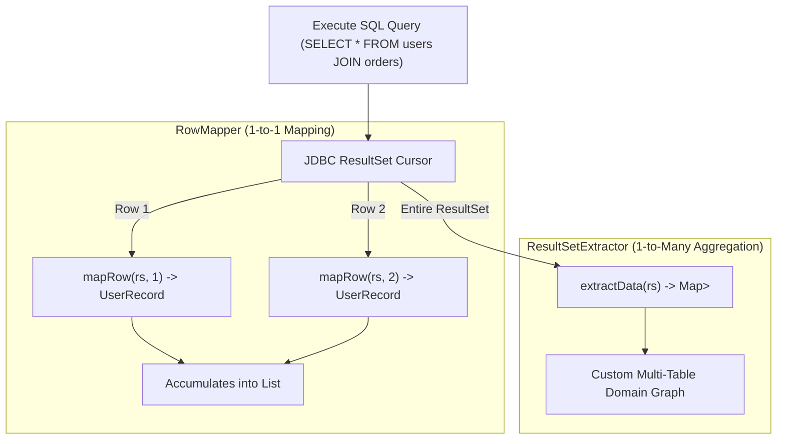

# 11-01: JdbcTemplate & NamedParameterJdbcTemplate: Low-Level Database Access

> **Module**: `MOD-11: Spring JDBC & Connection Pooling`
> **Topic ID**: `SB-11-01`
> **Prerequisites**: `SB-01-02`
> **Primary Technology**: Java 21 LTS | JDBC Architecture | Template Method Pattern
> **Verification Date**: 2026-09-01

---

## 1. Problem
Raw JDBC requires 30+ lines of repetitive boilerplate for every query: opening connections, creating statements, handling SQL exceptions, iterating result sets, and manually closing resources in `finally` blocks without leaking connections.

---

## 2. Why It Exists
Spring's `JdbcTemplate` and `NamedParameterJdbcTemplate` implement the **Template Method Pattern**. They manage the entire JDBC resource lifecycle, translate vendor-specific `SQLException`s into Spring's unified `DataAccessException` hierarchy, and provide high-performance mapping via `RowMapper<T>`, `ResultSetExtractor<T>`, and `RowCallbackHandler`.

---

## 3. Architecture: RowMapper vs ResultSetExtractor



---

## 4. Comparing the Three Mapping Abstractions

| Abstraction | Method Signature | Use Case | Memory Impact |
|---|---|---|---|
| **`RowMapper<T>`** | `T mapRow(ResultSet rs, int rowNum)` | **Standard 1-to-1 row-to-object mapping** | Memory proportional to result count |
| **`ResultSetExtractor<T>`** | `T extractData(ResultSet rs)` | **1-to-many aggregations (e.g. parent with child lists)** | Full developer control over iteration |
| **`RowCallbackHandler`** | `void processRow(ResultSet rs)` | **Streaming million-row exports to CSV/disk** | Constant $O(1)$ memory; no object accumulation |

---

## 5. Production Example in Java 21: `NamedParameterJdbcTemplate` & Batch Operations
```java
package com.spring.interview.jdbc.repository;

import org.springframework.jdbc.core.RowMapper;
import org.springframework.jdbc.core.namedparam.MapSqlParameterSource;
import org.springframework.jdbc.core.namedparam.NamedParameterJdbcTemplate;
import org.springframework.jdbc.core.namedparam.SqlParameterSourceUtils;
import org.springframework.stereotype.Repository;

import java.sql.ResultSet;
import java.sql.SQLException;
import java.util.List;
import java.util.Map;
import java.util.Optional;

@Repository
public class UserJdbcRepository {

    public record UserRecord(String id, String username, String email, String status) {}

    private final NamedParameterJdbcTemplate jdbcTemplate;

    public UserJdbcRepository(NamedParameterJdbcTemplate jdbcTemplate) {
        this.jdbcTemplate = jdbcTemplate;
    }

    private static final RowMapper<UserRecord> USER_ROW_MAPPER = (rs, rowNum) -> new UserRecord(
        rs.getString("id"),
        rs.getString("username"),
        rs.getString("email"),
        rs.getString("status")
    );

    public Optional<UserRecord> findById(String id) {
        String sql = "SELECT id, username, email, status FROM users WHERE id = :id";
        List<UserRecord> results = jdbcTemplate.query(sql, Map.of("id", id), USER_ROW_MAPPER);
        return results.stream().findFirst();
    }

    public int[] batchInsert(List<UserRecord> users) {
        String sql = "INSERT INTO users (id, username, email, status) VALUES (:id, :username, :email, :status)";
        return jdbcTemplate.batchUpdate(sql, SqlParameterSourceUtils.createBatch(users));
    }
}
```

---

## 6. Common Mistakes
- **Using `String` concatenation in SQL queries**: Introduces catastrophic SQL injection vulnerabilities. Always use `:parameterName` or `?` placeholders.

---

## 7. Interview Questions
1. **SDE2**: What is the difference between `RowMapper` and `ResultSetExtractor`?
2. **Senior**: How does Spring translate vendor-specific `SQLException` error codes into portable exceptions?

---

## 8. Interview Answer (Senior Level)
"`RowMapper<T>` is invoked per row by `JdbcTemplate`, making it ideal for 1:1 tabular mapping into a `List<T>`. `ResultSetExtractor<T>` gives full control over the cursor, making it essential for 1:N aggregations (such as reconstructing an Order and its LineItems from a SQL JOIN). Spring translates vendor-specific `SQLException` error codes into its unchecked `DataAccessException` hierarchy via `SQLErrorCodeSQLExceptionTranslator`, which reads database dialect XML mappings (`sql-error-codes.xml`). This maps PostgreSQL error code `23505` and MySQL error `1062` to the identical Spring `DuplicateKeyException`."
