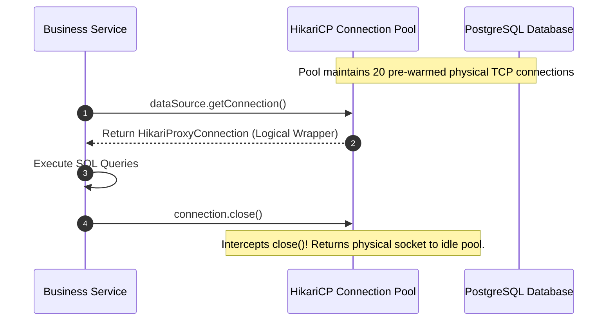

# 11-02: DataSource Architecture & The JDBC Connection Lifecycle

> **Module**: `MOD-11: Spring JDBC & Connection Pooling`
> **Topic ID**: `SB-11-02`
> **Prerequisites**: `SB-11-01`
> **Primary Technology**: Java 21 LTS | JDBC SPI | Connection Lifecycle
> **Verification Date**: 2026-09-01

---

## 1. Problem
Opening a physical TCP connection to PostgreSQL or Oracle takes **50ms to 200ms** (TCP handshake, TLS negotiation, authentication exchange, session initialization). Opening a physical connection on every HTTP request destroys application throughput.

---

## 2. Why It Exists
The `javax.sql.DataSource` interface is the factory abstraction for obtaining JDBC connections. Connection pools (like HikariCP) wrap `DataSource`, maintaining a pool of pre-established, open TCP database sockets. When an application calls `connection.close()`, it does **not** close the physical TCP socket; it returns the logical connection proxy back to the pool.

---

## 3. Architecture: Logical Connection Proxying

---

## 4. Physical Connection Cost Breakdown
- **TCP 3-Way Handshake**: 1 RTT (Round Trip Time)
- **TLS 1.3 Key Exchange**: 1–2 RTTs
- **Database Authentication & Handshake**: 2–3 RTTs (Password hash, session parameters)
- **Memory Allocation**: 5–10MB of RAM per connection on the DB server (Postgres process per connection)
- **Total Overhead**: ~100ms latency + high database CPU overhead.

---

## 5. Common Mistakes
- **Using `DriverManagerDataSource` in production**: `DriverManagerDataSource` creates a new physical TCP connection on *every single query*, causing massive latency and port exhaustion.

---

## 6. Interview Questions
1. **SDE2**: What actually happens when a Spring application calls `connection.close()` on a pooled connection?
2. **Senior**: How does `DataSourceUtils.getConnection(dataSource)` bind database connections to the current Spring `@Transactional` thread context?

---

## 7. Interview Answer (Senior Level)
"When an application calls `connection.close()` on a pooled connection, the call is intercepted by HikariCP's dynamic proxy (`HikariProxyConnection`). Instead of sending a TCP `FIN` packet to terminate the database socket, the proxy resets connection state (such as rolling back uncommitted transactions or resetting autocommit flags) and returns the physical connection instance to the idle bag of the pool. In Spring, `DataSourceUtils` queries `TransactionSynchronizationManager` to retrieve the connection bound to the current ThreadLocal context, ensuring that all repository calls within the same `@Transactional` method share the exact same physical database connection."
