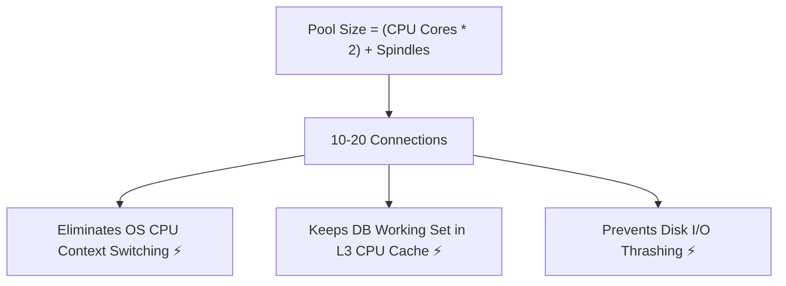

# 11-03: HikariCP Internals: Fast-Path, Lock-Free Collections & Pool Sizing

> **Module**: `MOD-11: Spring JDBC & Connection Pooling`
> **Topic ID**: `SB-11-03`
> **Prerequisites**: `SB-11-02`
> **Primary Technology**: Java 21 LTS | HikariCP | High-Throughput Database Physics
> **Verification Date**: 2026-09-01

---

## 1. Problem
Under heavy concurrent load (10,000 req/sec), traditional connection pools (Commons DBCP, C3P0) suffered severe thread lock contention on synchronized lock queues, degrading CPU performance. Furthermore, developers intuitively configure oversized connection pools (`maximum-pool-size=200`), ironically *slowing down* database execution.

---

## 2. Why It Exists
**HikariCP** is the default connection pool in Spring Boot due to its zero-overhead micro-optimizations:
1. **`FastList`**: An array-based list eliminating `ArrayList` range checks and reverse-order removals for fast `Statement` closing.
2. **`ConcurrentBag`**: A lock-free, lock-stealing collection based on `ThreadLocal` caching and `AtomicInteger` compare-and-swap (CAS).
3. **Bytecode Generation**: Generates direct bytecode proxies via Javassist to avoid reflective invocation overhead.

---

## 3. Architecture: The PostgreSQL Connection Pool Sizing Formula

Configuring 200 connections on a 16-core database creates severe OS context switching and disk I/O thrashing. The authoritative PostgreSQL / Oracle sizing formula is:

$$\text{Maximum Pool Size} = (\text{CPU Cores} \times 2) + \text{Effective Spindle Count}$$

```
Example:
Database Server: 8 CPU Cores + 1 SSD
Recommended Pool Size = (8 * 2) + 1 = 17 connections!
```



---

## 4. Production HikariCP Configuration in `application.yml`
```yaml
spring:
  datasource:
    hikari:
      pool-name: EnterpriseHikariPool
      maximum-pool-size: 20
      minimum-idle: 10
      idle-timeout: 300000          # 5 minutes
      max-lifetime: 1800000         # 30 minutes (must be shorter than DB server idle timeout)
      connection-timeout: 20000     # 20 seconds (wait time for available connection)
      leak-detection-threshold: 2000 # 2 seconds (logs warning if connection held > 2s)
```

---

## 5. Common Mistakes
- **Setting `maximum-pool-size=500`**: Overwhelms the database server process limits and destroys query cache locality.

---

## 6. Interview Questions
1. **SDE2**: Why is HikariCP significantly faster than traditional connection pools?
2. **Senior**: Why does reducing connection pool size from 100 to 20 often *increase* overall transaction throughput?

---

## 7. Interview Answer (Senior Level)
"HikariCP achieves near-zero overhead through `ConcurrentBag` (a lock-free, ThreadLocal-caching collection), `FastList` (eliminating range checks), and direct bytecode proxy generation. Counterintuitively, reducing connection pool size increases throughput because modern relational databases are bound by CPU cores and disk I/O. When 100 threads execute concurrent queries on an 8-core database server, the OS wastes immense CPU time on context switching and disk queue contention. Restricting the pool to `(cores * 2) + 1` ensures queries execute in CPU L3 cache without context-switch stalls, maximizing disk sequential read throughput."
