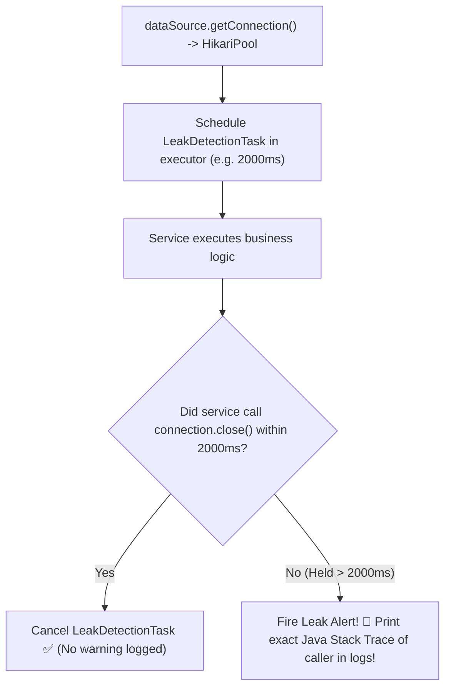

# 11-04: Connection Leaks, Pool Exhaustion & Diagnostic Profiling

> **Module**: `MOD-11: Spring JDBC & Connection Pooling`
> **Topic ID**: `SB-11-04`
> **Prerequisites**: `SB-11-03`
> **Primary Technology**: Java 21 LTS | Diagnostics | HikariCP Pool Exhaustion
> **Verification Date**: 2026-09-01

---

## 1. Problem
A microservice abruptly freezes under load, throwing:
`SQLTransientConnectionException: EnterpriseHikariPool - Connection is not available, request timed out after 30000ms`.
All incoming HTTP threads become blocked waiting for a database connection, cascading into a total system outage.

---

## 2. Why It Exists: Root Causes of Pool Exhaustion
1. **Connection Leak**: Application code opens a connection (or executes a long third-party REST call inside `@Transactional`) and fails to close or release it.
2. **Slow Queries**: Unindexed queries holding database connections for 15+ seconds.
3. **Third-Party Network Calls in `@Transactional`**: Holding a database connection while waiting 5 seconds for a Stripe or external API call.

---

## 3. Architecture: HikariCP Leak Detection Pipeline



---

## 4. Production Configuration for Leak Detection
```yaml
spring:
  datasource:
    hikari:
      leak-detection-threshold: 2000    # 2 seconds (0 = disabled)
      connection-timeout: 10000         # 10 seconds before throwing SQLTransientConnectionException
```

### The Diagnostic Log Output
When a leak occurs, HikariCP logs the exact instantiation stack trace:

```
WARN  com.zaxxer.hikari.pool.ProxyLeakTask - Connection leak detection triggered for org.postgresql.jdbc.PgConnection@4b1f4c7
Apparent connection leak detected at:
    com.spring.interview.service.OrderService.processOrderWithExternalApi(OrderService.java:84)
    com.spring.interview.controller.OrderController.createOrder(OrderController.java:42)
```

---

## 5. Common Mistakes
- **Executing external HTTP API calls inside `@Transactional` methods**: Holds a physical database connection idle for seconds while waiting on network I/O, quickly exhausting the pool.

---

## 6. Interview Questions
1. **SDE2**: What causes `SQLTransientConnectionException: Connection is not available`?
2. **Senior**: How do you detect and fix connection leaks in production microservices using HikariCP and JVM thread dumps?

---

## 7. Interview Answer (Senior Level)
"Connection pool exhaustion occurs when all pooled connections are held by active or leaked threads longer than the `connection-timeout` duration. Common causes include unindexed slow queries, connections not closed in non-Spring code, or executing external HTTP calls inside `@Transactional` blocks. To diagnose: 1) Enable `hikari.leak-detection-threshold=2000` to capture stack traces of long-lived connections, 2) Inspect HikariCP JMX/Micrometer metrics (`hikaricp.connections.active`, `pending`), and 3) Take a JVM thread dump to identify threads in `TIMED_WAITING` state inside `HikariPool.getConnection()`."
