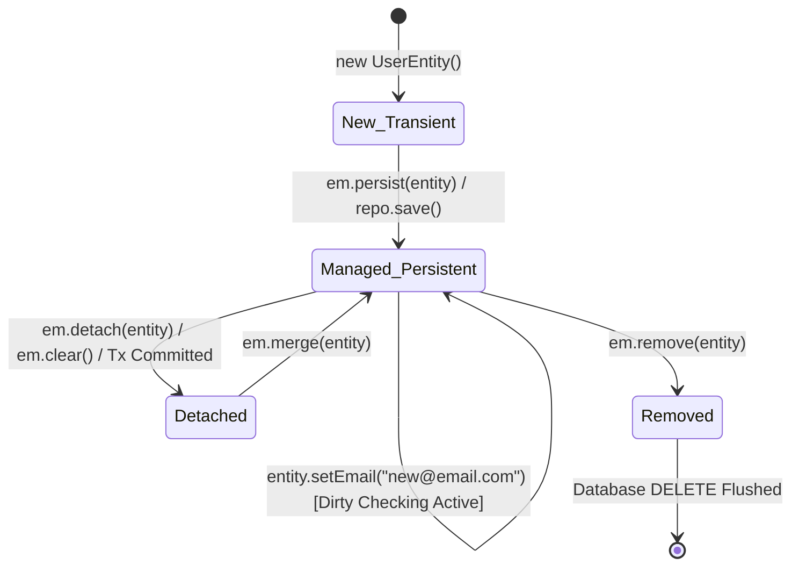

# 12-01: JPA Persistence Context, Entity Lifecycle & Dirty Checking Internals

> **Module**: `MOD-12: Spring Data JPA & Hibernate`
> **Topic ID**: `SB-12-01`
> **Prerequisites**: `SB-11-01`
> **Primary Technology**: Java 21 LTS | Hibernate 6.6 | Persistence Context Mechanics
> **Verification Date**: 2026-09-01

---

## 1. Problem
How does Hibernate detect modifications made to Java entity objects in memory and automatically flush SQL `UPDATE` statements to the database at transaction commit time without the developer calling `repository.save()`?

---

## 2. Why It Exists
The **Persistence Context** (encapsulated by `EntityManager` / Hibernate `Session`) acts as an in-memory **First-Level Cache** and **Identity Map**. When an entity is loaded, Hibernate saves an internal raw **Snapshot** of its field values.

---

## 3. Architecture: The 4 Entity States & Lifecycle Transitions

---

## 4. How Dirty Checking Works Under the Hood
1. **Entity Loaded**: When `findById()` executes, Hibernate places the entity instance into the `PersistenceContext` identity map and creates a bit-for-bit **Snapshot** copy in its `EntityEntry` registry.
2. **Entity Mutation**: The developer mutates a setter: `user.setEmail("alice@newcorp.com")`.
3. **Transaction Commit / Auto-Flush**: Before commit, Hibernate executes **`flush()`**:
   - Compares the current field state of every managed entity against its loaded **Snapshot**.
   - If any difference is found, marks the entity as dirty.
   - Generates an optimized SQL `UPDATE` statement and queues it in the `ActionQueue`.
   - Executes the batch update against JDBC.

---

## 5. Common Mistakes
- **Redundant `repository.save()` calls in `@Transactional` methods**: In a managed `@Transactional` method, calling `save()` on an already-managed entity is completely unnecessary and signals a junior misunderstanding of dirty checking.

---

## 6. Interview Questions
1. **SDE2**: What are the 4 entity lifecycle states in JPA?
2. **Senior**: How does Hibernate perform dirty checking during transaction flush, and what is its performance overhead on large object graphs?

---

## 7. Interview Answer (Senior Level)
"JPA entities exist in one of four states: **New/Transient** (instantiated in Java, no DB identity), **Managed/Persistent** (tracked by PersistenceContext with identity), **Detached** (session closed, changes untracked), and **Removed** (scheduled for SQL DELETE). Dirty checking occurs during `flush()`, where Hibernate iterates all managed entities in the First-Level Cache and performs a property-by-property equality comparison against their original loaded snapshot arrays (`EntityEntry`). For large object graphs (thousands of entities in a single session), snapshot array comparisons impose significant CPU and memory overhead, which is why read-only workflows should use DTO projections or `@Transactional(readOnly = true)` to disable snapshot creation."
