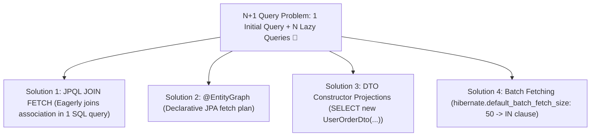

# 12-02: The N+1 Query Problem: Detection & 4 Production Remediation Strategies

> **Module**: `MOD-12: Spring Data JPA & Hibernate`
> **Topic ID**: `SB-12-02`
> **Prerequisites**: `SB-12-01`
> **Primary Technology**: Java 21 LTS | Hibernate 6.6 | Query Optimization Architecture
> **Verification Date**: 2026-09-01

---

## 1. Problem
You execute `List<User> users = userRepository.findAll()` (1 SQL query for 100 users). Then in a loop, your code calls `user.getOrders()`. Because `@OneToMany` defaults to `FetchType.LAZY`, Hibernate executes **100 additional individual `SELECT` queries** (`SELECT * FROM orders WHERE user_id = ?`).
1 initial query + $N$ lazy queries = **101 database network round-trips!**

---

## 2. Why It Exists
Lazy loading is designed to avoid loading child collections unless explicitly accessed. However, iterating lazily-loaded associations triggers unbatched secondary queries on every iteration.

---

## 3. Architecture: The 4 Production Solutions



---

## 4. In-Depth Analysis of the 4 Fix Strategies

### Strategy 1: JPQL `JOIN FETCH`
Forces an explicit SQL `INNER/LEFT JOIN` in a single query:
```java
@Query("SELECT u FROM UserEntity u LEFT JOIN FETCH u.orders")
List<UserEntity> findAllWithOrders();
```
*Caveat*: Do not fetch multiple independent `@OneToMany` `List` collections simultaneously (causes Cartesian Product `MultipleBagFetchException`).

### Strategy 2: `@EntityGraph`
Declaratively instructs Hibernate which lazy associations to fetch eagerly:
```java
@EntityGraph(attributePaths = {"orders"})
List<UserEntity> findAll();
```

### Strategy 3: DTO Record Constructor Projection (Fastest)
Bypasses entity management and dirty checking entirely:
```java
@Query("SELECT new com.spring.interview.jpa.dto.UserSummaryRecord(u.id, u.username, o.orderNumber) " +
       "FROM UserEntity u JOIN u.orders o")
List<UserSummaryRecord> findUserSummaries();
```

### Strategy 4: Batch Fetching (`default_batch_fetch_size`)
If lazy loading is unavoidable, configure batching in `application.yml`:
```yaml
spring:
  jpa:
    properties:
      hibernate:
        default_batch_fetch_size: 50
```
*Effect*: Replaces $N$ single queries with $\lceil N / 50 \rceil$ batched queries using `WHERE user_id IN (?, ?, ..., ?)`.

---

## 5. Common Mistakes
- **Switching `@OneToMany` to `FetchType.EAGER` in entity mappings**: Anti-pattern! Eager fetching on mappings causes Hibernate to *always* fetch collections even when not needed, multiplying query costs across other endpoints.

---

## 6. Interview Questions
1. **SDE2**: What is the N+1 query problem in Hibernate and how do you detect it?
2. **Senior**: When should you use `JOIN FETCH` vs `@EntityGraph` vs DTO constructor projections?

---

## 7. Interview Answer (Senior Level)
"The N+1 query problem occurs when accessing a lazy relationship on $N$ parent entities generates $N$ individual child queries, causing $N+1$ network round-trips. We detect it via Hibernate query statistics (`hibernate.generate_statistics=true`) or datasource query assertion tests (e.g. `QuickPerf` or `DataSourceProxy`). For read-only operations, DTO constructor projections are optimal because they select only required columns and bypass dirty checking overhead. For domain operations needing managed entities, JPQL `JOIN FETCH` or `@EntityGraph` fetches the graph in a single SQL JOIN query. As a global safety net, setting `hibernate.default_batch_fetch_size=50` converts unavoidable lazy queries into batched `IN` clauses."
