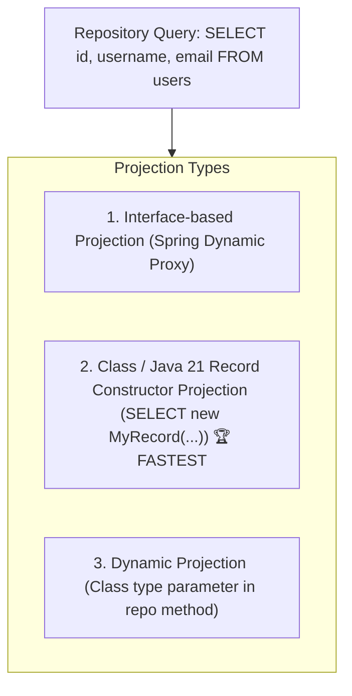

# 12-05: High-Performance JPA Projections: Interfaces, Records & Constructors

> **Module**: `MOD-12: Spring Data JPA & Hibernate`
> **Topic ID**: `SB-12-05`
> **Prerequisites**: `SB-12-01`, `SB-12-02`
> **Primary Technology**: Java 21 LTS | Projection Optimization | Zero-Dirty Checking
> **Verification Date**: 2026-09-01

---

## 1. Problem
Querying an entire entity with 30 columns (`SELECT * FROM users`) when you only need `id` and `email` wastes network bandwidth, database buffer memory, and JVM heap. Furthermore, managed entities incur dirty checking snapshot comparison overhead at transaction completion.

---

## 2. Why It Exists
Spring Data JPA supports **Projections**: selecting only the required columns and projecting them directly into lightweight carriers without loading full managed entities.

---

## 3. The 3 JPA Projection Types



---

## 4. In-Depth Comparison

### 1. Interface-Based Closed Projections
Spring creates a dynamic JDK proxy that reads result arrays:
```java
public interface UserSummaryProjection {
    String getId();
    String getUsername();
    String getEmail();
}
```

### 2. Java 21 Record Constructor Projections (Best Practice)
Selects exact columns and instantiates immutable Java records directly via JPQL `new`:
```java
public record UserSummaryRecord(String id, String username, String email) {}

// Repository method
@Query("SELECT new com.spring.interview.jpa.dto.UserSummaryRecord(u.id, u.username, u.email) FROM UserEntity u")
List<UserSummaryRecord> findAllUserSummaries();
```

---

## 5. Performance Comparison Matrix

| Metric | Full Entity Query | Interface Projection | Java 21 Record Projection |
|---|:---:|:---:|:---:|
| **Columns Selected in SQL** | All 30+ columns | Only requested columns | **Only requested columns** |
| **Tracked by Persistence Context?** | **YES (Dirty checking active)** | NO | **NO (Zero dirty checking)** |
| **Instantiation Overhead** | High (Entity proxy & snapshot) | Moderate (JDK Dynamic Proxy) | **Zero (Direct Record Constructor)** |
| **Immutability** | Mutable | Read-only proxy | **100% Immutable Record** |

---

## 6. Common Mistakes
- **Using Open Projections with SpEL (`@Value("#{target.firstName + ' ' + target.lastName}")`)**: Open projections force Hibernate to load the entire entity, losing all projection performance benefits.

---

## 7. Interview Questions
1. **SDE2**: What is the difference between an Interface projection and a Class/Record constructor projection in Spring Data JPA?
2. **Senior**: Why do Record constructor projections provide higher throughput than interface projections in high-load systems?

---

## 8. Interview Answer (Senior Level)
"Interface projections use Spring dynamic reflection proxies (`ProxyFactory`) to intercept getter calls, adding reflection and allocation overhead for every row in large result sets. Java 21 Record constructor projections (`SELECT new MyRecord(...)`) instruct Hibernate to invoke the compiled record constructor directly from the JDBC `ResultSet`. Record projections bypass the Persistence Context, eliminate dirty checking snapshots, require zero dynamic proxy generation, and produce 100% immutable, thread-safe instances, maximizing JVM execution throughput."
