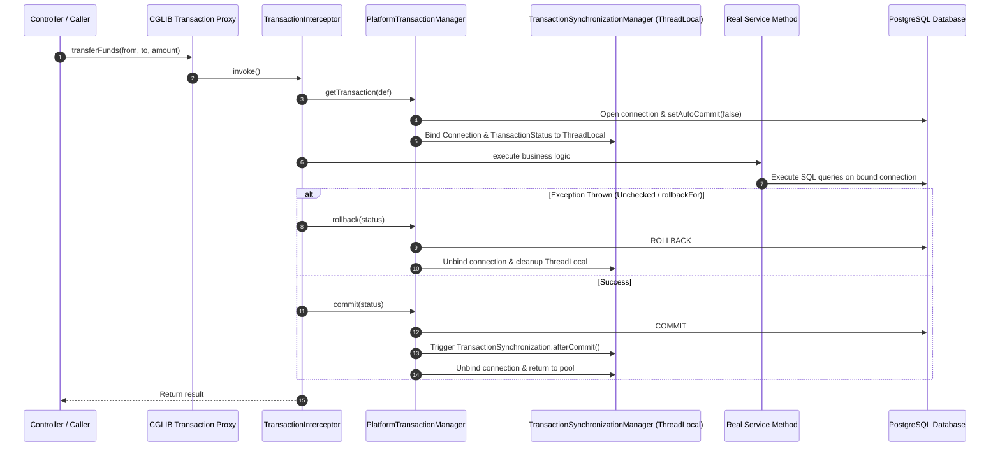

# 13-01: @Transactional Internals: Proxies, Interceptors & TransactionSynchronizationManager

> **Module**: `MOD-13: Transactions & Concurrency`
> **Topic ID**: `SB-13-01`
> **Prerequisites**: `SB-04-01`, `SB-11-02`
> **Primary Technology**: Java 21 LTS | Transaction Pipeline Architecture | ThreadLocal State
> **Verification Date**: 2026-09-01

---

## 1. Problem
How does annotating a method with `@Transactional` instruct Spring to acquire a database connection, disable auto-commit, execute SQL queries across multiple service repositories on the *same* physical connection, register after-commit hooks, and commit/rollback atomically?

---

## 2. Why It Exists
Spring's declarative transaction management is powered by **Spring AOP proxies** and `TransactionInterceptor`. Behind the scenes, `PlatformTransactionManager` (e.g. `JpaTransactionManager` or `DataSourceTransactionManager`) binds the active database connection to the current thread using `TransactionSynchronizationManager` (`ThreadLocal`).

---

## 3. Architecture: The Complete Transaction Pipeline



---

## 4. Transaction Synchronization Hooks: `afterCommit()`
A critical pattern in distributed event architectures (e.g. publishing Kafka events or sending emails only after the DB transaction commits):

```java
TransactionSynchronizationManager.registerSynchronization(new TransactionSynchronization() {
    @Override
    public void afterCommit() {
        // Guarantee message is published to Kafka ONLY AFTER database commit succeeds!
        kafkaTemplate.send("order-events", event);
    }
});
```

---

## 5. Common Mistakes
- **Publishing Kafka events inside a `@Transactional` method before commit**: If the database transaction subsequently rolls back due to a constraint violation, the external event has already been published, causing a phantom distributed inconsistency!

---

## 6. Interview Questions
1. **SDE2**: Walk me through the step-by-step internal mechanics when a `@Transactional` method is called.
2. **Senior**: Why is `TransactionSynchronizationManager` ThreadLocal state dangerous when using asynchronous reactive code or Virtual Threads?

---

## 7. Interview Answer (Senior Level)
"When a `@Transactional` method is invoked, the CGLIB proxy routes the call to `TransactionInterceptor`. It requests a `TransactionStatus` from `PlatformTransactionManager`, which borrows a physical JDBC connection from the pool, sets `autocommit=false`, and binds it to the calling thread in `TransactionSynchronizationManager` via `ThreadLocal`. All subsequent repository operations within that call graph retrieve the same connection via `DataSourceUtils.getConnection()`. Upon method completion, `TransactionInterceptor` either commits or rolls back, executes registered `TransactionSynchronization.afterCommit()` callbacks, unbinds the ThreadLocal resource, and returns the connection to HikariCP. Because transaction context relies on `ThreadLocal`, asynchronous context-switching (`CompletableFuture.supplyAsync`) without explicit context propagation loses the transaction boundary, running child tasks outside the transaction."
