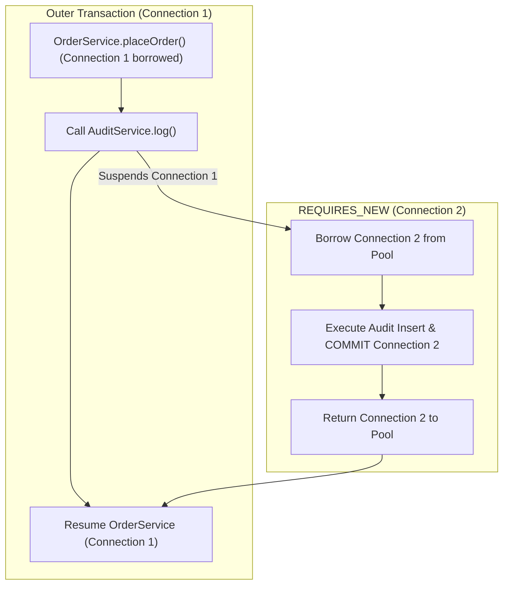

# 13-02: Transaction Propagation: REQUIRED vs REQUIRES_NEW & Suspension Physics

> **Module**: `MOD-13: Transactions & Concurrency`
> **Topic ID**: `SB-13-02`
> **Prerequisites**: `SB-13-01`
> **Primary Technology**: Java 21 LTS | Transaction Propagation | Suspension Architecture
> **Verification Date**: 2026-09-01

---

## 1. Problem
You want to log an audit record to the database inside an audit service even if the outer business transaction fails and rolls back. If the audit service uses default propagation (`REQUIRED`), rolling back the outer transaction rolls back the audit record too!

---

## 2. Why It Exists
Spring provides **Transaction Propagation Behaviors** (`Propagation` enum) defining how transaction boundaries behave when a `@Transactional` method calls another `@Transactional` method.

---

## 3. The 7 Propagation Behaviors Explained

| Propagation | If Outer Tx Exists? | If No Outer Tx? | Use Case / Notes |
|---|---|---|---|
| **`REQUIRED`** *(Default)* | **Joins outer transaction** | Creates new transaction | Standard CRUD service methods |
| **`REQUIRES_NEW`** | **Suspends outer transaction; opens NEW physical DB connection** | Creates new transaction | Audit logging, independent counters |
| **`NESTED`** | **Creates a DB JDBC Savepoint inside outer transaction** | Creates new transaction | Roll back sub-step to savepoint without failing parent |
| **`SUPPORTS`** | Executes transactionally | Executes non-transactionally | Read-only helper methods |
| **`NOT_SUPPORTED`** | **Suspends outer transaction** | Executes non-transactionally | Long-running non-DB operations |
| **`MANDATORY`** | Joins outer transaction | **Throws `IllegalTransactionStateException`** | Enforcement of strict transactional caller |
| **`NEVER`** | **Throws `IllegalTransactionStateException`** | Executes non-transactionally | Enforce non-transactional execution |

---

## 4. Architecture: `REQUIRES_NEW` & Transaction Suspension Physics

When `REQUIRES_NEW` executes within an existing outer transaction:
1. `TransactionManager` suspends the outer transaction.
2. Unbinds the outer `Connection1` from `TransactionSynchronizationManager`.
3. **Borrows a second physical connection (`Connection2`) from HikariCP!**
4. Executes child method on `Connection2` and commits.
5. Returns `Connection2` to HikariCP.
6. Resumes outer transaction on `Connection1`.

> [!WARNING]
> **HikariCP Deadlock Hazard**: If connection pool size is 10, and 10 concurrent threads each enter an outer transaction (holding 10 connections) and then all call a nested `REQUIRES_NEW` method (needing 10 more connections), the pool deadlocks permanently!

---

## 5. Common Mistakes
- **Self-invocation on `REQUIRES_NEW`**: Calling `this.logAudit()` bypasses the Spring proxy; `REQUIRES_NEW` is completely ignored and runs inside the parent transaction!

---

## 6. Interview Questions
1. **SDE2**: What is the difference between `REQUIRED` and `REQUIRES_NEW`?
2. **Senior**: How can `REQUIRES_NEW` cause HikariCP connection pool deadlocks under high concurrency?

---

## 7. Interview Answer (Senior Level)
"`REQUIRED` joins the caller's existing transaction (sharing the same physical connection and commit boundary), whereas `REQUIRES_NEW` suspends the outer transaction and borrows a *second* physical connection from the pool to execute and commit an independent transaction. Under high concurrency, `REQUIRES_NEW` can cause pool exhaustion deadlocks: if all threads in the thread pool consume every available connection in the outer transaction, none of the suspended threads can acquire a second connection for their `REQUIRES_NEW` step, causing a total application deadlock."
