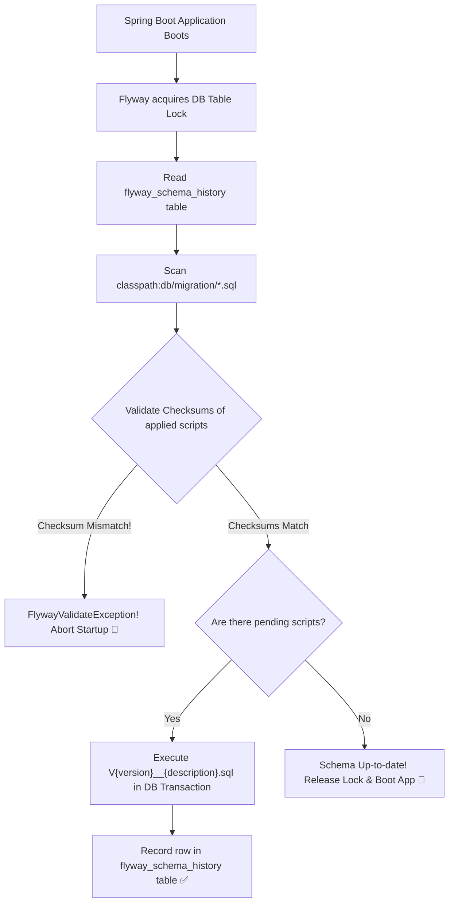

# 14-01: Database Schema Migration: Flyway vs Liquibase Architecture

> **Module**: `MOD-14: Database Migrations`
> **Topic ID**: `SB-14-01`
> **Prerequisites**: `SB-11-01`
> **Primary Technology**: Java 21 LTS | Flyway | Database Schema Versioning
> **Verification Date**: 2026-09-01

---

## 1. Problem
Manual database DDL scripts executed by DBAs or using `spring.jpa.hibernate.ddl-auto=update` in production creates catastrophic schema drift, race conditions across cluster nodes, and irreversible data loss.

---

## 2. Why It Exists
Database migration tools provide **Automated, Version-Controlled, Idempotent Schema Evolution**. When Spring Boot boots up, the migration tool acquires a distributed database lock, inspects the schema history table (`flyway_schema_history` or `DATABASECHANGELOG`), computes file checksums, and applies any pending migration scripts sequentially in transactions.

---

## 3. Comprehensive Flyway vs Liquibase Comparison

| Feature / Dimension | Flyway | Liquibase |
|---|:---:|:---:|
| **Primary Format** | **Pure Plain SQL (`.sql`)** | XML, YAML, JSON, or SQL Changesets |
| **Philosophy** | Simple, opinionated, SQL-native | Abstract, database-agnostic |
| **Learning Curve** | **Near Zero (Just write standard SQL)** | Steep (Complex XML/YAML schemas) |
| **Checksum Verification** | CRC32 / SHA-256 on SQL script | MD5 on XML changeset elements |
| **Auto-Rollback Support** | Requires Flyway Teams (Undo `U__`) | Built-in via `<rollback>` tags |
| **Java-based Migrations** | **Native (`BaseJavaMigration`)** | Custom Java Change classes |
| **Industry Adoption** | **Dominant in modern Java/Spring microservices** | Large enterprise multi-database products |

---

## 4. Architecture: Flyway Schema History Tracking

---

## 5. Common Mistakes
- **Using `spring.jpa.hibernate.ddl-auto=update` in production**: Hibernate `ddl-auto` is dangerous: it does not handle column drops, index renames, or table splits safely. Always set `ddl-auto=validate` in production!

---

## 6. Interview Questions
1. **SDE2**: How does Flyway ensure that two microservice instances starting up simultaneously don't run the same migration twice?
2. **Senior**: When would you choose Liquibase over Flyway?

---

## 7. Interview Answer (Senior Level)
"Flyway prevents concurrent execution across multi-node clusters by acquiring an exclusive database-level advisory lock (or locking the `flyway_schema_history` table) at the start of the migration lifecycle. Other instances block waiting for the lock, and once acquired, they discover that all pending scripts have already been applied and committed. Liquibase is preferred when a single application must support multiple heterogeneous database vendors (e.g. Oracle, PostgreSQL, and SQL Server) where abstract XML/YAML changesets automatically translate into vendor-specific DDL dialects, whereas Flyway is preferred for simplicity and raw SQL power in dedicated PostgreSQL/MySQL microservices."
