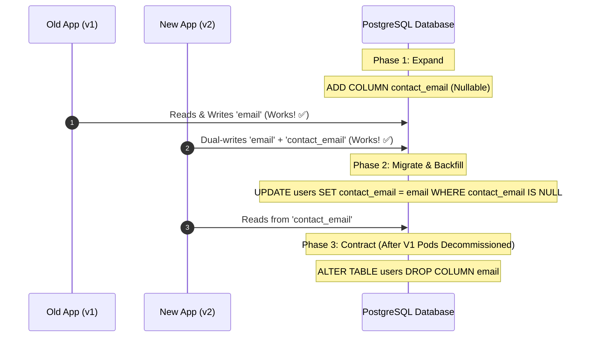

# 14-03: Zero-Downtime Database Migrations: The Expand & Contract Pattern

> **Module**: `MOD-14: Database Migrations`
> **Topic ID**: `SB-14-03`
> **Prerequisites**: `SB-14-01`, `SB-14-02`
> **Primary Technology**: Java 21 LTS | Continuous Delivery | Expand and Contract Pattern
> **Verification Date**: 2026-09-01

---

## 1. Problem
In continuous deployment environments with rolling pod updates, Old Pods ($V1$) and New Pods ($V2$) run concurrently for several minutes. If $V2$ drops or renames a column (`ALTER TABLE users RENAME COLUMN email TO contact_email`), active $V1$ pods instantly crash with `SQLException: Column "email" not found`.

---

## 2. Why It Exists
Zero-downtime schema evolution requires the **Expand and Contract Pattern (Parallel Run Pattern)**. Breaking database modifications are split across three backward-compatible release phases:
1. **Phase 1: Expand (Add New Column)**: Add `contact_email` as nullable. Deploy $V2$ application code that writes to *both* `email` and `contact_email` (Dual-Write), but reads from `email`.
2. **Phase 2: Migrate (Backfill Data)**: Run a background batch job to copy historical data from `email` to `contact_email`. Update application code to read from `contact_email`.
3. **Phase 3: Contract (Drop Old Column)**: Once all pods are on $V2$ and no traffic touches `email`, deploy a final migration to drop the legacy `email` column.

---

## 3. Architecture: The 3-Phase Lifecycle

---

## 4. Non-Breaking Schema Change Rules
- **Never rename a column in a single migration**: Use Expand/Contract.
- **Never add a `NOT NULL` column without a default value**: Always add as nullable, backfill values, then apply `SET NOT NULL`.
- **Never add unindexed foreign keys on large tables**: Acquires exclusive table locks; always create indexes concurrently in PostgreSQL (`CREATE INDEX CONCURRENTLY`).

---

## 5. Common Mistakes
- **Applying destructive DDL (dropping tables/columns) before decommissioning old application versions**: Instantly crashes rolling deployments in Kubernetes.

---

## 6. Interview Questions
1. **SDE2**: Why can't you rename a database column in a single migration script during rolling deployments?
2. **Senior**: Walk me through how you rename a column in a 500-million row PostgreSQL table in production with zero downtime.

---

## 7. Interview Answer (Senior Level)
"In rolling deployments, old and new application instances run simultaneously. Renaming a column directly breaks all running $V1$ instances immediately. We execute a zero-downtime Expand-and-Contract lifecycle: 1) Deploy a migration adding the new column `new_col` as nullable, 2) Deploy app version $V2$ configured to dual-write to both `old_col` and `new_col` while reading from `old_col`, 3) Run an asynchronous chunked backfill script (`UPDATE ... WHERE id BETWEEN ...`) to copy historical data, 4) Switch $V2$ to read from `new_col`, and 5) After all $V1$ pods are decommissioned and verified, deploy a final migration script dropping `old_col`."
