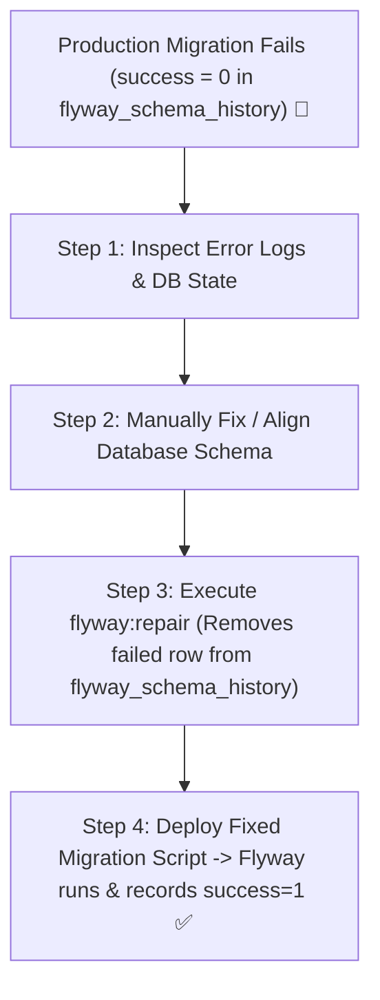

# 14-04: Handling Failed Migrations in Production: Flyway Repair & Disaster Recovery

> **Module**: `MOD-14: Database Migrations`
> **Topic ID**: `SB-14-04`
> **Prerequisites**: `SB-14-02`, `SB-14-03`
> **Primary Technology**: Java 21 LTS | Flyway | Disaster Recovery
> **Verification Date**: 2026-09-01

---

## 1. Problem
A migration script fails halfway through in production (e.g. invalid syntax on statement 3 in a database that does not support transactional DDL, like MySQL). Flyway marks the migration row in `flyway_schema_history` as `success = 0 (false)`. All future application restarts fail immediately with `FlywayException: Detected failed migration to version X`.

---

## 2. Why It Exists: Transactional vs Non-Transactional DDL
- **PostgreSQL**: Supports **Transactional DDL**. If statement 3 fails, PostgreSQL automatically rolls back statements 1 and 2, keeping the database in its clean prior state.
- **MySQL / Oracle**: **Do NOT support Transactional DDL**. Statements 1 and 2 are committed immediately and cannot be rolled back!

---

## 3. Architecture: The 4-Step Production Disaster Recovery Workflow



---

## 4. Remediation Commands in Production

### Step 1: Run Flyway Repair
Removes failed migration entries from `flyway_schema_history` and re-aligns checksums:
```bash
mvn flyway:repair
# Or in Spring Boot CLI
./mvnw -Dflyway.repair
```

### Step 2: Ensure Idempotency
Use `IF NOT EXISTS` or write clean DDL so rerunning partial migrations succeeds cleanly:
```sql
CREATE TABLE IF NOT EXISTS audit_logs (
    id VARCHAR(64) PRIMARY KEY,
    event VARCHAR(255) NOT NULL
);
```

---

## 5. Common Mistakes
- **Manually deleting rows in `flyway_schema_history` via raw SQL without repairing**: Leaves checksum caches out of sync and risks future migration corruption.

---

## 6. Interview Questions
1. **SDE2**: What happens when a Flyway migration script fails in production?
2. **Senior**: Why does PostgreSQL handle failed Flyway migrations significantly better than MySQL?

---

## 7. Interview Answer (Senior Level)
"When a migration fails, Flyway records `success = 0` in `flyway_schema_history` and locks further deployments. In databases without transactional DDL (like MySQL), statements prior to the failure remain partially committed in the schema. PostgreSQL is superior because it supports fully transactional DDL (`CREATE TABLE`, `ALTER TABLE`, `ADD COLUMN` execute inside standard transactions). If a migration fails in PostgreSQL, the entire transaction rolls back cleanly, leaving the database state identical to the pre-migration state. To recover on non-transactional databases: manually reconcile the applied DDL changes in the database, execute `flyway.repair()` to purge the failed record, and deploy the corrected script."
